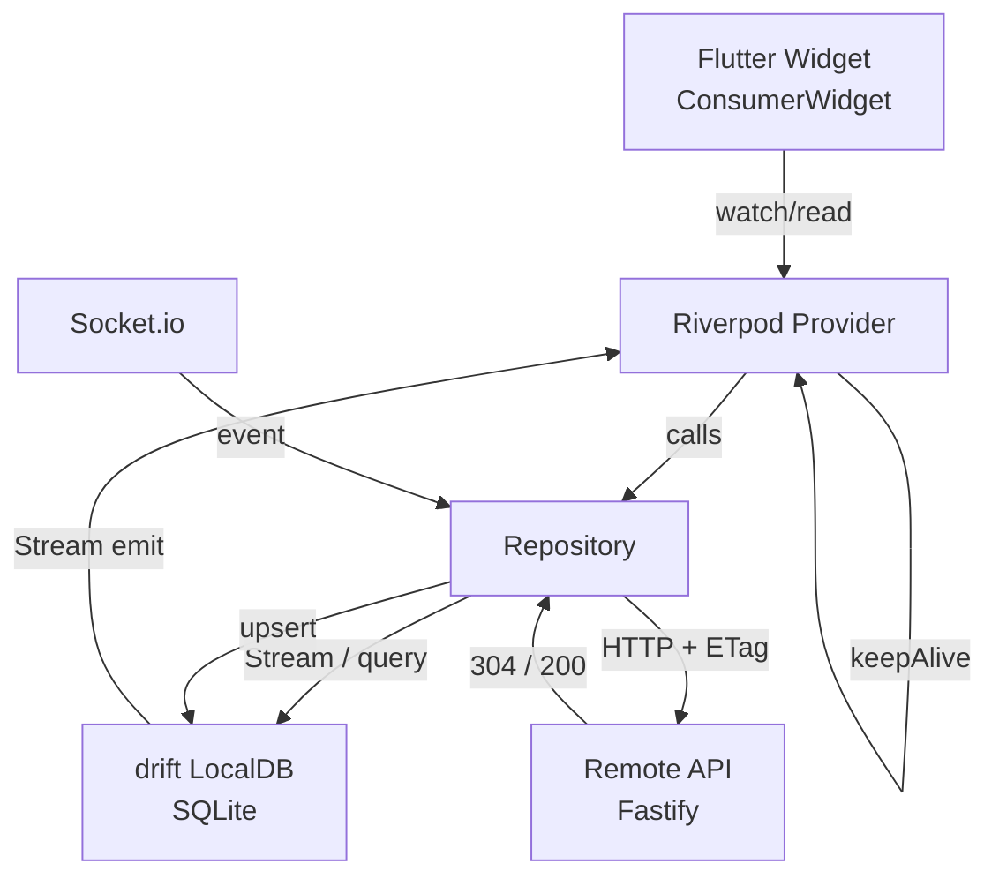

# Flutter 앱 로컬 DB 캐싱 전략 기획서

- 문서 버전: 1.0
- 작성일: 2026-04-04
- 작성자: 기획/개발팀
- 관련 프로젝트: Spots (위치 기반 스포츠 매칭 플랫폼)

---

## 목차

1. [개요](#1-개요)
2. [현재 문제점](#2-현재-문제점)
3. [도입 기술: drift](#3-도입-기술-drift)
4. [아키텍처 설계](#4-아키텍처-설계)
5. [데이터별 캐싱 전략](#5-데이터별-캐싱-전략)
6. [DB 스키마 설계](#6-db-스키마-설계)
7. [Stale-While-Revalidate 구현 방식](#7-stale-while-revalidate-구현-방식)
8. [통신 최적화 전략](#8-통신-최적화-전략)
9. [서버 측 변경사항](#9-서버-측-변경사항)
10. [마이그레이션 계획](#10-마이그레이션-계획)
11. [구현 우선순위 및 TODO 목록](#11-구현-우선순위-및-todo-목록)

---

## 1. 개요

### 1.1 목적

Spots 앱의 로컬 SQLite 데이터베이스(drift)를 도입하여 다음 목표를 달성한다.

- **앱 재시작 후 데이터 즉시 표시**: 앱 종료 후 재실행 시 로컬 캐시로 화면을 즉시 렌더링
- **불필요한 API 호출 제거**: 변경되지 않은 데이터는 서버에 재요청하지 않음
- **오프라인 부분 지원**: 네트워크 없이도 캐시된 데이터로 읽기 기능 제공
- **사용자 체감 속도 향상**: Stale-While-Revalidate 패턴으로 로딩 없이 즉시 화면 표시

### 1.2 배경

현재 Spots 앱은 모든 데이터를 Riverpod Provider의 인메모리 상태로만 관리한다. 앱을 종료하거나 메모리가 해제되면 채팅 메시지, 핀 목록, 유저 정보 등 모든 데이터가 소실되고, 다음 화면 진입 시 API를 다시 호출해야 한다. 사용자가 자주 방문하는 핀 목록, 채팅방 목록 같은 데이터는 거의 변경되지 않음에도 매번 전체 조회가 발생하고 있다.

---

## 2. 현재 문제점

### 2.1 데이터 영속성 부재

| 문제 | 영향 |
|------|------|
| 앱 종료 시 모든 Provider 상태 초기화 | 재실행마다 로딩 화면 노출 |
| SecureStorage는 토큰만 저장 | 사용자 프로필, 채팅 기록 등 재조회 필요 |
| 핀 데이터(수백 개)를 매 앱 실행마다 재조회 | 초기 로딩 지연, 트래픽 낭비 |

### 2.2 과도한 API 호출

| Provider | 현재 동작 | 문제점 |
|----------|-----------|--------|
| `nearbyPinsListProvider` | 화면 진입 시마다 `GET /pins/nearby` | 핀 데이터는 변경 빈도 낮음 |
| `chatRoomListProvider` | 화면 진입 시마다 `GET /chat-rooms` | 소켓 이벤트로 대체 가능 |
| `matchDetailProvider` | 화면 진입 시마다 `GET /matches` | 로컬 캐시 후 소켓 invalidation 가능 |
| `UserNotifier` | 매 프로필 조회 시 API 호출 | 로그인 1회 캐시로 충분 |

### 2.3 사용자 경험 저하

- 채팅방 진입 시 이전 메시지 없음 (스켈레톤 UI 또는 로딩 스피너 표시)
- 매칭 목록 화면 진입마다 빈 화면에서 시작
- 오프라인 상태에서 앱 사용 불가

---

## 3. 도입 기술: drift

### 3.1 drift 개요

drift(구 moor)는 Flutter/Dart를 위한 타입 안전 SQLite 래퍼 라이브러리다. raw SQL 대신 Dart 코드로 스키마와 쿼리를 정의하며, 코드 생성(build_runner)을 통해 컴파일 타임에 타입을 검증한다.

### 3.2 선택 이유

| 기준 | drift | sqflite | Hive | Isar |
|------|-------|---------|------|------|
| 타입 안전성 | 컴파일 타임 보장 | 런타임 Map | 런타임 | 컴파일 타임 |
| 관계형 데이터 | JOIN, FK 지원 | 직접 SQL 작성 | NoSQL | NoSQL |
| Stream 지원 | 네이티브 지원 | 없음 | 네이티브 | 네이티브 |
| Riverpod 통합 | StreamProvider 직결 | 수동 구현 | 수동 구현 | 수동 구현 |
| 마이그레이션 | 버전 기반 자동화 | 수동 | 수동 | 수동 |
| null 안전성 | 완전 지원 | 부분 | 완전 | 완전 |

Spots 앱은 채팅 메시지와 핀, 매칭 간 관계형 구조를 가지며, Provider에서 Stream을 직접 구독하는 패턴이 많으므로 drift가 가장 적합하다.

### 3.3 패키지 구성

```yaml
# pubspec.yaml
dependencies:
  drift: ^2.x
  drift_flutter: ^0.x      # Flutter용 SQLite 구현체

dev_dependencies:
  drift_dev: ^2.x
  build_runner: ^2.x
```

---

## 4. 아키텍처 설계

### 4.1 3계층 아키텍처

```
┌─────────────────────────────────────────────┐
│                  UI Layer                   │
│   (Flutter Widgets - ConsumerWidget 등)     │
└───────────────┬─────────────────────────────┘
                │ watch / read
┌───────────────▼─────────────────────────────┐
│             Provider Layer                  │
│   (Riverpod: FutureProvider, AsyncNotifier, │
│    StreamProvider)                          │
│                                             │
│   역할: 캐싱 정책 결정, TTL 검사,           │
│         SWR 오케스트레이션                  │
└───────────────┬─────────────────────────────┘
                │ call
┌───────────────▼─────────────────────────────┐
│           Repository Layer                  │
│                                             │
│   ┌──────────────┐   ┌───────────────────┐  │
│   │  Local DB    │   │   Remote API      │  │
│   │  (drift)     │   │   (Dio + REST)    │  │
│   │              │   │                   │  │
│   │  - 즉시 응답 │   │  - 백그라운드 갱신│  │
│   │  - Stream    │   │  - ETag 304 체크  │  │
│   │  - TTL 관리  │   │  - 배치 요청      │  │
│   └──────────────┘   └───────────────────┘  │
└─────────────────────────────────────────────┘
```

### 4.2 Repository 인터페이스 패턴

각 도메인마다 Repository 클래스를 두고, Provider는 Repository만 호출한다. Repository 내부에서 로컬 DB와 원격 API 간 조율을 담당한다.

```
lib/
  data/
    local/
      database.dart          # drift AppDatabase 정의
      database.g.dart        # 코드 생성 파일
      tables/
        pins_table.dart
        users_table.dart
        chat_rooms_table.dart
        messages_table.dart
        matches_table.dart
        cache_meta_table.dart
      daos/
        pins_dao.dart
        chat_dao.dart
        users_dao.dart
        matches_dao.dart
    remote/
      api_client.dart        # 기존 Dio 싱글톤
      pins_api.dart
      chat_api.dart
      users_api.dart
      matches_api.dart
    repositories/
      pin_repository.dart    # 로컬 + 원격 조율
      chat_repository.dart
      user_repository.dart
      match_repository.dart
  providers/
    pin_providers.dart       # Repository 기반으로 재작성
    chat_providers.dart
    user_providers.dart
    match_providers.dart
```

### 4.3 Provider에서 Repository 사용 방식

기존 Provider는 API를 직접 호출했으나, 변경 후에는 Repository를 통해 로컬 DB Stream을 구독하고 백그라운드 갱신을 트리거한다.

```dart
// 기존 방식
final nearbyPinsListProvider = FutureProvider<List<Pin>>((ref) async {
  return await apiClient.get('/pins/nearby');
});

// 변경 후
final nearbyPinsListProvider = StreamProvider<List<Pin>>((ref) {
  final repository = ref.watch(pinRepositoryProvider);
  // 백그라운드 갱신 트리거 (TTL 만료 시만 API 호출)
  ref.listen(appLifecycleProvider, (_, state) {
    if (state == AppLifecycleState.resumed) {
      repository.refreshIfStale();
    }
  });
  // 로컬 DB Stream 반환 (데이터 변경 시 자동 UI 갱신)
  return repository.watchAllPins();
});
```

---

## 5. 데이터별 캐싱 전략

| 데이터 종류 | 캐싱 방식 | TTL | 초기 로딩 | 갱신 조건 | 소켓 연동 |
|------------|-----------|-----|-----------|-----------|-----------|
| 핀 전체 목록 | 로컬 DB 저장 | 24시간 | 앱 최초 1회 전체 조회 후 저장 | TTL 만료 + 앱 foreground 복귀 | 없음 (주기적 갱신) |
| 핀 상세/게시글 | 로컬 DB 저장 | 1시간 | 핀 상세 진입 시 1회 | TTL 만료 시 자동 | 없음 |
| 내 프로필 | 로컬 DB 저장 | 영구 | 로그인 1회 | 프로필 수정 API 성공 시만 | 없음 |
| 타 유저 프로필 | 로컬 DB 저장 | 6시간 | 프로필 조회 시 1회 | TTL 만료 시 | 없음 |
| 채팅방 목록 | 로컬 DB 저장 | 앱 재시작 | 앱 실행 1회 | 소켓 이벤트 / 풀투리프레시 | new_message, room_created |
| 채팅 메시지 | 로컬 DB 저장 | 영구 보관 | 방 진입 시 로컬 표시, 최신 fetch | 소켓 수신 시 append | message_received |
| 매칭 목록 | 로컬 DB 저장 | 5분 | 화면 진입 시 로컬 먼저 표시 | TTL 만료, 소켓 이벤트 | match_status_changed |
| 게임 정보 | 로컬 DB 저장 | 30분 | 게임 화면 진입 시 | TTL 만료 시 | 없음 |

### 5.1 핀 데이터 전략 상세

핀 데이터는 변경 빈도가 낮고 양이 많으므로(수백 개) 전략이 중요하다.

- 앱 최초 실행(또는 로그아웃 후 재로그인) 시 `GET /pins/all`로 전체 조회, 로컬 DB에 upsert
- 이후 앱 실행 시에는 로컬 DB에서 즉시 표시
- 앱이 foreground로 복귀할 때 `cache_meta` 테이블의 `last_fetched_at`을 확인
- TTL(24시간) 초과 시 ETag와 함께 서버 재조회, 304 응답이면 `last_fetched_at`만 갱신
- 핀 신규 생성/삭제는 해당 핀만 로컬 DB upsert/delete 처리

### 5.2 채팅 메시지 전략 상세

채팅은 실시간 특성상 가장 복잡한 캐싱 대상이다.

- 방 진입 시 로컬 DB의 메시지를 즉시 표시 (로딩 없음)
- 로컬 DB의 가장 최신 `message_id`(cursor)를 서버에 전송, 그 이후 메시지만 fetch
- 소켓으로 수신한 메시지는 즉시 로컬 DB에 저장 → Stream이 자동으로 UI 갱신
- 위로 스크롤(이전 메시지 로드) 시 서버에서 커서 기반으로 추가 fetch → 로컬 DB에 저장
- 발송 실패 메시지는 `status = 'failed'`로 로컬 DB에 보관, 재전송 가능하게 처리

---

## 6. DB 스키마 설계

### 6.1 drift 테이블 정의

```dart
// lib/data/local/tables/pins_table.dart
class PinsTable extends Table {
  IntColumn get id => integer()();
  TextColumn get title => text().withLength(max: 100)();
  TextColumn get description => text().nullable()();
  TextColumn get sport => text()();          // 'golf', 'tennis', etc.
  RealColumn get latitude => real()();
  RealColumn get longitude => real()();
  TextColumn get address => text().nullable()();
  TextColumn get thumbnailUrl => text().nullable()();
  IntColumn get createdBy => integer()();
  IntColumn get participantCount => integer().withDefault(const Constant(0))();
  DateTimeColumn get createdAt => dateTime()();
  DateTimeColumn get updatedAt => dateTime()();

  @override
  Set<Column> get primaryKey => {id};
}

// lib/data/local/tables/users_table.dart
class UsersTable extends Table {
  IntColumn get id => integer()();
  TextColumn get nickname => text().withLength(max: 50)();
  TextColumn get profileImageUrl => text().nullable()();
  TextColumn get sport => text().nullable()();
  TextColumn get tier => text().nullable()();    // 'bronze', 'silver', 'gold', etc.
  IntColumn get rating => integer().withDefault(const Constant(0))();
  DateTimeColumn get cachedAt => dateTime()();   // 캐시 시각 (TTL 계산용)

  @override
  Set<Column> get primaryKey => {id};
}

// lib/data/local/tables/chat_rooms_table.dart
class ChatRoomsTable extends Table {
  IntColumn get id => integer()();
  TextColumn get name => text().withLength(max: 100)();
  TextColumn get type => text()();               // 'direct', 'group'
  IntColumn get pinId => integer().nullable()(); // 핀 기반 채팅방인 경우
  TextColumn get lastMessage => text().nullable()();
  IntColumn get lastMessageId => integer().nullable()();
  DateTimeColumn get lastMessageAt => dateTime().nullable()();
  IntColumn get unreadCount => integer().withDefault(const Constant(0))();
  DateTimeColumn get cachedAt => dateTime()();

  @override
  Set<Column> get primaryKey => {id};
}

// lib/data/local/tables/messages_table.dart
class MessagesTable extends Table {
  IntColumn get id => integer()();
  IntColumn get roomId => integer()();
  IntColumn get senderId => integer()();
  TextColumn get content => text()();
  TextColumn get type => text().withDefault(const Constant('text'))();
  TextColumn get status => text().withDefault(const Constant('sent'))();
  // 'sending' | 'sent' | 'delivered' | 'read' | 'failed'
  DateTimeColumn get createdAt => dateTime()();
  BoolColumn get isLocal => boolean().withDefault(const Constant(false))();
  // 로컬에서 임시 생성된 메시지 여부 (발송 전)

  @override
  Set<Column> get primaryKey => {id};

  // roomId + createdAt 복합 인덱스 (스크롤 쿼리 최적화)
  @override
  List<Set<Column>> get uniqueKeys => [];
}

// lib/data/local/tables/matches_table.dart
class MatchesTable extends Table {
  IntColumn get id => integer()();
  IntColumn get pinId => integer()();
  IntColumn get requesterId => integer()();
  IntColumn get responderId => integer().nullable()();
  TextColumn get status => text()();
  // 'pending' | 'accepted' | 'rejected' | 'cancelled' | 'completed'
  TextColumn get sport => text()();
  DateTimeColumn get scheduledAt => dateTime().nullable()();
  DateTimeColumn get cachedAt => dateTime()();

  @override
  Set<Column> get primaryKey => {id};
}

// lib/data/local/tables/cache_meta_table.dart
// 각 데이터 타입의 마지막 fetch 시각과 ETag를 저장
class CacheMetaTable extends Table {
  // key 예시: 'pins_all', 'chat_rooms', 'matches_pending', 'pin_posts_42'
  TextColumn get cacheKey => text()();
  DateTimeColumn get lastFetchedAt => dateTime()();
  TextColumn get etag => text().nullable()();
  TextColumn get cursor => text().nullable()(); // 페이지네이션 커서 보관

  @override
  Set<Column> get primaryKey => {cacheKey};
}
```

### 6.2 AppDatabase 정의

```dart
// lib/data/local/database.dart
@DriftDatabase(
  tables: [
    PinsTable,
    UsersTable,
    ChatRoomsTable,
    MessagesTable,
    MatchesTable,
    CacheMetaTable,
  ],
  daos: [
    PinsDao,
    ChatDao,
    UsersDao,
    MatchesDao,
  ],
)
class AppDatabase extends _$AppDatabase {
  AppDatabase() : super(_openConnection());

  @override
  int get schemaVersion => 1;

  @override
  MigrationStrategy get migration => MigrationStrategy(
    onCreate: (m) => m.createAll(),
    onUpgrade: (m, from, to) async {
      // 스키마 버전업 시 마이그레이션 로직 추가
    },
  );
}

QueryExecutor _openConnection() {
  return driftDatabase(name: 'spots_local_db');
}
```

### 6.3 DAO 예시 (ChatDao)

```dart
// lib/data/local/daos/chat_dao.dart
@DriftAccessor(tables: [ChatRoomsTable, MessagesTable])
class ChatDao extends DatabaseAccessor<AppDatabase> with _$ChatDaoMixin {
  ChatDao(super.db);

  // 채팅방 목록 Stream (변경 시 자동 emit)
  Stream<List<ChatRoom>> watchChatRooms() {
    return (select(chatRoomsTable)
      ..orderBy([(t) => OrderingTerm.desc(t.lastMessageAt)]))
        .watch();
  }

  // 특정 방의 메시지 Stream (페이지네이션 지원)
  Stream<List<Message>> watchMessages(int roomId, {int limit = 50}) {
    return (select(messagesTable)
      ..where((t) => t.roomId.equals(roomId))
      ..orderBy([(t) => OrderingTerm.desc(t.createdAt)])
      ..limit(limit))
        .watch();
  }

  // 방의 가장 최신 메시지 ID 조회 (증분 fetch용 커서)
  Future<int?> getLatestMessageId(int roomId) async {
    final query = selectOnly(messagesTable)
      ..addColumns([messagesTable.id.max()])
      ..where(messagesTable.roomId.equals(roomId));
    final result = await query.getSingleOrNull();
    return result?.read(messagesTable.id.max());
  }

  // 메시지 배치 upsert
  Future<void> upsertMessages(List<MessagesTableCompanion> messages) {
    return batch((b) {
      b.insertAllOnConflictUpdate(messagesTable, messages);
    });
  }

  // 채팅방 정보 upsert
  Future<void> upsertChatRoom(ChatRoomsTableCompanion room) {
    return into(chatRoomsTable).insertOnConflictUpdate(room);
  }
}
```

---

## 7. Stale-While-Revalidate 구현 방식

### 7.1 SWR 개념

SWR(Stale-While-Revalidate)은 다음 순서로 동작한다.

1. 로컬 DB에서 캐시된 데이터를 즉시 반환 (화면 즉시 표시)
2. 백그라운드에서 서버 API 호출
3. 응답이 오면 로컬 DB 업데이트
4. drift의 Stream이 변경을 감지하여 UI 자동 갱신

### 7.2 TTL 검사 유틸리티

```dart
// lib/data/local/cache_ttl_helper.dart
class CacheTtlHelper {
  static const Duration pinsTtl = Duration(hours: 24);
  static const Duration userProfileTtl = Duration(hours: 6);
  static const Duration matchesTtl = Duration(minutes: 5);
  static const Duration pinDetailTtl = Duration(hours: 1);
  static const Duration gamesTtl = Duration(minutes: 30);

  /// cache_meta 테이블 조회 후 TTL 만료 여부 반환
  static Future<bool> isStale(
    AppDatabase db,
    String cacheKey,
    Duration ttl,
  ) async {
    final meta = await (db.select(db.cacheMetaTable)
      ..where((t) => t.cacheKey.equals(cacheKey)))
        .getSingleOrNull();

    if (meta == null) return true; // 캐시 없음 = stale

    final age = DateTime.now().difference(meta.lastFetchedAt);
    return age > ttl;
  }

  /// 마지막 fetch 시각과 ETag 갱신
  static Future<void> updateMeta(
    AppDatabase db,
    String cacheKey, {
    String? etag,
    String? cursor,
  }) async {
    await db.into(db.cacheMetaTable).insertOnConflictUpdate(
      CacheMetaTableCompanion.insert(
        cacheKey: cacheKey,
        lastFetchedAt: DateTime.now(),
        etag: Value(etag),
        cursor: Value(cursor),
      ),
    );
  }
}
```

### 7.3 PinRepository - SWR 구현 예시

```dart
// lib/data/repositories/pin_repository.dart
class PinRepository {
  const PinRepository({
    required this.localDb,
    required this.remoteApi,
  });

  final AppDatabase localDb;
  final PinsApi remoteApi;

  static const String _cacheKey = 'pins_all';

  /// UI는 이 Stream을 구독. 데이터 변경 시 자동 갱신.
  Stream<List<PinModel>> watchAllPins() {
    return localDb.pinsDao
        .watchAllPins()
        .map((rows) => rows.map(PinModel.fromRow).toList());
  }

  /// Provider 초기화 시 또는 foreground 복귀 시 호출.
  /// TTL 만료 시만 API 호출.
  Future<void> refreshIfStale() async {
    final stale = await CacheTtlHelper.isStale(
      localDb,
      _cacheKey,
      CacheTtlHelper.pinsTtl,
    );

    if (!stale) return; // 캐시 유효 → 아무 것도 하지 않음

    await _fetchAndCache();
  }

  /// 강제 갱신 (풀투리프레시 등)
  Future<void> forceRefresh() => _fetchAndCache();

  Future<void> _fetchAndCache() async {
    // ETag 조회
    final meta = await (localDb.select(localDb.cacheMetaTable)
      ..where((t) => t.cacheKey.equals(_cacheKey)))
        .getSingleOrNull();

    try {
      final response = await remoteApi.getAllPins(etag: meta?.etag);

      if (response.statusCode == 304) {
        // 변경 없음: last_fetched_at만 갱신
        await CacheTtlHelper.updateMeta(localDb, _cacheKey, etag: meta?.etag);
        return;
      }

      // 200: 전체 upsert
      final pins = response.data as List<dynamic>;
      await localDb.pinsDao.upsertAllPins(
        pins.map((e) => PinModel.fromJson(e).toCompanion()).toList(),
      );
      await CacheTtlHelper.updateMeta(
        localDb,
        _cacheKey,
        etag: response.headers.value('etag'),
      );
    } on DioException catch (e) {
      // 네트워크 오류 시 로컬 캐시 유지, 오류 로그만 기록
      debugPrint('[PinRepository] refresh failed: ${e.message}');
    }
  }
}
```

### 7.4 ChatRepository - 증분 fetch 구현 예시

```dart
// lib/data/repositories/chat_repository.dart
class ChatRepository {
  const ChatRepository({
    required this.localDb,
    required this.remoteApi,
  });

  final AppDatabase localDb;
  final ChatApi remoteApi;

  /// 특정 방 메시지 Stream (로컬 DB 즉시 반환)
  Stream<List<MessageModel>> watchMessages(int roomId) {
    return localDb.chatDao
        .watchMessages(roomId)
        .map((rows) => rows.map(MessageModel.fromRow).toList());
  }

  /// 방 진입 시 호출: 로컬 최신 ID 이후 메시지만 fetch
  Future<void> fetchNewMessages(int roomId) async {
    final latestId = await localDb.chatDao.getLatestMessageId(roomId);

    final response = await remoteApi.getMessages(
      roomId: roomId,
      after: latestId, // null이면 최신 50개 조회
      limit: 50,
    );

    if (response.data.isEmpty) return;

    await localDb.chatDao.upsertMessages(
      response.data.map((e) => MessageModel.fromJson(e).toCompanion()).toList(),
    );
  }

  /// 소켓 수신 메시지 즉시 로컬 DB에 저장
  Future<void> onSocketMessage(MessageModel message) async {
    await localDb.chatDao.upsertMessages([message.toCompanion()]);

    // 채팅방 last_message 갱신
    await localDb.chatDao.upsertChatRoom(
      ChatRoomsTableCompanion(
        id: Value(message.roomId),
        lastMessage: Value(message.content),
        lastMessageId: Value(message.id),
        lastMessageAt: Value(message.createdAt),
        cachedAt: Value(DateTime.now()),
      ),
    );
  }

  /// 이전 메시지 로드 (위로 스크롤 시)
  Future<void> fetchOlderMessages(int roomId, int beforeId) async {
    final response = await remoteApi.getMessages(
      roomId: roomId,
      before: beforeId,
      limit: 50,
    );

    if (response.data.isEmpty) return;

    await localDb.chatDao.upsertMessages(
      response.data.map((e) => MessageModel.fromJson(e).toCompanion()).toList(),
    );
  }
}
```

### 7.5 Provider에서 Repository 연결

```dart
// lib/providers/chat_providers.dart

// Repository Provider (싱글톤)
final chatRepositoryProvider = Provider<ChatRepository>((ref) {
  return ChatRepository(
    localDb: ref.watch(appDatabaseProvider),
    remoteApi: ref.watch(chatApiProvider),
  );
});

// 채팅방 목록 Stream (로컬 DB 기반, 자동 갱신)
final chatRoomListProvider = StreamProvider<List<ChatRoomModel>>((ref) {
  final repo = ref.watch(chatRepositoryProvider);

  // 소켓 이벤트 수신 시 자동 반영됨 (DB Stream)
  // 풀투리프레시는 별도 메서드 호출
  return repo.watchChatRooms();
});

// 특정 방 메시지 Stream
final chatMessagesProvider = StreamProvider.family<List<MessageModel>, int>(
  (ref, roomId) {
    final repo = ref.watch(chatRepositoryProvider);

    // 방 진입 시 증분 fetch 실행 (side effect)
    Future.microtask(() => repo.fetchNewMessages(roomId));

    return repo.watchMessages(roomId);
  },
);

// 소켓 메시지 수신 연결 (기존 socketProvider와 통합)
final socketMessageListenerProvider = Provider<void>((ref) {
  final repo = ref.watch(chatRepositoryProvider);
  final socket = ref.watch(socketConnectionProvider);

  socket.on('message_received', (data) async {
    final message = MessageModel.fromJson(data as Map<String, dynamic>);
    await repo.onSocketMessage(message);
    // Stream이 자동으로 UI에 갱신을 전파함
  });
});
```

---

## 8. 통신 최적화 전략

### 8.1 ETag / 304 Not Modified

서버에서 응답에 `ETag` 헤더를 포함하고, 클라이언트는 `If-None-Match` 헤더로 재요청한다. 데이터가 변경되지 않은 경우 서버는 `304`를 반환하고 body를 전송하지 않는다.

```dart
// lib/data/remote/pins_api.dart
Future<Response<dynamic>> getAllPins({String? etag}) {
  return apiClient.get(
    '/pins/all',
    options: Options(
      headers: etag != null ? {'If-None-Match': etag} : null,
      validateStatus: (status) => status == 200 || status == 304,
    ),
  );
}
```

적용 대상: 핀 전체 목록, 핀 상세, 게임 정보

### 8.2 배치 API

여러 리소스를 개별 요청하는 대신 단일 요청으로 묶어 조회한다.

```
// 개별 요청 (기존) — N회 왕복
GET /users/1
GET /users/2
GET /users/3

// 배치 요청 (신규) — 1회 왕복
GET /users?ids=1,2,3
```

적용 대상: 채팅방 참여자 프로필, 매칭 관련 유저 목록, 핀 특정 IDs 조회

### 8.3 소켓 이벤트 기반 Invalidation

TTL 방식만으로는 실시간성이 부족한 데이터에 소켓 이벤트를 통한 즉시 갱신을 적용한다.

| 소켓 이벤트 | 처리 방식 |
|-------------|-----------|
| `message_received` | 메시지 로컬 DB append, 채팅방 last_message 갱신 |
| `match_status_changed` | 해당 매칭 row 로컬 DB update |
| `room_created` | 채팅방 목록에 신규 row insert |
| `pin_updated` | 해당 핀 row 로컬 DB update |
| `notification_received` | 알림 뱃지 카운트 갱신 |

```dart
// 소켓 이벤트 → Repository → LocalDB → Stream → UI
socket.on('match_status_changed', (data) async {
  final updated = MatchModel.fromJson(data);
  await matchRepository.updateLocalMatch(updated);
  // matchesProvider가 자동으로 새 데이터를 emit
});
```

### 8.4 AppLifecycle 기반 조건부 갱신

백그라운드에서 포그라운드로 복귀할 때만 TTL 검사 후 갱신을 트리거한다. 불필요한 foreground polling을 제거한다.

```dart
// lib/providers/app_lifecycle_provider.dart
final appLifecycleProvider = StateProvider<AppLifecycleState>((ref) {
  return AppLifecycleState.resumed;
});

// 앱 최상단 위젯에서 lifecycle 감지
class AppLifecycleObserver extends WidgetsBindingObserver {
  AppLifecycleObserver(this.ref);
  final WidgetRef ref;

  @override
  void didChangeAppLifecycleState(AppLifecycleState state) {
    ref.read(appLifecycleProvider.notifier).state = state;
  }
}

// Provider에서 foreground 복귀 시 refresh
ref.listen(appLifecycleProvider, (previous, next) {
  if (next == AppLifecycleState.resumed &&
      previous == AppLifecycleState.paused) {
    pinRepository.refreshIfStale();
    matchRepository.refreshIfStale();
  }
});
```

### 8.5 Riverpod keepAlive 설정

자주 사용하는 Provider는 `autoDispose`를 비활성화하여 화면 이탈 후에도 상태를 유지한다. 이로써 화면 재진입 시 로컬 DB 재조회나 Stream 재구독 오버헤드를 줄인다.

```dart
// 핵심 Provider는 keepAlive 설정
final chatRoomListProvider = StreamProvider<List<ChatRoomModel>>((ref) {
  ref.keepAlive(); // autoDispose 방지
  // ...
});

final nearbyPinsListProvider = StreamProvider<List<PinModel>>((ref) {
  ref.keepAlive();
  // ...
});
```

### 8.6 썸네일 URL 분리

리스트 화면에서는 서버가 제공하는 소형 썸네일 URL을 사용하고, 상세 화면에서만 원본 이미지를 로드한다. 이는 서버 측에서 썸네일 URL 필드를 별도로 내려주거나 URL 파라미터로 크기를 지정하는 방식으로 구현한다.

```
// 리스트 API 응답 예시
{
  "id": 1,
  "title": "강남 테니스 클럽",
  "thumbnailUrl": "https://cdn.spots.kr/pins/1/thumb_150.webp",
  "imageUrl": "https://cdn.spots.kr/pins/1/original.webp"
}
```

---

## 9. 서버 측 변경사항

### 9.1 ETag 지원 (fastify-etag)

```bash
npm install @fastify/etag
```

```typescript
// server/src/plugins/etag.ts
import fastifyEtag from '@fastify/etag';

export async function registerEtag(app: FastifyInstance) {
  await app.register(fastifyEtag, {
    algorithm: 'fnv1a', // 경량 해시 알고리즘
    weak: true,         // Weak ETag (내용 동등 비교, 바이트 동일 불필요)
  });
}
```

fastify-etag를 등록하면 모든 GET 응답에 자동으로 ETag 헤더가 추가되고, `If-None-Match` 요청 시 자동으로 304를 반환한다. 별도 엔드포인트 수정 불필요.

### 9.2 배치 조회 API 추가

```typescript
// 유저 배치 조회
// GET /users?ids=1,2,3
app.get('/users', async (request, reply) => {
  const { ids } = request.query as { ids?: string };

  if (ids) {
    const idList = ids.split(',').map(Number).filter(Boolean);
    if (idList.length > 50) {
      return reply.code(400).send({ error: 'ids 최대 50개' });
    }
    const users = await prisma.user.findMany({
      where: { id: { in: idList } },
      select: { id: true, nickname: true, profileImageUrl: true, tier: true },
    });
    return reply.send(users);
  }

  // 기존 단일 목록 조회 로직
});

// 핀 배치 조회
// GET /pins?ids=1,2,3
app.get('/pins', async (request, reply) => {
  const { ids, lat, lng, radius } = request.query as PinQueryParams;

  if (ids) {
    const idList = ids.split(',').map(Number).filter(Boolean);
    const pins = await prisma.pin.findMany({
      where: { id: { in: idList } },
    });
    return reply.send(pins);
  }

  // 기존 위치 기반 조회 로직 유지
});
```

### 9.3 증분 메시지 조회 파라미터 추가

```typescript
// GET /chat-rooms/:roomId/messages?after=12345&limit=50
// GET /chat-rooms/:roomId/messages?before=12345&limit=50
app.get('/chat-rooms/:roomId/messages', async (request, reply) => {
  const { roomId } = request.params as { roomId: string };
  const { after, before, limit = 50 } = request.query as MessageQueryParams;

  const where: Prisma.MessageWhereInput = {
    roomId: Number(roomId),
    ...(after && { id: { gt: Number(after) } }),
    ...(before && { id: { lt: Number(before) } }),
  };

  const messages = await prisma.message.findMany({
    where,
    orderBy: { id: after ? 'asc' : 'desc' },
    take: Math.min(Number(limit), 100),
  });

  return reply.send(messages);
});
```

### 9.4 서버 변경사항 요약

| 항목 | 변경 내용 | 우선순위 |
|------|-----------|----------|
| fastify-etag 플러그인 등록 | GET 응답 전체에 ETag 자동 적용 | Must |
| `GET /chat-rooms/:id/messages` | `after`, `before` 쿼리 파라미터 추가 | Must |
| `GET /users?ids=` | 배치 유저 조회 엔드포인트 추가 | Should |
| `GET /pins?ids=` | 배치 핀 조회 엔드포인트 추가 | Should |
| 핀 응답에 `thumbnailUrl` 필드 추가 | S3 썸네일 URL 별도 제공 | Could |

---

## 10. 마이그레이션 계획

### 10.1 전환 원칙

- 기존 Provider를 한 번에 교체하지 않고 도메인별로 순차 전환
- 각 도메인 전환 후 QA를 완료한 다음 다음 도메인으로 이동
- Repository 레이어 도입 → 기존 Provider가 Repository를 호출하도록 중간 단계 유지
- drift 없이도 앱이 동작하는 fallback 경로 확보

### 10.2 단계별 전환 로드맵

**Phase 1 — 기반 구축 (1~2주)**

| 작업 | 내용 |
|------|------|
| drift 패키지 설치 및 초기 설정 | `pubspec.yaml`, `AppDatabase` 클래스, `build_runner` 설정 |
| 6개 테이블 스키마 정의 | pins, users, chat_rooms, messages, matches, cache_meta |
| `CacheTtlHelper` 구현 | TTL 검사 및 meta 업데이트 유틸리티 |
| `AppDatabaseProvider` 등록 | Riverpod에서 DB 싱글톤 접근 |
| 서버: fastify-etag 적용 | GET 응답에 ETag 자동 헤더 추가 |

**Phase 2 — 유저 프로필 캐싱 (1주)**

전환 범위가 작고 임팩트가 크며 리스크가 낮아 첫 도메인으로 적합하다.

| 작업 | 내용 |
|------|------|
| `UserRepository` 구현 | 로그인 시 프로필 저장, TTL 영구, 수정 시 갱신 |
| `UserNotifier` → Repository 호출로 수정 | 기존 API 직접 호출 제거 |
| QA | 로그인, 프로필 수정, 앱 재시작 후 프로필 즉시 표시 검증 |

**Phase 3 — 핀 데이터 캐싱 (1~2주)**

데이터 양이 많고 TTL 전략이 중요한 도메인이다.

| 작업 | 내용 |
|------|------|
| `PinRepository` 구현 | SWR + ETag + TTL 24시간 |
| `nearbyPinsListProvider` → StreamProvider 전환 | FutureProvider 제거 |
| 서버: `GET /pins/all` ETag 응답 확인 | 304 응답 정상 동작 QA |
| foreground 복귀 시 refreshIfStale 연결 | `AppLifecycleObserver` 구현 |
| QA | 앱 재시작 후 핀 즉시 표시, TTL 24시간 후 갱신, 오프라인 모드 |

**Phase 4 — 채팅 캐싱 (2~3주)**

가장 복잡한 도메인이다. 소켓 연동과 증분 fetch가 핵심이다.

| 작업 | 내용 |
|------|------|
| 서버: messages API에 `after`/`before` 파라미터 추가 | 증분 조회 지원 |
| `ChatRepository` 구현 | 증분 fetch, 소켓 메시지 저장 |
| `ChatMessagesNotifier` → StreamProvider 전환 | drift Stream 기반 |
| 소켓 이벤트 → Repository 연결 | `message_received`, `room_created` |
| 발송 실패 메시지 재전송 UI 구현 | `status = 'failed'` 처리 |
| QA | 방 재진입 시 이전 메시지 즉시 표시, 오프라인 읽기, 소켓 재연결 후 메시지 동기화 |

**Phase 5 — 매칭 캐싱 (1주)**

| 작업 | 내용 |
|------|------|
| `MatchRepository` 구현 | TTL 5분, 소켓 invalidation |
| `MatchRequestNotifier` → Repository 전환 | |
| 소켓 이벤트 연결 | `match_status_changed` |
| QA | 매칭 수락/거절 소켓 이벤트 후 즉시 UI 반영 확인 |

**Phase 6 — 정리 및 최적화 (1주)**

| 작업 | 내용 |
|------|------|
| 배치 API 도입 | `GET /users?ids=`, `GET /pins?ids=` |
| keepAlive 설정 검토 | 핵심 Provider에 `ref.keepAlive()` 적용 |
| 사용하지 않는 FutureProvider 제거 | 코드 정리 |
| DB 마이그레이션 전략 수립 | 스키마 버전 1 → 2 대비 |

---

## 11. 구현 우선순위 및 TODO 목록

### 11.1 Must (MVP 범위)

- [ ] `REQ-001` drift 패키지 설치 및 `AppDatabase` 초기 셋업
- [ ] `REQ-002` 6개 테이블 스키마 정의 및 코드 생성 (`build_runner`)
- [ ] `REQ-003` `CacheTtlHelper` 구현 (TTL 검사 + meta 업데이트)
- [ ] `REQ-004` `AppDatabaseProvider` Riverpod 등록
- [ ] `REQ-005` `UserRepository` 구현 및 `UserNotifier` 연결
- [ ] `REQ-006` `PinRepository` 구현 (SWR + ETag + TTL 24시간)
- [ ] `REQ-007` `nearbyPinsListProvider` → StreamProvider 전환
- [ ] `REQ-008` `AppLifecycleObserver` 구현 및 foreground 복귀 시 refresh 연결
- [ ] `REQ-009` 서버: fastify-etag 플러그인 등록
- [ ] `REQ-010` 서버: messages API `after`/`before` 쿼리 파라미터 추가
- [ ] `REQ-011` `ChatRepository` 구현 (증분 fetch + 소켓 메시지 저장)
- [ ] `REQ-012` `chatMessagesProvider` → StreamProvider 전환

### 11.2 Should (2차 구현)

- [ ] `REQ-013` `MatchRepository` 구현 및 소켓 이벤트 연결
- [ ] `REQ-014` `chatRoomListProvider` keepAlive 설정
- [ ] `REQ-015` 발송 실패 메시지 재전송 UI 구현
- [ ] `REQ-016` 서버: `GET /users?ids=` 배치 조회 API 추가
- [ ] `REQ-017` 서버: `GET /pins?ids=` 배치 조회 API 추가
- [ ] `REQ-018` 채팅방 unread_count 로컬 관리

### 11.3 Could (3차 구현)

- [ ] `REQ-019` 서버: 핀 응답에 `thumbnailUrl` 필드 분리
- [ ] `REQ-020` DB 스키마 마이그레이션 전략 수립 (버전 관리)
- [ ] `REQ-021` 오프라인 메시지 발송 큐 구현 (네트워크 복구 시 자동 재전송)
- [ ] `REQ-022` 로컬 DB 용량 관리 (오래된 메시지 자동 삭제, 예: 90일 초과)
- [ ] `REQ-023` `PinBoardNotifier` 로컬 DB 연동

### 11.4 Won't (현재 범위 제외)

- 전체 오프라인 지원 (읽기 전용 오프라인만 지원)
- 기기 간 데이터 동기화 (서버가 source of truth)
- 로컬 DB 암호화 (SQLCipher 도입)

---

## 부록: 의존성 다이어그램



---

*본 문서는 실제 구현 착수 전 팀 리뷰를 거쳐 확정한다. Phase별 완료 시점에 문서를 업데이트하여 최신 상태를 유지한다.*
