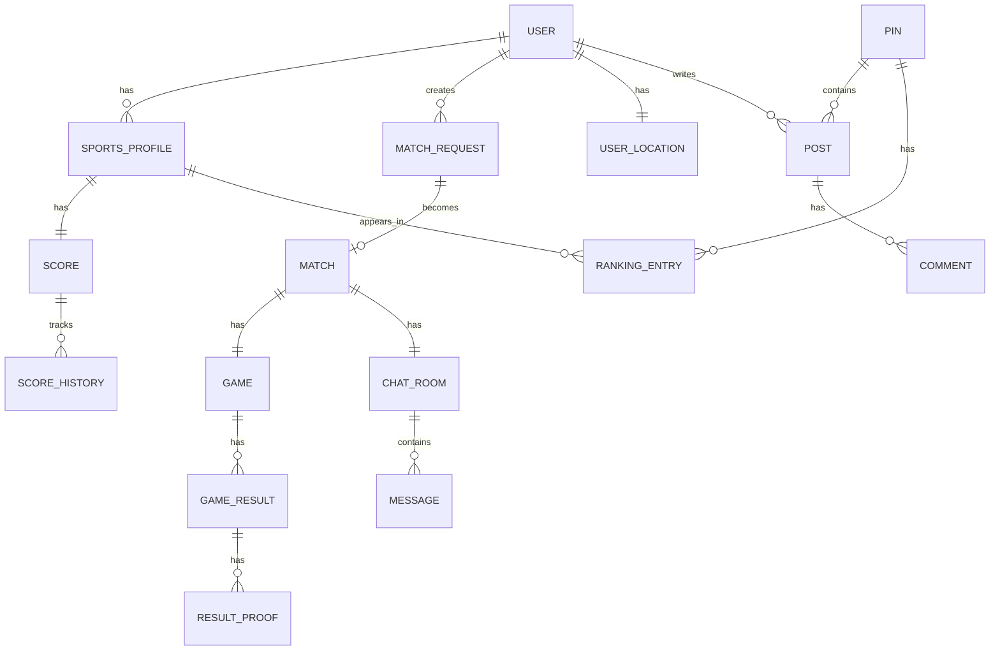

# 위치 기반 스포츠 매칭 플랫폼 종합 기획 문서

> 문서 버전: v1.0
> 작성일: 2026-04-01
> 초기 종목: 골프 (추후 당구, 테니스, 탁구 확장)
> 시스템 구성: 서버(Node.js) + 어드민(React) + 모바일 앱(Flutter)

---

## 목차

1. [PRD - 제품 요구사항 문서](#1-prd---제품-요구사항-문서)
2. [도메인 모델](#2-도메인-모델)
3. [DB 스키마](#3-db-스키마)
4. [API 설계](#4-api-설계)
5. [점수/랭킹/티어 로직](#5-점수랭킹티어-로직)
6. [지역 핀 정책](#6-지역-핀-정책)
7. [앱 화면 구조](#7-앱-화면-구조)
8. [어드민 기능 정의](#8-어드민-기능-정의)
9. [서버 아키텍처](#9-서버-아키텍처)
10. [MVP 개발 로드맵](#10-mvp-개발-로드맵)

---

# 1. PRD - 제품 요구사항 문서

## 1.1 제품 개요

### 비전

"당신 근처의 실력 있는 스포츠 파트너를 찾아드립니다" — 위치와 실력 기반으로 최적의 스포츠 매칭을 제공하는 플랫폼

### 목표

| 구분 | 내용 |
|------|------|
| 비즈니스 목표 | 론칭 6개월 내 MAU 10,000명, 월 매칭 성사 5,000건 |
| 사용자 목표 | 반경 내 비슷한 실력의 상대를 30분 이내에 찾는다 |
| 품질 목표 | 매칭 수락률 60% 이상, 경기 완료율 70% 이상 |

### 대상 사용자 (페르소나)

**페르소나 A: 주말 골퍼 김민준 (35세, 직장인)**
- 주말마다 골프를 치고 싶으나 동반자 구하기가 어려움
- 골프존 G핸디 15 보유, 비슷한 실력의 상대를 원함
- 집 근처 골프장에서 부담 없이 라운딩 원함

**페르소나 B: 경쟁심 강한 골퍼 이서연 (42세, 자영업)**
- 랭킹 경쟁과 티어 상승에 동기 부여됨
- 지역 내 상위권 유지에 자부심을 느낌
- 실력 향상을 위한 다양한 상대와의 경기 원함

**페르소나 C: 신규 골퍼 박지호 (28세, 대학원생)**
- 골프를 시작한 지 1년 미만
- 비슷한 실력의 입문자 동반자를 찾기 어려움
- 부담 없는 매칭과 피드백 원함

---

## 1.2 기능 요구사항 (FR)

### FR-001: 회원 및 프로필 관리

| ID | 기능 | 우선순위 | 수용 기준 |
|----|------|----------|-----------|
| FR-001-1 | 소셜 로그인 (카카오, 애플) | Must | 로그인 후 JWT 토큰 발급, 30초 이내 완료 |
| FR-001-2 | 이메일/비밀번호 로그인 | Should | 이메일 인증 포함 |
| FR-001-3 | 스포츠 프로필 생성 | Must | 종목별 프로필 1개, G핸디 입력 검증 |
| FR-001-4 | 프로필 사진 업로드 | Must | 최대 5MB, JPG/PNG, 자동 리사이징 |
| FR-001-5 | 활동 지역 설정 | Must | 지도에서 핀 선택 또는 현재 위치 자동 설정 |
| FR-001-6 | 매칭 반경 설정 | Must | 1km~50km, 기본값 10km |

### FR-002: 매칭 시스템

| ID | 기능 | 우선순위 | 수용 기준 |
|----|------|----------|-----------|
| FR-002-1 | 자동 매칭 요청 등록 | Must | 종목/날짜/시간대/위치 입력, 즉시 매칭 풀 진입 |
| FR-002-2 | "오늘 대결 나가고 싶다" 즉시 매칭 | Must | 현재 위치 기반, 2시간 이내 상대 탐색 |
| FR-002-3 | 매칭 조건 설정 | Must | 실력 범위(±점수), 거리, 날짜, 시간대 |
| FR-002-4 | 매칭 수락/거절 | Must | 푸시 알림 발송, 30분 내 응답 없으면 자동 거절 |
| FR-002-5 | 매칭 취소 | Must | 경기 24시간 전까지 가능, 반복 취소 시 패널티 |
| FR-002-6 | 매칭 히스토리 조회 | Should | 최근 50건 |

### FR-003: 채팅

| ID | 기능 | 우선순위 | 수용 기준 |
|----|------|----------|-----------|
| FR-003-1 | 1:1 채팅방 자동 생성 | Must | 매칭 성사 즉시 채팅방 오픈 |
| FR-003-2 | 텍스트 메시지 | Must | 실시간, 최대 500자 |
| FR-003-3 | 이미지 메시지 | Should | 최대 10MB |
| FR-003-4 | 골프장/시간 제안 카드 | Could | 구조화된 일정 제안 UI |
| FR-003-5 | 채팅 알림 | Must | 푸시 + 인앱 배지 |
| FR-003-6 | 채팅방 신고 | Must | 욕설/사기 등 신고 기능 |

### FR-004: 경기 결과 처리

| ID | 기능 | 우선순위 | 수용 기준 |
|----|------|----------|-----------|
| FR-004-1 | 경기 결과 사진 업로드 | Must | 스코어카드 사진, 최대 3장 |
| FR-004-2 | 결과 상호 인증 | Must | 양측 모두 동의 시 점수 반영 |
| FR-004-3 | 결과 이의 신청 | Must | 인증 후 48시간 이내 |
| FR-004-4 | 점수 자동 계산 및 반영 | Must | 인증 완료 후 즉시 반영 |
| FR-004-5 | 결과 미입력 패널티 | Should | 경기 후 72시간 내 미입력 시 경고 |

### FR-005: 랭킹 및 티어

| ID | 기능 | 우선순위 | 수용 기준 |
|----|------|----------|-----------|
| FR-005-1 | 지역 핀 단위 랭킹 | Must | 실시간 갱신, 상위 100명 표시 |
| FR-005-2 | 전국 랭킹 | Should | 주 1회 갱신 |
| FR-005-3 | 티어 배지 표시 | Must | 브론즈/실버/골드/플래티넘 |
| FR-005-4 | 랭킹 히스토리 | Could | 월별 랭킹 추이 |

### FR-006: 지역 핀 게시판

| ID | 기능 | 우선순위 | 수용 기준 |
|----|------|----------|-----------|
| FR-006-1 | 핀별 게시판 | Must | 글쓰기/수정/삭제, 최대 2000자 |
| FR-006-2 | 댓글/대댓글 | Must | 2depth |
| FR-006-3 | 게시글 좋아요 | Should | 1인 1회 |
| FR-006-4 | 게시글 신고 | Must | 관리자 검토 |
| FR-006-5 | 사진 첨부 | Should | 게시글당 최대 5장 |

---

## 1.3 비기능 요구사항 (NFR)

| ID | 항목 | 요구사항 |
|----|------|----------|
| NFR-001 | 응답 시간 | API 응답 95% p95 < 300ms |
| NFR-002 | 가용성 | 월 가동률 99.5% 이상 |
| NFR-003 | 동시 접속 | 최대 5,000 동시 접속 처리 |
| NFR-004 | 위치 검색 성능 | 반경 검색 100ms 이내 |
| NFR-005 | 채팅 지연 | 메시지 전달 1초 이내 |
| NFR-006 | 보안 | HTTPS 전용, JWT 만료 7일, Refresh 30일 |
| NFR-007 | 개인정보 | 위치 정보 최소 수집, 동의 기반 |
| NFR-008 | 확장성 | 종목 추가 시 코드 변경 최소화 |

---

## 1.4 제약 조건 및 가정

### 제약 조건
- G핸디는 골프존 공식 데이터를 자체 입력(자동 연동 불가, 추후 API 연동 검토)
- 초기 서비스 지역: 수도권 우선 론칭, 이후 전국 확대
- 결제 시스템: MVP에서 제외, 추후 프리미엄 구독 모델 검토

### 가정
- 사용자는 스마트폰(iOS/Android) 보유
- 경기 결과 인증은 스코어카드 사진 기반(자동 OCR은 추후 적용)
- 핀 데이터는 행정동 기반으로 초기 구성

---

## 1.5 MoSCoW 우선순위 요약

| Must (MVP 필수) | Should (MVP 이후) | Could (확장) | Won't (현재 제외) |
|-----------------|-------------------|--------------|-------------------|
| 소셜 로그인 | 이메일 로그인 | 골프장 API 연동 | 실시간 스코어 추적 |
| 프로필 + G핸디 입력 | 전국 랭킹 | OCR 결과 인증 | 동영상 업로드 |
| 자동 매칭 | 랭킹 히스토리 | 코치 매칭 | 베팅 시스템 |
| 1:1 채팅 | 게시글 좋아요 | 다중 종목 동시 활성 | NFT 티어 |
| 결과 인증 + 점수 반영 | 프리미엄 배지 | 리그 시스템 | |
| 지역 핀 랭킹 | | | |
| 핀 게시판 | | | |

---

# 2. 도메인 모델

## 2.1 핵심 도메인 객체 정의

### Bounded Context 구분

```
┌─────────────────────────────────────────────────────────────┐
│                    Identity Context                          │
│  User, UserProfile, SportsProfile                           │
├─────────────────────────────────────────────────────────────┤
│                    Matching Context                          │
│  MatchRequest, Match, MatchCondition                        │
├─────────────────────────────────────────────────────────────┤
│                    Game Context                              │
│  Game, GameResult, ResultProof, Dispute                     │
├─────────────────────────────────────────────────────────────┤
│                    Ranking Context                           │
│  Score, RankingEntry, Tier, PinRanking                      │
├─────────────────────────────────────────────────────────────┤
│                    Community Context                         │
│  Pin, Post, Comment, Board                                  │
├─────────────────────────────────────────────────────────────┤
│                    Messaging Context                         │
│  ChatRoom, Message, Notification                            │
└─────────────────────────────────────────────────────────────┘
```

## 2.2 엔티티 관계도 (ERD 개요)



## 2.3 핵심 도메인 객체 상세 정의

### User (사용자)
```
User {
  id: UUID (PK)
  email: String (unique, nullable - 소셜 로그인 시 선택)
  nickname: String (unique, max 20자)
  profileImageUrl: String
  phone: String (nullable)
  status: Enum [ACTIVE, SUSPENDED, WITHDRAWN]
  createdAt: DateTime
  lastLoginAt: DateTime
}
```

### SportsProfile (스포츠 프로필)
스포츠별 확장 가능한 구조 — sport_type + JSON 확장 필드 패턴 사용
```
SportsProfile {
  id: UUID (PK)
  userId: UUID (FK)
  sportType: Enum [GOLF, BILLIARDS, TENNIS, TABLE_TENNIS]
  displayName: String
  initialScore: Integer       // 초기 산정 점수
  currentScore: Integer       // 현재 ELO 점수
  tier: Enum [BRONZE, SILVER, GOLD, PLATINUM]
  gHandicap: Float (nullable) // 골프 전용: G핸디
  extraData: JSONB            // 종목별 추가 데이터
  isVerified: Boolean         // 실력 인증 여부
  gamesPlayed: Integer
  wins: Integer
  losses: Integer
  createdAt: DateTime
}
```

### MatchRequest (매칭 요청)
```
MatchRequest {
  id: UUID (PK)
  requesterId: UUID (FK -> User)
  sportType: Enum
  requestType: Enum [SCHEDULED, INSTANT]  // INSTANT = "오늘 대결"
  desiredDate: Date
  desiredTimeSlot: Enum [MORNING, AFTERNOON, EVENING, ANY]
  location: Point (경위도)
  locationName: String
  radiusKm: Float
  minScoreOpponent: Integer   // 상대 점수 하한
  maxScoreOpponent: Integer   // 상대 점수 상한
  status: Enum [WAITING, MATCHED, CANCELLED, EXPIRED]
  expiresAt: DateTime
  createdAt: DateTime
}
```

### Match (매칭)
```
Match {
  id: UUID (PK)
  matchRequestId: UUID (FK)
  requesterProfileId: UUID (FK -> SportsProfile)
  opponentProfileId: UUID (FK -> SportsProfile)
  sportType: Enum
  scheduledDate: Date (nullable, 채팅 후 확정)
  status: Enum [CHAT, CONFIRMED, COMPLETED, CANCELLED, DISPUTED]
  chatRoomId: UUID (FK)
  confirmedAt: DateTime
  completedAt: DateTime
  createdAt: DateTime
}
```

### Game (경기)
```
Game {
  id: UUID (PK)
  matchId: UUID (FK)
  sportType: Enum
  venueName: String           // 골프장명
  venueLocation: Point
  playedAt: DateTime
  scoreData: JSONB            // 종목별 경기 결과 (타수, 세트 등)
  resultStatus: Enum [PENDING, PROOF_UPLOADED, VERIFIED, DISPUTED, VOIDED]
  winnerId: UUID (FK -> SportsProfile, nullable)
  createdAt: DateTime
}
```

### Score (점수)
```
Score {
  id: UUID (PK)
  sportsProfileId: UUID (FK)
  currentElo: Integer
  peakElo: Integer
  seasonElo: Integer
  gamesPlayed: Integer
  updatedAt: DateTime
}
```

### Pin (지역 핀)
```
Pin {
  id: UUID (PK)
  name: String                // "강남구 역삼동"
  center: Point               // 핀 중심 좌표
  boundary: Polygon           // 핀 경계
  level: Enum [DISTRICT, REGION, PROVINCE]  // 동/구/광역
  parentPinId: UUID (nullable)
  isActive: Boolean
  userCount: Integer          // 해당 핀 활성 사용자 수
  createdAt: DateTime
}
```

### RankingEntry (랭킹 항목)
```
RankingEntry {
  id: UUID (PK)
  pinId: UUID (FK)
  sportsProfileId: UUID (FK)
  sportType: Enum
  rank: Integer
  score: Integer
  tier: Enum
  updatedAt: DateTime
}
```

---

# 3. DB 스키마

## 3.1 기술 선택

- **RDBMS**: PostgreSQL 16 (PostGIS 확장 — 위치 기반 쿼리)
- **Cache**: Redis 7 (랭킹, 세션, 채팅 임시 저장)
- **File Storage**: AWS S3 (프로필 사진, 결과 사진)

## 3.2 테이블 정의

### users

```sql
CREATE TABLE users (
    id              UUID PRIMARY KEY DEFAULT gen_random_uuid(),
    email           VARCHAR(255) UNIQUE,
    nickname        VARCHAR(20) NOT NULL UNIQUE,
    profile_image_url TEXT,
    phone           VARCHAR(20),
    status          VARCHAR(20) NOT NULL DEFAULT 'ACTIVE'
                    CHECK (status IN ('ACTIVE', 'SUSPENDED', 'WITHDRAWN')),
    created_at      TIMESTAMPTZ NOT NULL DEFAULT NOW(),
    updated_at      TIMESTAMPTZ NOT NULL DEFAULT NOW(),
    last_login_at   TIMESTAMPTZ
);

CREATE INDEX idx_users_email ON users(email) WHERE email IS NOT NULL;
CREATE INDEX idx_users_nickname ON users(nickname);
CREATE INDEX idx_users_status ON users(status);
```

### social_accounts

```sql
CREATE TABLE social_accounts (
    id              UUID PRIMARY KEY DEFAULT gen_random_uuid(),
    user_id         UUID NOT NULL REFERENCES users(id) ON DELETE CASCADE,
    provider        VARCHAR(20) NOT NULL CHECK (provider IN ('KAKAO', 'APPLE', 'GOOGLE')),
    provider_id     VARCHAR(255) NOT NULL,
    access_token    TEXT,
    refresh_token   TEXT,
    created_at      TIMESTAMPTZ NOT NULL DEFAULT NOW(),
    UNIQUE (provider, provider_id)
);

CREATE INDEX idx_social_accounts_user_id ON social_accounts(user_id);
```

### user_locations

```sql
CREATE EXTENSION IF NOT EXISTS postgis;

CREATE TABLE user_locations (
    id              UUID PRIMARY KEY DEFAULT gen_random_uuid(),
    user_id         UUID NOT NULL UNIQUE REFERENCES users(id) ON DELETE CASCADE,
    current_point   GEOGRAPHY(POINT, 4326),   -- 현재 위치
    home_point      GEOGRAPHY(POINT, 4326),   -- 활동 거점
    home_address    VARCHAR(255),
    match_radius_km FLOAT NOT NULL DEFAULT 10.0
                    CHECK (match_radius_km BETWEEN 1 AND 50),
    updated_at      TIMESTAMPTZ NOT NULL DEFAULT NOW()
);

CREATE INDEX idx_user_locations_home_point
    ON user_locations USING GIST(home_point);
CREATE INDEX idx_user_locations_current_point
    ON user_locations USING GIST(current_point);
```

### sports_profiles

```sql
CREATE TABLE sports_profiles (
    id              UUID PRIMARY KEY DEFAULT gen_random_uuid(),
    user_id         UUID NOT NULL REFERENCES users(id) ON DELETE CASCADE,
    sport_type      VARCHAR(20) NOT NULL
                    CHECK (sport_type IN ('GOLF', 'BILLIARDS', 'TENNIS', 'TABLE_TENNIS')),
    display_name    VARCHAR(50),
    g_handicap      NUMERIC(4,1),             -- 골프 전용 G핸디 (0.0~54.0)
    initial_score   INTEGER NOT NULL DEFAULT 1000,
    current_score   INTEGER NOT NULL DEFAULT 1000,
    tier            VARCHAR(20) NOT NULL DEFAULT 'BRONZE'
                    CHECK (tier IN ('BRONZE', 'SILVER', 'GOLD', 'PLATINUM')),
    is_verified     BOOLEAN NOT NULL DEFAULT FALSE,
    games_played    INTEGER NOT NULL DEFAULT 0,
    wins            INTEGER NOT NULL DEFAULT 0,
    losses          INTEGER NOT NULL DEFAULT 0,
    draws           INTEGER NOT NULL DEFAULT 0,
    extra_data      JSONB DEFAULT '{}',        -- 종목별 확장 필드
    is_active       BOOLEAN NOT NULL DEFAULT TRUE,
    created_at      TIMESTAMPTZ NOT NULL DEFAULT NOW(),
    updated_at      TIMESTAMPTZ NOT NULL DEFAULT NOW(),
    UNIQUE (user_id, sport_type)
);

CREATE INDEX idx_sports_profiles_user_id ON sports_profiles(user_id);
CREATE INDEX idx_sports_profiles_sport_type ON sports_profiles(sport_type);
CREATE INDEX idx_sports_profiles_current_score ON sports_profiles(current_score);
CREATE INDEX idx_sports_profiles_tier ON sports_profiles(tier);
```

### score_histories

```sql
CREATE TABLE score_histories (
    id                  UUID PRIMARY KEY DEFAULT gen_random_uuid(),
    sports_profile_id   UUID NOT NULL REFERENCES sports_profiles(id),
    game_id             UUID,                  -- 경기 기반 변동 시 FK
    change_type         VARCHAR(30) NOT NULL
                        CHECK (change_type IN ('GAME_WIN', 'GAME_LOSS', 'GAME_DRAW',
                                               'INITIAL', 'ADJUSTMENT', 'SEASON_RESET')),
    score_before        INTEGER NOT NULL,
    score_change        INTEGER NOT NULL,      -- 양수/음수
    score_after         INTEGER NOT NULL,
    opponent_score      INTEGER,               -- 상대 점수 (K 계수 계산용)
    k_factor            INTEGER,               -- 적용된 K 계수
    created_at          TIMESTAMPTZ NOT NULL DEFAULT NOW()
);

CREATE INDEX idx_score_histories_sports_profile_id
    ON score_histories(sports_profile_id, created_at DESC);
CREATE INDEX idx_score_histories_game_id ON score_histories(game_id);
```

### pins

```sql
CREATE TABLE pins (
    id              UUID PRIMARY KEY DEFAULT gen_random_uuid(),
    name            VARCHAR(100) NOT NULL,
    slug            VARCHAR(100) NOT NULL UNIQUE,  -- URL용 식별자
    center          GEOGRAPHY(POINT, 4326) NOT NULL,
    boundary        GEOGRAPHY(POLYGON, 4326),
    level           VARCHAR(20) NOT NULL
                    CHECK (level IN ('DONG', 'GU', 'CITY', 'PROVINCE')),
    parent_pin_id   UUID REFERENCES pins(id),
    region_code     VARCHAR(10),               -- 행정동 코드
    is_active       BOOLEAN NOT NULL DEFAULT TRUE,
    user_count      INTEGER NOT NULL DEFAULT 0,
    metadata        JSONB DEFAULT '{}',
    created_at      TIMESTAMPTZ NOT NULL DEFAULT NOW()
);

CREATE INDEX idx_pins_center ON pins USING GIST(center);
CREATE INDEX idx_pins_boundary ON pins USING GIST(boundary);
CREATE INDEX idx_pins_parent_pin_id ON pins(parent_pin_id);
CREATE INDEX idx_pins_level ON pins(level);
```

### user_pins (사용자-핀 연관)

```sql
CREATE TABLE user_pins (
    id              UUID PRIMARY KEY DEFAULT gen_random_uuid(),
    user_id         UUID NOT NULL REFERENCES users(id) ON DELETE CASCADE,
    pin_id          UUID NOT NULL REFERENCES pins(id),
    is_primary      BOOLEAN NOT NULL DEFAULT FALSE,  -- 주 활동 핀
    joined_at       TIMESTAMPTZ NOT NULL DEFAULT NOW(),
    UNIQUE (user_id, pin_id)
);

CREATE INDEX idx_user_pins_user_id ON user_pins(user_id);
CREATE INDEX idx_user_pins_pin_id ON user_pins(pin_id);
```

### match_requests

```sql
CREATE TABLE match_requests (
    id                  UUID PRIMARY KEY DEFAULT gen_random_uuid(),
    requester_id        UUID NOT NULL REFERENCES users(id),
    sports_profile_id   UUID NOT NULL REFERENCES sports_profiles(id),
    sport_type          VARCHAR(20) NOT NULL,
    request_type        VARCHAR(20) NOT NULL DEFAULT 'SCHEDULED'
                        CHECK (request_type IN ('SCHEDULED', 'INSTANT')),
    desired_date        DATE,
    desired_time_slot   VARCHAR(20)
                        CHECK (desired_time_slot IN ('MORNING', 'AFTERNOON', 'EVENING', 'ANY')),
    location_point      GEOGRAPHY(POINT, 4326) NOT NULL,
    location_name       VARCHAR(255),
    radius_km           FLOAT NOT NULL DEFAULT 10.0,
    min_opponent_score  INTEGER NOT NULL DEFAULT 800,
    max_opponent_score  INTEGER NOT NULL DEFAULT 1200,
    message             TEXT,
    status              VARCHAR(20) NOT NULL DEFAULT 'WAITING'
                        CHECK (status IN ('WAITING', 'MATCHED', 'CANCELLED', 'EXPIRED')),
    expires_at          TIMESTAMPTZ NOT NULL,
    created_at          TIMESTAMPTZ NOT NULL DEFAULT NOW(),
    updated_at          TIMESTAMPTZ NOT NULL DEFAULT NOW()
);

CREATE INDEX idx_match_requests_location ON match_requests USING GIST(location_point);
CREATE INDEX idx_match_requests_status ON match_requests(status, sport_type);
CREATE INDEX idx_match_requests_requester_id ON match_requests(requester_id);
CREATE INDEX idx_match_requests_expires_at ON match_requests(expires_at)
    WHERE status = 'WAITING';
```

### matches

```sql
CREATE TABLE matches (
    id                      UUID PRIMARY KEY DEFAULT gen_random_uuid(),
    match_request_id        UUID REFERENCES match_requests(id),
    requester_profile_id    UUID NOT NULL REFERENCES sports_profiles(id),
    opponent_profile_id     UUID NOT NULL REFERENCES sports_profiles(id),
    sport_type              VARCHAR(20) NOT NULL,
    scheduled_date          DATE,
    scheduled_time          TIME,
    venue_name              VARCHAR(255),
    venue_location          GEOGRAPHY(POINT, 4326),
    status                  VARCHAR(20) NOT NULL DEFAULT 'CHAT'
                            CHECK (status IN ('CHAT', 'CONFIRMED', 'COMPLETED',
                                              'CANCELLED', 'DISPUTED')),
    chat_room_id            UUID,
    confirmed_at            TIMESTAMPTZ,
    completed_at            TIMESTAMPTZ,
    cancelled_by            UUID REFERENCES users(id),
    cancel_reason           TEXT,
    created_at              TIMESTAMPTZ NOT NULL DEFAULT NOW(),
    updated_at              TIMESTAMPTZ NOT NULL DEFAULT NOW()
);

CREATE INDEX idx_matches_requester_profile_id ON matches(requester_profile_id);
CREATE INDEX idx_matches_opponent_profile_id ON matches(opponent_profile_id);
CREATE INDEX idx_matches_status ON matches(status);
CREATE INDEX idx_matches_created_at ON matches(created_at DESC);
```

### games

```sql
CREATE TABLE games (
    id                  UUID PRIMARY KEY DEFAULT gen_random_uuid(),
    match_id            UUID NOT NULL UNIQUE REFERENCES matches(id),
    sport_type          VARCHAR(20) NOT NULL,
    venue_name          VARCHAR(255),
    venue_location      GEOGRAPHY(POINT, 4326),
    played_at           TIMESTAMPTZ,
    score_data          JSONB DEFAULT '{}',     -- 종목별 점수 데이터
    result_status       VARCHAR(20) NOT NULL DEFAULT 'PENDING'
                        CHECK (result_status IN ('PENDING', 'PROOF_UPLOADED',
                                                 'VERIFIED', 'DISPUTED', 'VOIDED')),
    winner_profile_id   UUID REFERENCES sports_profiles(id),
    requester_score     INTEGER,                -- 요청자 타수/점수
    opponent_score      INTEGER,                -- 상대 타수/점수
    result_input_deadline TIMESTAMPTZ,          -- 결과 입력 기한
    verified_at         TIMESTAMPTZ,
    created_at          TIMESTAMPTZ NOT NULL DEFAULT NOW(),
    updated_at          TIMESTAMPTZ NOT NULL DEFAULT NOW()
);

CREATE INDEX idx_games_match_id ON games(match_id);
CREATE INDEX idx_games_result_status ON games(result_status);
CREATE INDEX idx_games_winner_profile_id ON games(winner_profile_id);
```

### game_result_proofs (결과 증빙)

```sql
CREATE TABLE game_result_proofs (
    id                  UUID PRIMARY KEY DEFAULT gen_random_uuid(),
    game_id             UUID NOT NULL REFERENCES games(id),
    uploaded_by         UUID NOT NULL REFERENCES users(id),
    image_url           TEXT NOT NULL,
    image_type          VARCHAR(30)
                        CHECK (image_type IN ('SCORECARD', 'RECEIPT', 'OTHER')),
    ocr_data            JSONB,                 -- 추후 OCR 결과 저장
    is_approved         BOOLEAN,               -- NULL=미검토, TRUE=승인, FALSE=거부
    reviewed_by         UUID REFERENCES users(id),  -- 관리자 또는 자동
    created_at          TIMESTAMPTZ NOT NULL DEFAULT NOW()
);

CREATE INDEX idx_game_result_proofs_game_id ON game_result_proofs(game_id);
```

### result_confirmations (상호 인증)

```sql
CREATE TABLE result_confirmations (
    id              UUID PRIMARY KEY DEFAULT gen_random_uuid(),
    game_id         UUID NOT NULL REFERENCES games(id),
    user_id         UUID NOT NULL REFERENCES users(id),
    is_confirmed    BOOLEAN NOT NULL,
    comment         TEXT,
    confirmed_at    TIMESTAMPTZ NOT NULL DEFAULT NOW(),
    UNIQUE (game_id, user_id)
);
```

### chat_rooms

```sql
CREATE TABLE chat_rooms (
    id              UUID PRIMARY KEY DEFAULT gen_random_uuid(),
    match_id        UUID UNIQUE REFERENCES matches(id),
    room_type       VARCHAR(20) NOT NULL DEFAULT 'MATCH'
                    CHECK (room_type IN ('MATCH', 'SUPPORT')),
    status          VARCHAR(20) NOT NULL DEFAULT 'ACTIVE'
                    CHECK (status IN ('ACTIVE', 'ARCHIVED', 'BLOCKED')),
    last_message_at TIMESTAMPTZ,
    created_at      TIMESTAMPTZ NOT NULL DEFAULT NOW()
);
```

### messages

```sql
CREATE TABLE messages (
    id              UUID PRIMARY KEY DEFAULT gen_random_uuid(),
    chat_room_id    UUID NOT NULL REFERENCES chat_rooms(id),
    sender_id       UUID NOT NULL REFERENCES users(id),
    message_type    VARCHAR(20) NOT NULL DEFAULT 'TEXT'
                    CHECK (message_type IN ('TEXT', 'IMAGE', 'SYSTEM', 'SCHEDULE_PROPOSAL')),
    content         TEXT,
    image_url       TEXT,
    extra_data      JSONB DEFAULT '{}',        -- 일정 제안 등 구조화 데이터
    is_deleted      BOOLEAN NOT NULL DEFAULT FALSE,
    created_at      TIMESTAMPTZ NOT NULL DEFAULT NOW()
);

CREATE INDEX idx_messages_chat_room_id ON messages(chat_room_id, created_at DESC);
CREATE INDEX idx_messages_sender_id ON messages(sender_id);
```

### ranking_entries (랭킹 스냅샷)

```sql
CREATE TABLE ranking_entries (
    id                  UUID PRIMARY KEY DEFAULT gen_random_uuid(),
    pin_id              UUID NOT NULL REFERENCES pins(id),
    sports_profile_id   UUID NOT NULL REFERENCES sports_profiles(id),
    sport_type          VARCHAR(20) NOT NULL,
    rank                INTEGER NOT NULL,
    score               INTEGER NOT NULL,
    tier                VARCHAR(20) NOT NULL,
    games_played        INTEGER NOT NULL DEFAULT 0,
    updated_at          TIMESTAMPTZ NOT NULL DEFAULT NOW(),
    UNIQUE (pin_id, sports_profile_id, sport_type)
);

CREATE INDEX idx_ranking_entries_pin_sport ON ranking_entries(pin_id, sport_type, rank);
CREATE INDEX idx_ranking_entries_sports_profile ON ranking_entries(sports_profile_id);
```

### posts (게시판)

```sql
CREATE TABLE posts (
    id              UUID PRIMARY KEY DEFAULT gen_random_uuid(),
    pin_id          UUID NOT NULL REFERENCES pins(id),
    author_id       UUID NOT NULL REFERENCES users(id),
    title           VARCHAR(100) NOT NULL,
    content         TEXT NOT NULL,
    category        VARCHAR(30) DEFAULT 'GENERAL'
                    CHECK (category IN ('GENERAL', 'MATCH_SEEK', 'REVIEW', 'NOTICE')),
    view_count      INTEGER NOT NULL DEFAULT 0,
    like_count      INTEGER NOT NULL DEFAULT 0,
    comment_count   INTEGER NOT NULL DEFAULT 0,
    is_deleted      BOOLEAN NOT NULL DEFAULT FALSE,
    created_at      TIMESTAMPTZ NOT NULL DEFAULT NOW(),
    updated_at      TIMESTAMPTZ NOT NULL DEFAULT NOW()
);

CREATE INDEX idx_posts_pin_id ON posts(pin_id, created_at DESC);
CREATE INDEX idx_posts_author_id ON posts(author_id);
```

### post_images

```sql
CREATE TABLE post_images (
    id          UUID PRIMARY KEY DEFAULT gen_random_uuid(),
    post_id     UUID NOT NULL REFERENCES posts(id) ON DELETE CASCADE,
    image_url   TEXT NOT NULL,
    sort_order  INTEGER NOT NULL DEFAULT 0,
    created_at  TIMESTAMPTZ NOT NULL DEFAULT NOW()
);
```

### comments

```sql
CREATE TABLE comments (
    id          UUID PRIMARY KEY DEFAULT gen_random_uuid(),
    post_id     UUID NOT NULL REFERENCES posts(id) ON DELETE CASCADE,
    author_id   UUID NOT NULL REFERENCES users(id),
    parent_id   UUID REFERENCES comments(id),   -- 대댓글
    content     TEXT NOT NULL,
    is_deleted  BOOLEAN NOT NULL DEFAULT FALSE,
    created_at  TIMESTAMPTZ NOT NULL DEFAULT NOW(),
    updated_at  TIMESTAMPTZ NOT NULL DEFAULT NOW()
);

CREATE INDEX idx_comments_post_id ON comments(post_id, created_at);
CREATE INDEX idx_comments_parent_id ON comments(parent_id);
```

### notifications

```sql
CREATE TABLE notifications (
    id              UUID PRIMARY KEY DEFAULT gen_random_uuid(),
    user_id         UUID NOT NULL REFERENCES users(id) ON DELETE CASCADE,
    type            VARCHAR(50) NOT NULL,
    title           VARCHAR(255) NOT NULL,
    body            TEXT,
    data            JSONB DEFAULT '{}',        -- 딥링크 등 추가 데이터
    is_read         BOOLEAN NOT NULL DEFAULT FALSE,
    created_at      TIMESTAMPTZ NOT NULL DEFAULT NOW()
);

CREATE INDEX idx_notifications_user_id ON notifications(user_id, created_at DESC);
CREATE INDEX idx_notifications_unread ON notifications(user_id)
    WHERE is_read = FALSE;
```

### reports (신고)

```sql
CREATE TABLE reports (
    id              UUID PRIMARY KEY DEFAULT gen_random_uuid(),
    reporter_id     UUID NOT NULL REFERENCES users(id),
    target_type     VARCHAR(30) NOT NULL
                    CHECK (target_type IN ('USER', 'POST', 'COMMENT', 'GAME_RESULT', 'CHAT')),
    target_id       UUID NOT NULL,
    reason          VARCHAR(50) NOT NULL,
    description     TEXT,
    status          VARCHAR(20) NOT NULL DEFAULT 'PENDING'
                    CHECK (status IN ('PENDING', 'REVIEWED', 'RESOLVED', 'DISMISSED')),
    resolved_by     UUID REFERENCES users(id),
    resolved_at     TIMESTAMPTZ,
    created_at      TIMESTAMPTZ NOT NULL DEFAULT NOW()
);

CREATE INDEX idx_reports_target ON reports(target_type, target_id);
CREATE INDEX idx_reports_status ON reports(status, created_at);
```

## 3.3 파티셔닝 전략

```sql
-- messages 테이블: 월별 파티셔닝 (대용량 예상)
CREATE TABLE messages (
    ...
    created_at TIMESTAMPTZ NOT NULL DEFAULT NOW()
) PARTITION BY RANGE (created_at);

CREATE TABLE messages_2026_04 PARTITION OF messages
    FOR VALUES FROM ('2026-04-01') TO ('2026-05-01');

-- score_histories: 연별 파티셔닝
CREATE TABLE score_histories_2026 PARTITION OF score_histories
    FOR VALUES FROM ('2026-01-01') TO ('2027-01-01');
```

---

# 4. API 설계

## 4.1 기본 규칙

| 항목 | 규칙 |
|------|------|
| Base URL | `https://api.sportsmatch.kr/v1` |
| 인증 | Bearer JWT (Authorization 헤더) |
| 응답 형식 | JSON, UTF-8 |
| 날짜 형식 | ISO 8601 (YYYY-MM-DDTHH:mm:ssZ) |
| 페이지네이션 | cursor 기반 (`cursor`, `limit` 파라미터) |
| 에러 형식 | `{ code, message, details }` |

### 표준 응답 구조

```json
{
  "success": true,
  "data": { ... },
  "meta": {
    "cursor": "next_cursor_value",
    "hasMore": true
  }
}
```

### 표준 에러 구조

```json
{
  "success": false,
  "error": {
    "code": "MATCH_001",
    "message": "매칭 요청을 찾을 수 없습니다.",
    "details": {}
  }
}
```

---

## 4.2 인증 API

### POST /auth/kakao
카카오 소셜 로그인

**Request**
```json
{
  "accessToken": "kakao_access_token"
}
```

**Response 200**
```json
{
  "success": true,
  "data": {
    "accessToken": "eyJhbGci...",
    "refreshToken": "eyJhbGci...",
    "user": {
      "id": "uuid",
      "nickname": "골프왕김민준",
      "profileImageUrl": "https://...",
      "isNewUser": true
    }
  }
}
```

### POST /auth/apple
애플 소셜 로그인

**Request**
```json
{
  "identityToken": "apple_identity_token",
  "authorizationCode": "apple_auth_code"
}
```

### POST /auth/refresh
액세스 토큰 갱신

**Request**
```json
{ "refreshToken": "eyJhbGci..." }
```

### POST /auth/logout
**Header**: Authorization: Bearer {token}

---

## 4.3 사용자/프로필 API

### GET /users/me
내 정보 조회

**Response 200**
```json
{
  "data": {
    "id": "uuid",
    "nickname": "골프왕김민준",
    "profileImageUrl": "https://...",
    "sportsProfiles": [
      {
        "id": "uuid",
        "sportType": "GOLF",
        "currentScore": 1150,
        "tier": "SILVER",
        "gHandicap": 12.5,
        "gamesPlayed": 23,
        "wins": 14,
        "losses": 9
      }
    ],
    "location": {
      "homeAddress": "서울 강남구 역삼동",
      "matchRadiusKm": 15
    }
  }
}
```

### PATCH /users/me
내 정보 수정

**Request**
```json
{
  "nickname": "새닉네임",
  "profileImageUrl": "https://..."
}
```

### POST /users/me/location
활동 지역 설정

**Request**
```json
{
  "latitude": 37.5012,
  "longitude": 127.0396,
  "address": "서울 강남구 역삼동",
  "matchRadiusKm": 15
}
```

### POST /sports-profiles
스포츠 프로필 생성

**Request**
```json
{
  "sportType": "GOLF",
  "displayName": "주말 골퍼",
  "gHandicap": 12.5
}
```

**Response 201**
```json
{
  "data": {
    "id": "uuid",
    "sportType": "GOLF",
    "initialScore": 1150,
    "currentScore": 1150,
    "tier": "SILVER",
    "gHandicap": 12.5
  }
}
```

### PATCH /sports-profiles/:id
스포츠 프로필 수정

### GET /users/:id/profile
타 사용자 프로필 조회 (공개 정보만)

---

## 4.4 매칭 API

### POST /matches/requests
매칭 요청 생성

**Request**
```json
{
  "sportType": "GOLF",
  "requestType": "SCHEDULED",
  "desiredDate": "2026-04-15",
  "desiredTimeSlot": "MORNING",
  "latitude": 37.5012,
  "longitude": 127.0396,
  "locationName": "강남 근처",
  "radiusKm": 15,
  "minOpponentScore": 1050,
  "maxOpponentScore": 1250,
  "message": "주말 라운딩 같이 하실 분"
}
```

**Response 201**
```json
{
  "data": {
    "id": "uuid",
    "status": "WAITING",
    "expiresAt": "2026-04-15T23:59:59Z",
    "candidatesCount": 3
  }
}
```

### POST /matches/instant
"오늘 대결" 즉시 매칭 요청

**Request**
```json
{
  "sportType": "GOLF",
  "latitude": 37.5012,
  "longitude": 127.0396,
  "availableUntil": "2026-04-01T18:00:00Z"
}
```

### GET /matches/requests
내 매칭 요청 목록

**Query**: `status`, `sportType`, `cursor`, `limit`

### DELETE /matches/requests/:id
매칭 요청 취소

### GET /matches
내 매칭 목록

**Query**: `status`, `cursor`, `limit`

**Response 200**
```json
{
  "data": [
    {
      "id": "uuid",
      "status": "CHAT",
      "sportType": "GOLF",
      "opponent": {
        "id": "uuid",
        "nickname": "이서연프로",
        "tier": "GOLD",
        "currentScore": 1320,
        "profileImageUrl": "https://..."
      },
      "scheduledDate": "2026-04-15",
      "chatRoomId": "uuid",
      "createdAt": "2026-04-01T10:00:00Z"
    }
  ]
}
```

### GET /matches/:id
매칭 상세 조회

### PATCH /matches/:id/confirm
경기 확정 (날짜/장소 확정)

**Request**
```json
{
  "scheduledDate": "2026-04-15",
  "scheduledTime": "09:00",
  "venueName": "강남컨트리클럽",
  "venueLatitude": 37.49,
  "venueLongitude": 127.03
}
```

### PATCH /matches/:id/cancel
경기 취소

---

## 4.5 경기 결과 API

### POST /games/:gameId/proofs
결과 사진 업로드

**Request (multipart/form-data)**
```
images: [File, File, ...]  (최대 3장)
imageType: SCORECARD
```

**Response 201**
```json
{
  "data": {
    "gameId": "uuid",
    "proofs": [
      { "id": "uuid", "imageUrl": "https://...", "imageType": "SCORECARD" }
    ],
    "resultStatus": "PROOF_UPLOADED"
  }
}
```

### POST /games/:gameId/result
경기 결과 입력

**Request**
```json
{
  "myScore": 82,
  "opponentScore": 88,
  "winnerId": "my_sports_profile_id"
}
```

### POST /games/:gameId/confirm
결과 인증 동의/거절

**Request**
```json
{
  "isConfirmed": true,
  "comment": "정확한 결과입니다"
}
```

### POST /games/:gameId/dispute
결과 이의 신청

**Request**
```json
{
  "reason": "상대가 잘못된 스코어를 입력했습니다",
  "evidenceImageUrls": ["https://..."]
}
```

---

## 4.6 채팅 API

### GET /chat-rooms
내 채팅방 목록

**Response 200**
```json
{
  "data": [
    {
      "id": "uuid",
      "matchId": "uuid",
      "opponent": {
        "id": "uuid",
        "nickname": "이서연프로",
        "profileImageUrl": "https://..."
      },
      "lastMessage": {
        "content": "강남CC 어떠세요?",
        "createdAt": "2026-04-01T10:30:00Z"
      },
      "unreadCount": 2
    }
  ]
}
```

### GET /chat-rooms/:id/messages
메시지 목록 (cursor 기반 페이지네이션)

**Query**: `cursor`, `limit` (기본 50)

### POST /chat-rooms/:id/messages
메시지 전송 (HTTP fallback, 실제는 WebSocket)

**Request**
```json
{
  "messageType": "TEXT",
  "content": "내일 오전 강남CC 어떠세요?"
}
```

---

## 4.7 랭킹 API

### GET /rankings/pins/:pinId
핀 랭킹 조회

**Query**: `sportType`, `limit` (기본 50, 최대 100)

**Response 200**
```json
{
  "data": {
    "pin": {
      "id": "uuid",
      "name": "강남구 역삼동",
      "level": "DONG"
    },
    "rankings": [
      {
        "rank": 1,
        "sportsProfile": {
          "id": "uuid",
          "nickname": "이서연프로",
          "tier": "GOLD",
          "score": 1420,
          "gamesPlayed": 45
        }
      }
    ],
    "myRank": {
      "rank": 12,
      "score": 1150
    }
  }
}
```

### GET /rankings/nearby
현재 위치 기반 핀 랭킹

**Query**: `latitude`, `longitude`, `sportType`

### GET /rankings/national
전국 랭킹

**Query**: `sportType`, `cursor`, `limit`

---

## 4.8 핀/게시판 API

### GET /pins/nearby
주변 핀 목록

**Query**: `latitude`, `longitude`, `radius` (km)

**Response 200**
```json
{
  "data": [
    {
      "id": "uuid",
      "name": "강남구 역삼동",
      "level": "DONG",
      "center": { "lat": 37.5012, "lng": 127.0396 },
      "userCount": 234,
      "activeMatchRequests": 5
    }
  ]
}
```

### GET /pins/:id
핀 상세 조회

### GET /pins/:pinId/posts
게시글 목록

**Query**: `category`, `cursor`, `limit`

### POST /pins/:pinId/posts
게시글 작성

**Request (multipart/form-data)**
```
title: 역삼동 골퍼 모여요
content: 주말 라운딩 같이 하실 분 구합니다...
category: MATCH_SEEK
images: [File, ...]
```

### GET /pins/:pinId/posts/:postId
게시글 상세

### PATCH /pins/:pinId/posts/:postId
게시글 수정

### DELETE /pins/:pinId/posts/:postId
게시글 삭제

### POST /pins/:pinId/posts/:postId/comments
댓글 작성

### POST /pins/:pinId/posts/:postId/like
좋아요 토글

---

## 4.9 알림 API

### GET /notifications
알림 목록

**Query**: `isRead`, `cursor`, `limit`

### PATCH /notifications/read-all
전체 읽음 처리

### PATCH /notifications/:id/read
단건 읽음 처리

### POST /devices/push-token
푸시 토큰 등록

**Request**
```json
{
  "token": "fcm_or_apns_token",
  "platform": "ANDROID"
}
```

### DELETE /devices/push-token
푸시 토큰 해제 (로그아웃 시)

**Request**
```json
{
  "token": "fcm_or_apns_token"
}
```

### PATCH /notifications/settings
알림 설정 변경

**Request**
```json
{
  "chatMessage": true,
  "matchFound": true,
  "matchRequest": true,
  "gameResult": true,
  "scoreChange": true,
  "communityReply": true,
  "doNotDisturbStart": "23:00",
  "doNotDisturbEnd": "08:00"
}
```

---

## 4.10 실시간 알림 시스템 상세 설계

### 4.10.1 전체 아키텍처

```
┌─────────────┐     ┌─────────────────────────────────────────────────┐
│  Flutter App │     │                    Server                       │
│             │     │                                                 │
│  Socket.io  │◄────┤──► Socket.io Gateway (ws://api/ws)              │
│  Client     │     │        │                                        │
│             │     │        ▼                                        │
│  FCM SDK    │◄────┤──  Redis Pub/Sub  ◄── NotificationService       │
│             │     │        │                    │                    │
│  Local      │     │        ▼                    ▼                    │
│  Notification│    │   Socket.io Adapter    FCM/APNs Push            │
│  Handler    │     │   (@socket.io/         (firebase-admin)         │
│             │     │    redis-adapter)                                │
└─────────────┘     │                                                 │
                    │   BullMQ Worker ──► 지연/예약 알림 처리           │
                    └─────────────────────────────────────────────────┘
```

### 4.10.2 알림 유형 정의

| type | 트리거 | 실시간 (Socket) | 푸시 (FCM) | 딥링크 |
|------|--------|:-:|:-:|--------|
| `MATCH_FOUND` | 매칭 성사 | ✅ | ✅ | `/match/:matchId` |
| `MATCH_REQUEST_RECEIVED` | 매칭 요청 수신 | ✅ | ✅ | `/match-requests/:id` |
| `MATCH_ACCEPTED` | 상대가 매칭 수락 | ✅ | ✅ | `/match/:matchId/chat` |
| `MATCH_REJECTED` | 상대가 매칭 거절 | ✅ | ✅ | `/match-requests` |
| `MATCH_EXPIRED` | 매칭 30분 타임아웃 | ✅ | ✅ | `/match-requests` |
| `CHAT_MESSAGE` | 새 채팅 메시지 | ✅ | ✅ (앱 백그라운드일 때만) | `/chat/:roomId` |
| `CHAT_IMAGE` | 채팅 이미지 수신 | ✅ | ✅ (앱 백그라운드일 때만) | `/chat/:roomId` |
| `GAME_RESULT_SUBMITTED` | 상대가 결과 제출 | ✅ | ✅ | `/games/:gameId/confirm` |
| `GAME_RESULT_CONFIRMED` | 결과 인증 완료 | ✅ | ✅ | `/games/:gameId/result` |
| `SCORE_UPDATED` | 점수 변동 반영 | ✅ | ✅ | `/profile/score` |
| `TIER_CHANGED` | 티어 승급/강등 | ✅ | ✅ | `/profile/score` |
| `RESULT_DEADLINE` | 결과 입력 기한 임박 (3시간 전) | ❌ | ✅ | `/games/:gameId` |
| `COMMUNITY_REPLY` | 게시글/댓글 답글 | ✅ | ✅ | `/pins/:pinId/posts/:postId` |

### 4.10.3 DB 스키마 추가

```sql
-- 디바이스 푸시 토큰 관리
CREATE TABLE device_tokens (
    id          UUID PRIMARY KEY DEFAULT gen_random_uuid(),
    user_id     UUID NOT NULL REFERENCES users(id) ON DELETE CASCADE,
    token       VARCHAR(512) NOT NULL,
    platform    VARCHAR(10) NOT NULL CHECK (platform IN ('ANDROID', 'IOS')),
    is_active   BOOLEAN NOT NULL DEFAULT TRUE,
    created_at  TIMESTAMPTZ NOT NULL DEFAULT NOW(),
    updated_at  TIMESTAMPTZ NOT NULL DEFAULT NOW(),
    UNIQUE(token)
);

CREATE INDEX idx_device_tokens_user ON device_tokens(user_id) WHERE is_active = TRUE;

-- 알림 설정 (사용자별)
CREATE TABLE notification_settings (
    user_id              UUID PRIMARY KEY REFERENCES users(id) ON DELETE CASCADE,
    chat_message         BOOLEAN NOT NULL DEFAULT TRUE,
    match_found          BOOLEAN NOT NULL DEFAULT TRUE,
    match_request        BOOLEAN NOT NULL DEFAULT TRUE,
    game_result          BOOLEAN NOT NULL DEFAULT TRUE,
    score_change         BOOLEAN NOT NULL DEFAULT TRUE,
    community_reply      BOOLEAN NOT NULL DEFAULT TRUE,
    do_not_disturb_start TIME,           -- 예: 23:00
    do_not_disturb_end   TIME,           -- 예: 08:00
    updated_at           TIMESTAMPTZ NOT NULL DEFAULT NOW()
);
```

### 4.10.4 NotificationService 구현

```typescript
import { Server as SocketServer } from 'socket.io';
import * as admin from 'firebase-admin';
import { PrismaClient } from '@prisma/client';
import { Redis } from 'ioredis';
import { Queue } from 'bullmq';

// ─── 알림 페이로드 타입 ───
interface NotificationPayload {
  userId: string;
  type: NotificationType;
  title: string;
  body: string;
  data?: Record<string, string>;   // 딥링크, matchId 등
  saveToDb?: boolean;               // DB 저장 여부 (기본 true)
}

type NotificationType =
  | 'MATCH_FOUND'
  | 'MATCH_REQUEST_RECEIVED'
  | 'MATCH_ACCEPTED'
  | 'MATCH_REJECTED'
  | 'MATCH_EXPIRED'
  | 'CHAT_MESSAGE'
  | 'CHAT_IMAGE'
  | 'GAME_RESULT_SUBMITTED'
  | 'GAME_RESULT_CONFIRMED'
  | 'SCORE_UPDATED'
  | 'TIER_CHANGED'
  | 'RESULT_DEADLINE'
  | 'COMMUNITY_REPLY';

// ─── 채팅 알림 카테고리 매핑 (설정 체크용) ───
const TYPE_TO_SETTING: Record<NotificationType, string> = {
  MATCH_FOUND: 'match_found',
  MATCH_REQUEST_RECEIVED: 'match_request',
  MATCH_ACCEPTED: 'match_found',
  MATCH_REJECTED: 'match_found',
  MATCH_EXPIRED: 'match_found',
  CHAT_MESSAGE: 'chat_message',
  CHAT_IMAGE: 'chat_message',
  GAME_RESULT_SUBMITTED: 'game_result',
  GAME_RESULT_CONFIRMED: 'game_result',
  SCORE_UPDATED: 'score_change',
  TIER_CHANGED: 'score_change',
  RESULT_DEADLINE: 'game_result',
  COMMUNITY_REPLY: 'community_reply',
};

export class NotificationService {
  constructor(
    private io: SocketServer,
    private prisma: PrismaClient,
    private redis: Redis,
    private pushQueue: Queue,       // BullMQ 큐 - FCM 발송 전용
  ) {}

  // ─── 단건 알림 발송 ───
  async send(payload: NotificationPayload): Promise<void> {
    // 1) 사용자 알림 설정 확인
    const settingKey = TYPE_TO_SETTING[payload.type];
    const settings = await this.getUserSettings(payload.userId);
    if (settings && !settings[settingKey]) return; // 사용자가 해당 알림 OFF

    // 2) DB 저장 (채팅 메시지는 선택적 — 채팅 자체가 저장되므로)
    if (payload.saveToDb !== false) {
      await this.prisma.notification.create({
        data: {
          userId: payload.userId,
          type: payload.type,
          title: payload.title,
          body: payload.body,
          data: payload.data ?? {},
        },
      });
    }

    // 3) Socket.io 실시간 전송 (앱이 포그라운드일 때 즉시 수신)
    this.io.to(`user:${payload.userId}`).emit('notification', {
      type: payload.type,
      title: payload.title,
      body: payload.body,
      data: payload.data,
      createdAt: new Date().toISOString(),
    });

    // 4) FCM 푸시 발송 (BullMQ 큐에 넣어 비동기 처리)
    await this.pushQueue.add('send-push', {
      userId: payload.userId,
      type: payload.type,
      title: payload.title,
      body: payload.body,
      data: payload.data,
    }, {
      attempts: 3,
      backoff: { type: 'exponential', delay: 1000 },
    });
  }

  // ─── 복수 사용자 일괄 알림 ───
  async sendBulk(payloads: NotificationPayload[]): Promise<void> {
    await Promise.allSettled(payloads.map(p => this.send(p)));
  }

  // ─── 알림 설정 캐시 (Redis 5분 TTL) ───
  private async getUserSettings(userId: string) {
    const cacheKey = `notif_settings:${userId}`;
    const cached = await this.redis.get(cacheKey);
    if (cached) return JSON.parse(cached);

    const settings = await this.prisma.notificationSettings.findUnique({
      where: { userId },
    });
    if (settings) {
      await this.redis.setex(cacheKey, 300, JSON.stringify(settings));
    }
    return settings;
  }
}
```

### 4.10.5 FCM Push Worker (BullMQ)

```typescript
import { Worker } from 'bullmq';
import * as admin from 'firebase-admin';
import { PrismaClient } from '@prisma/client';
import { Redis } from 'ioredis';

const prisma = new PrismaClient();
const redis = new Redis(process.env.REDIS_URL!);

// Firebase Admin 초기화
admin.initializeApp({
  credential: admin.credential.cert(
    JSON.parse(process.env.FIREBASE_SERVICE_ACCOUNT!)
  ),
});

const pushWorker = new Worker('send-push', async (job) => {
  const { userId, type, title, body, data } = job.data;

  // 1) 방해금지 시간 체크
  const settings = await getNotificationSettings(userId);
  if (isDoNotDisturbTime(settings)) return;

  // 2) 채팅 메시지: 사용자가 해당 채팅방에 접속 중이면 푸시 스킵
  if (type === 'CHAT_MESSAGE' || type === 'CHAT_IMAGE') {
    const activeRoom = await redis.get(`user_active_room:${userId}`);
    if (activeRoom === data?.roomId) return; // 이미 채팅방 보고 있음
  }

  // 3) 디바이스 토큰 조회
  const tokens = await prisma.deviceToken.findMany({
    where: { userId, isActive: true },
  });
  if (tokens.length === 0) return;

  // 4) FCM 멀티캐스트 발송
  const message: admin.messaging.MulticastMessage = {
    tokens: tokens.map(t => t.token),
    notification: {
      title,
      body,
    },
    data: {
      type,
      deepLink: data?.deepLink ?? '',
      ...data,
    },
    android: {
      priority: 'high',
      notification: {
        channelId: getAndroidChannel(type),
        sound: 'default',
        clickAction: 'FLUTTER_NOTIFICATION_CLICK',
      },
    },
    apns: {
      payload: {
        aps: {
          sound: 'default',
          badge: await getUnreadCount(userId),
          'mutable-content': 1,
          'thread-id': getThreadId(type, data),
        },
      },
    },
  };

  const response = await admin.messaging().sendEachForMulticast(message);

  // 5) 실패 토큰 비활성화 (토큰 만료/삭제된 경우)
  response.responses.forEach((resp, idx) => {
    if (!resp.success && resp.error?.code === 'messaging/registration-token-not-registered') {
      prisma.deviceToken.update({
        where: { id: tokens[idx].id },
        data: { isActive: false },
      }).catch(console.error);
    }
  });
}, {
  connection: redis,
  concurrency: 10,
});

// ─── 헬퍼 함수들 ───

function getAndroidChannel(type: string): string {
  if (type.startsWith('CHAT_')) return 'chat_messages';
  if (type.startsWith('MATCH_')) return 'match_alerts';
  return 'general';
}

function getThreadId(type: string, data?: Record<string, string>): string {
  if (type.startsWith('CHAT_') && data?.roomId) return `chat_${data.roomId}`;
  if (type.startsWith('MATCH_') && data?.matchId) return `match_${data.matchId}`;
  return type;
}

async function getUnreadCount(userId: string): Promise<number> {
  const count = await prisma.notification.count({
    where: { userId, isRead: false },
  });
  return count;
}

function isDoNotDisturbTime(settings: any): boolean {
  if (!settings?.doNotDisturbStart || !settings?.doNotDisturbEnd) return false;
  const now = new Date();
  const hours = now.getHours();
  const minutes = now.getMinutes();
  const current = hours * 60 + minutes;

  const [startH, startM] = settings.doNotDisturbStart.split(':').map(Number);
  const [endH, endM] = settings.doNotDisturbEnd.split(':').map(Number);
  const start = startH * 60 + startM;
  const end = endH * 60 + endM;

  // 자정을 넘기는 경우 (예: 23:00 ~ 08:00)
  if (start > end) return current >= start || current < end;
  return current >= start && current < end;
}

async function getNotificationSettings(userId: string) {
  return prisma.notificationSettings.findUnique({ where: { userId } });
}
```

### 4.10.6 Socket.io Gateway 상세

```typescript
import { Server, Socket } from 'socket.io';
import { createAdapter } from '@socket.io/redis-adapter';
import { Redis } from 'ioredis';
import { verifyAccessToken } from '../shared/utils/jwt';
import { PrismaClient } from '@prisma/client';

const prisma = new PrismaClient();

export function setupSocketGateway(io: Server, redis: Redis) {
  // Redis Adapter (멀티 서버 인스턴스 간 이벤트 동기화)
  const pubClient = redis.duplicate();
  const subClient = redis.duplicate();
  io.adapter(createAdapter(pubClient, subClient));

  // ─── 인증 미들웨어 ───
  io.use(async (socket, next) => {
    try {
      const token = socket.handshake.auth?.token
        || socket.handshake.query?.token as string;
      if (!token) throw new Error('NO_TOKEN');

      const payload = verifyAccessToken(token);
      socket.data.userId = payload.userId;
      next();
    } catch {
      next(new Error('UNAUTHORIZED'));
    }
  });

  io.on('connection', async (socket: Socket) => {
    const userId = socket.data.userId;

    // ─── 사용자 전용 룸 자동 조인 (알림 수신용) ───
    socket.join(`user:${userId}`);

    // 온라인 상태 기록
    await redis.sadd('online_users', userId);
    await redis.set(`user_socket:${userId}`, socket.id, 'EX', 86400);

    console.log(`[WS] Connected: ${userId} (${socket.id})`);

    // ─── 채팅방 입장 ───
    socket.on('JOIN_ROOM', async (data: { roomId: string }) => {
      // 권한 확인: 해당 채팅방의 참여자인지
      const room = await prisma.chatRoom.findUnique({
        where: { id: data.roomId },
        include: { match: { include: { requesterProfile: true, opponentProfile: true } } },
      });
      if (!room) return socket.emit('ERROR', { message: 'ROOM_NOT_FOUND' });

      const participantIds = [
        room.match.requesterProfile.userId,
        room.match.opponentProfile.userId,
      ];
      if (!participantIds.includes(userId)) {
        return socket.emit('ERROR', { message: 'FORBIDDEN' });
      }

      socket.join(`room:${data.roomId}`);

      // 현재 활성 채팅방 기록 (푸시 스킵 판단용)
      await redis.set(`user_active_room:${userId}`, data.roomId, 'EX', 3600);
    });

    // ─── 채팅방 퇴장 ───
    socket.on('LEAVE_ROOM', async (data: { roomId: string }) => {
      socket.leave(`room:${data.roomId}`);
      await redis.del(`user_active_room:${userId}`);
    });

    // ─── 메시지 전송 ───
    socket.on('SEND_MESSAGE', async (data: {
      roomId: string;
      content: string;
      messageType: 'TEXT' | 'IMAGE' | 'LOCATION';
    }) => {
      // DB 저장
      const message = await prisma.message.create({
        data: {
          chatRoomId: data.roomId,
          senderId: userId,
          messageType: data.messageType,
          content: data.content,
        },
        include: { sender: { select: { id: true, nickname: true, profileImageUrl: true } } },
      });

      // 같은 채팅방의 모든 소켓에 실시간 전달
      io.to(`room:${data.roomId}`).emit('NEW_MESSAGE', {
        id: message.id,
        roomId: data.roomId,
        sender: message.sender,
        content: message.content,
        messageType: message.messageType,
        createdAt: message.createdAt,
      });

      // 상대방에게 푸시 알림 발송 (NotificationService 연동)
      const room = await prisma.chatRoom.findUnique({
        where: { id: data.roomId },
        include: { match: { include: { requesterProfile: true, opponentProfile: true } } },
      });

      const opponentUserId = room!.match.requesterProfile.userId === userId
        ? room!.match.opponentProfile.userId
        : room!.match.requesterProfile.userId;

      const sender = await prisma.user.findUnique({ where: { id: userId } });

      // NotificationService를 통해 소켓 + 푸시 동시 처리
      await notificationService.send({
        userId: opponentUserId,
        type: data.messageType === 'IMAGE' ? 'CHAT_IMAGE' : 'CHAT_MESSAGE',
        title: sender!.nickname,
        body: data.messageType === 'IMAGE' ? '사진을 보냈습니다' : data.content.substring(0, 100),
        data: {
          roomId: data.roomId,
          senderId: userId,
          deepLink: `/chat/${data.roomId}`,
        },
        saveToDb: false,  // 채팅 메시지는 messages 테이블에 이미 저장됨
      });
    });

    // ─── 타이핑 표시 ───
    socket.on('TYPING', (data: { roomId: string }) => {
      socket.to(`room:${data.roomId}`).emit('USER_TYPING', {
        userId,
        roomId: data.roomId,
      });
    });

    // ─── 연결 해제 ───
    socket.on('disconnect', async () => {
      await redis.srem('online_users', userId);
      await redis.del(`user_socket:${userId}`);
      await redis.del(`user_active_room:${userId}`);
      console.log(`[WS] Disconnected: ${userId}`);
    });
  });
}
```

### 4.10.7 매칭 성사 시 알림 플로우

```
사용자 A: 매칭 요청 생성
        │
        ▼
   MatchingService.tryAutoMatch()
        │
        ├─ 후보 탐색 (PostGIS 범위 쿼리)
        │
        ├─ 최적 후보 B 선택
        │
        ▼
   DB 트랜잭션 {
     ├─ Match 레코드 생성 (status: PENDING)
     ├─ ChatRoom 생성
     └─ 시스템 메시지 삽입
   }
        │
        ▼
   NotificationService.sendBulk([
     ├─ A에게: { type: MATCH_FOUND, "매칭 상대를 찾았습니다!" }
     │   ├─ Socket: user:A 룸으로 즉시 전달
     │   └─ FCM Push: BullMQ → FCM Worker → A의 디바이스
     │
     └─ B에게: { type: MATCH_REQUEST_RECEIVED, "새 매칭 요청!" }
         ├─ Socket: user:B 룸으로 즉시 전달
         └─ FCM Push: BullMQ → FCM Worker → B의 디바이스
   ]
        │
        ▼
   B가 수락 시 → NotificationService.send(A, MATCH_ACCEPTED)
        │
        ▼
   Match status → CHAT, 양측 채팅방 입장 가능
```

### 4.10.8 채팅 메시지 알림 플로우

```
사용자 A: SEND_MESSAGE 이벤트
        │
        ▼
   Socket.io Gateway
        │
        ├─ 1) DB 저장 (messages 테이블)
        │
        ├─ 2) 같은 room 소켓에 NEW_MESSAGE emit
        │     └─ B가 채팅방에 접속 중이면 → 즉시 화면 갱신
        │
        └─ 3) NotificationService.send(B)
              │
              ├─ Socket: user:B 룸으로 notification 이벤트
              │   └─ 앱 포그라운드 → 인앱 토스트/배지 갱신
              │
              └─ FCM Push Queue
                  │
                  └─ Push Worker 처리:
                      ├─ B가 해당 채팅방 활성 중? → 스킵 (중복 방지)
                      ├─ 방해금지 시간? → 스킵
                      └─ 그 외 → FCM 발송
                          ├─ Android: chat_messages 채널, high priority
                          └─ iOS: sound + badge 갱신 + thread-id 그룹핑
```

### 4.10.9 Flutter 클라이언트 구현 가이드

```dart
// ─── 1) Socket.io 연결 관리 (앱 전역 싱글톤) ───
class SocketService {
  late Socket _socket;
  final _notificationController = StreamController<Map<String, dynamic>>.broadcast();
  final _messageController = StreamController<Map<String, dynamic>>.broadcast();

  Stream<Map<String, dynamic>> get onNotification => _notificationController.stream;
  Stream<Map<String, dynamic>> get onNewMessage => _messageController.stream;

  void connect(String accessToken) {
    _socket = io('wss://api.sportsmatch.kr/ws', OptionBuilder()
      .setTransports(['websocket'])
      .setAuth({'token': accessToken})
      .enableReconnection()
      .setReconnectionDelay(1000)
      .setReconnectionAttempts(10)
      .build()
    );

    _socket.onConnect((_) => debugPrint('[WS] Connected'));
    _socket.onDisconnect((_) => debugPrint('[WS] Disconnected'));

    // 실시간 알림 수신 (매칭, 점수 변동 등)
    _socket.on('notification', (data) {
      _notificationController.add(Map<String, dynamic>.from(data));
      _handleInAppNotification(data);
    });

    // 채팅 메시지 수신
    _socket.on('NEW_MESSAGE', (data) {
      _messageController.add(Map<String, dynamic>.from(data));
    });
  }

  void joinRoom(String roomId) => _socket.emit('JOIN_ROOM', {'roomId': roomId});
  void leaveRoom(String roomId) => _socket.emit('LEAVE_ROOM', {'roomId': roomId});

  void sendMessage(String roomId, String content, {String type = 'TEXT'}) {
    _socket.emit('SEND_MESSAGE', {
      'roomId': roomId,
      'content': content,
      'messageType': type,
    });
  }

  // 인앱 알림 표시 (포그라운드)
  void _handleInAppNotification(dynamic data) {
    final type = data['type'] as String;
    // 현재 채팅방에서 온 메시지면 토스트 표시 안 함
    if (type == 'CHAT_MESSAGE' && _isInChatRoom(data['data']?['roomId'])) return;

    // 인앱 배너/토스트 표시
    showInAppNotification(
      title: data['title'],
      body: data['body'],
      onTap: () => _navigateToDeepLink(data['data']?['deepLink']),
    );
  }

  void dispose() {
    _socket.dispose();
    _notificationController.close();
    _messageController.close();
  }
}

// ─── 2) FCM 푸시 초기화 ───
class PushNotificationService {
  final FirebaseMessaging _messaging = FirebaseMessaging.instance;

  Future<void> initialize() async {
    // 권한 요청 (iOS)
    await _messaging.requestPermission(
      alert: true,
      badge: true,
      sound: true,
    );

    // FCM 토큰 등록
    final token = await _messaging.getToken();
    if (token != null) await _registerToken(token);

    // 토큰 갱신 감지
    _messaging.onTokenRefresh.listen(_registerToken);

    // 포그라운드 메시지 핸들러 (소켓으로 이미 받으므로 배지만 갱신)
    FirebaseMessaging.onMessage.listen((message) {
      _updateBadgeCount();
      // 소켓 연결이 끊겼을 때 폴백으로 사용
      if (!SocketService.instance.isConnected) {
        _showLocalNotification(message);
      }
    });

    // 백그라운드/종료 상태에서 알림 탭 → 딥링크 처리
    FirebaseMessaging.onMessageOpenedApp.listen(_handleDeepLink);
    final initial = await _messaging.getInitialMessage();
    if (initial != null) _handleDeepLink(initial);
  }

  Future<void> _registerToken(String token) async {
    await ApiClient.post('/devices/push-token', body: {
      'token': token,
      'platform': Platform.isIOS ? 'IOS' : 'ANDROID',
    });
  }

  void _handleDeepLink(RemoteMessage message) {
    final deepLink = message.data['deepLink'];
    if (deepLink != null) NavigationService.navigateTo(deepLink);
  }
}

// ─── 3) 앱 진입점에서 초기화 ───
void main() async {
  WidgetsFlutterBinding.ensureInitialized();
  await Firebase.initializeApp();
  await PushNotificationService().initialize();

  // 로그인 후 소켓 연결
  // SocketService.instance.connect(accessToken);

  runApp(const MyApp());
}
```

### 4.10.10 Android 알림 채널 설정

```dart
// Android 8.0+ 알림 채널 (Flutter local_notifications)
const androidChannels = [
  AndroidNotificationChannel(
    'match_alerts',       // id
    '매칭 알림',           // name
    description: '매칭 성사, 요청, 수락/거절 알림',
    importance: Importance.high,
    sound: RawResourceAndroidNotificationSound('match_sound'),
  ),
  AndroidNotificationChannel(
    'chat_messages',
    '채팅 메시지',
    description: '새 채팅 메시지 알림',
    importance: Importance.high,
  ),
  AndroidNotificationChannel(
    'general',
    '일반 알림',
    description: '점수 변동, 결과 인증, 커뮤니티 알림',
    importance: Importance.defaultImportance,
  ),
];
```

---

## 4.11 파일 업로드 API

### POST /uploads/presigned-url
S3 Presigned URL 발급

**Request**
```json
{
  "fileType": "PROFILE_IMAGE",
  "contentType": "image/jpeg",
  "fileSize": 204800
}
```

**Response 200**
```json
{
  "data": {
    "uploadUrl": "https://s3.amazonaws.com/...",
    "fileUrl": "https://cdn.sportsmatch.kr/...",
    "expiresIn": 300
  }
}
```

> **Note**: WebSocket 이벤트 상세 설계는 4.10 실시간 알림 시스템에 통합되었습니다.

---

# 5. 점수/랭킹/티어 로직

## 5.1 ELO 기반 점수 시스템

### 기본 ELO 공식

```
E_A = 1 / (1 + 10^((R_B - R_A) / 400))
새 점수 = R_A + K × (S_A - E_A)

E_A: A가 이길 확률 (기댓값)
R_A: A의 현재 점수
R_B: B의 현재 점수
K: K 계수 (변동폭 결정)
S_A: 실제 결과 (승=1, 패=0, 무=0.5)
```

### K 계수 설정

| 조건 | K 계수 | 이유 |
|------|--------|------|
| 첫 10게임 (입문) | 40 | 초기 정확도 빠른 수렴 |
| 11~30게임 | 30 | 중간 수렴 단계 |
| 31게임 이상 | 20 | 안정화 단계 |
| 플래티넘 티어 | 16 | 고점수 변동 억제 |

### 점수 계산 예시

```typescript
interface EloCalculation {
  ratingA: number;
  ratingB: number;
  kFactor: number;
  result: 'WIN' | 'LOSS' | 'DRAW';
}

function calculateElo(params: EloCalculation): { newRatingA: number; change: number } {
  const { ratingA, ratingB, kFactor, result } = params;

  // 기댓값 계산
  const expectedA = 1 / (1 + Math.pow(10, (ratingB - ratingA) / 400));

  // 실제 결과 수치화
  const actualScore = result === 'WIN' ? 1 : result === 'DRAW' ? 0.5 : 0;

  // 점수 변동
  const change = Math.round(kFactor * (actualScore - expectedA));
  const newRatingA = ratingA + change;

  return { newRatingA, change };
}

// 예시: A(1200) vs B(1000), A 승리, K=20
// E_A = 1 / (1 + 10^((1000-1200)/400)) = 0.760
// change = 20 × (1 - 0.760) = +4.8 → +5
// A: 1200 → 1205
// B: 1000 → 1000 - 5 = 995
```

### 골프 특수 규칙

골프는 타수(낮을수록 우수)이므로 승패 결정에 별도 로직 적용:

```typescript
function determineGolfWinner(
  requesterStrokes: number,
  opponentStrokes: number,
  requesterHandicap: number,
  opponentHandicap: number
): 'REQUESTER' | 'OPPONENT' | 'DRAW' {
  // 핸디캡 적용 순 타수
  const requesterNet = requesterStrokes - requesterHandicap;
  const opponentNet = opponentStrokes - opponentHandicap;

  if (requesterNet < opponentNet) return 'REQUESTER';
  if (opponentNet < requesterNet) return 'OPPONENT';
  return 'DRAW';
}
```

---

## 5.2 초기 점수 산정

### 골프 G핸디 → ELO 매핑

G핸디는 낮을수록 실력이 높음 (0이 최고, 54가 최저)

```typescript
function gHandicapToInitialScore(gHandicap: number): number {
  // 선형 매핑: G핸디 0 → 1800점, G핸디 54 → 800점
  const maxHandicap = 54;
  const minScore = 800;
  const maxScore = 1800;

  const score = maxScore - ((gHandicap / maxHandicap) * (maxScore - minScore));
  return Math.round(score / 50) * 50; // 50점 단위 반올림
}

// 매핑 테이블 예시
// G핸디 0  → 1800점 (플래티넘)
// G핸디 9  → 1633점 (골드)
// G핸디 18 → 1467점 (실버 상위)
// G핸디 27 → 1300점 (실버)
// G핸디 36 → 1133점 (브론즈 상위)
// G핸디 54 → 800점  (브론즈)
```

| G핸디 범위 | 초기 ELO | 배정 티어 |
|-----------|---------|----------|
| 0 ~ 8 | 1,650 ~ 1,800 | PLATINUM |
| 9 ~ 17 | 1,300 ~ 1,649 | GOLD |
| 18 ~ 30 | 1,100 ~ 1,299 | SILVER |
| 31 ~ 54 | 800 ~ 1,099 | BRONZE |

---

## 5.3 티어 기준

| 티어 | 점수 범위 | 배지 색상 | 설명 |
|------|----------|----------|------|
| BRONZE | 800 ~ 1,099 | #CD7F32 | 입문~초급 |
| SILVER | 1,100 ~ 1,349 | #C0C0C0 | 중급 |
| GOLD | 1,350 ~ 1,649 | #FFD700 | 상급 |
| PLATINUM | 1,650 이상 | #E5E4E2 | 최상급 |

### 티어 강등/승격 정책

```typescript
function calculateTier(score: number): Tier {
  if (score >= 1650) return 'PLATINUM';
  if (score >= 1350) return 'GOLD';
  if (score >= 1100) return 'SILVER';
  return 'BRONZE';
}

// 티어 강등 보호: 티어 경계에서 -50점 버퍼
// 예: 실버(1100) 경계에서 1050까지는 SILVER 유지 (단, 최대 3게임)
function calculateTierWithBuffer(score: number, currentTier: Tier, gamesInTier: number): Tier {
  const rawTier = calculateTier(score);
  const tierOrder = ['BRONZE', 'SILVER', 'GOLD', 'PLATINUM'];

  if (tierOrder.indexOf(rawTier) < tierOrder.indexOf(currentTier)) {
    // 강등 가능 상황 — 버퍼 적용
    if (gamesInTier < 3) return currentTier; // 3게임 유예
  }
  return rawTier;
}
```

---

## 5.4 랭킹 알고리즘

### 핀별 랭킹 계산

```sql
-- 실시간 랭킹 뷰 (Redis 캐시와 병행)
CREATE MATERIALIZED VIEW pin_rankings AS
SELECT
    up.pin_id,
    sp.sport_type,
    sp.id AS sports_profile_id,
    u.nickname,
    sp.current_score,
    sp.tier,
    sp.games_played,
    sp.wins,
    RANK() OVER (
        PARTITION BY up.pin_id, sp.sport_type
        ORDER BY sp.current_score DESC
    ) AS rank
FROM user_pins up
JOIN users u ON u.id = up.user_id
JOIN sports_profiles sp ON sp.user_id = u.id
WHERE sp.games_played >= 3   -- 최소 3게임 이상 참가자만
  AND sp.is_active = TRUE
  AND u.status = 'ACTIVE';

-- 매시간 갱신
REFRESH MATERIALIZED VIEW CONCURRENTLY pin_rankings;
```

### Redis 랭킹 구조

```typescript
// Redis Sorted Set으로 실시간 랭킹 관리
// Key: ranking:{pinId}:{sportType}
// Member: sportsProfileId
// Score: currentElo

async function updateRanking(
  pinId: string,
  sportType: string,
  sportsProfileId: string,
  newScore: number
): Promise<void> {
  const key = `ranking:${pinId}:${sportType}`;
  await redis.zadd(key, newScore, sportsProfileId);
  await redis.expire(key, 86400); // 24시간 TTL
}

async function getPinRanking(
  pinId: string,
  sportType: string,
  limit: number = 50
): Promise<RankingEntry[]> {
  const key = `ranking:${pinId}:${sportType}`;
  // 높은 점수부터 역순으로
  const result = await redis.zrevrangebyscore(key, '+inf', '-inf',
    'WITHSCORES', 'LIMIT', 0, limit);
  return parseRankingResult(result);
}
```

### 랭킹 최소 게임 수 정책

```
- 핀 랭킹 진입 조건: 해당 핀 활동 반경 내 게임 3판 이상
- 전국 랭킹 진입 조건: 총 게임 10판 이상
- 비활성 기간 30일 초과 시 랭킹에서 숨김 처리 (점수는 유지)
```

---

## 5.5 부정행위 방지

### 결과 조작 감지 규칙

```typescript
interface AntiFraudCheck {
  game: Game;
  requesterProfile: SportsProfile;
  opponentProfile: SportsProfile;
}

function checkSuspiciousResult(params: AntiFraudCheck): FraudFlag[] {
  const flags: FraudFlag[] = [];
  const { game, requesterProfile, opponentProfile } = params;

  // Rule 1: 동일 상대와 7일 내 3회 이상 경기
  // (점수 세탁 방지)
  const recentGamesWithSameOpponent = getRecentGames(
    requesterProfile.id, opponentProfile.id, 7
  );
  if (recentGamesWithSameOpponent.length >= 3) {
    flags.push({ type: 'FREQUENT_SAME_OPPONENT', severity: 'MEDIUM' });
  }

  // Rule 2: 점수 차이가 500 이상인 경기 반복
  const scoreDiff = Math.abs(requesterProfile.currentScore - opponentProfile.currentScore);
  if (scoreDiff > 500) {
    flags.push({ type: 'LARGE_SCORE_GAP', severity: 'LOW' });
  }

  // Rule 3: 동일 IP/기기에서 양쪽 계정 로그인
  // (자전거 타기 방지)
  if (checkSameDevice(requesterProfile.userId, opponentProfile.userId)) {
    flags.push({ type: 'SAME_DEVICE', severity: 'HIGH' });
  }

  return flags;
}
```

### 패널티 정책

| 위반 | 1회 | 2회 | 3회 이상 |
|------|-----|-----|---------|
| 결과 미입력 | 경고 | 3일 매칭 제한 | 7일 매칭 제한 |
| 허위 결과 입력 | 경고 + 점수 취소 | 14일 정지 | 영구 정지 |
| 반복 취소 (월 3회 초과) | 경고 | 7일 매칭 제한 | 30일 제한 |
| 동일 기기 다중 계정 | 계정 정지 검토 | 영구 정지 | — |

---

# 6. 지역 핀 정책

## 6.1 핀 배치 전략

### 핀 레벨 계층

```
Level 0 (국가): 대한민국
  └─ Level 1 (광역): 서울, 경기, 부산 ...
       └─ Level 2 (구/시): 강남구, 수원시 ...
            └─ Level 3 (동): 역삼동, 삼성동 ... (서울 전용)
```

### 서울 vs 지방 핀 밀도 기준

| 지역 | 핀 단위 | 핀 반경 | 이유 |
|------|--------|--------|------|
| 서울 25개 구 | 법정동 단위 | 약 0.5~1km | 인구 밀도 높음 |
| 경기/인천 | 읍면동 단위 | 약 2~5km | 중간 밀도 |
| 광역시 (부산/대구 등) | 동 단위 | 약 1~3km | 도시 밀도 |
| 중소도시 | 시/군 단위 | 약 5~15km | 낮은 밀도 |
| 군 지역 | 군 단위 | 약 20~50km | 매우 낮은 밀도 |

### 핀 활성화 기준

```typescript
const PIN_ACTIVATION_THRESHOLD = {
  DONG: 10,      // 동 핀: 10명 이상 가입 시 활성화
  GU: 30,        // 구 핀: 30명 이상
  CITY: 50,      // 도시 핀: 50명 이상
  PROVINCE: 100  // 광역 핀: 100명 이상
};

// 사용자가 적을 경우 상위 레벨 핀으로 자동 병합
function getEffectivePin(userLocation: Point): Pin {
  const dongPin = findNearestPin(userLocation, 'DONG');
  if (dongPin && dongPin.userCount >= PIN_ACTIVATION_THRESHOLD.DONG) {
    return dongPin;
  }
  const guPin = findNearestPin(userLocation, 'GU');
  if (guPin && guPin.userCount >= PIN_ACTIVATION_THRESHOLD.GU) {
    return guPin;
  }
  return findNearestPin(userLocation, 'CITY');
}
```

## 6.2 핀 데이터 구조 및 초기 데이터

### 서울 핀 예시 데이터

```sql
-- 서울 강남구 핀들 예시
INSERT INTO pins (name, slug, center, level, region_code) VALUES
('강남구', 'seoul-gangnam-gu', ST_GeogFromText('POINT(127.0473 37.5172)'), 'GU', '11680'),
('역삼동', 'seoul-gangnam-yeoksam', ST_GeogFromText('POINT(127.0361 37.5007)'), 'DONG', '1168010100'),
('삼성동', 'seoul-gangnam-samsung', ST_GeogFromText('POINT(127.0596 37.5140)'), 'DONG', '1168010700'),
('청담동', 'seoul-gangnam-cheongdam', ST_GeogFromText('POINT(127.0521 37.5242)'), 'DONG', '1168010800'),
('대치동', 'seoul-gangnam-daechi', ST_GeogFromText('POINT(127.0619 37.4952)'), 'DONG', '1168010400');
```

### 핀 배정 알고리즘

```typescript
// 사용자 위치 → 주 핀 자동 배정
async function assignUserToPin(userId: string, location: Point): Promise<void> {
  // 1. 가장 가까운 활성 핀 찾기 (반경 3km 내)
  const nearbyPins = await db.query(`
    SELECT id, name, level, user_count,
           ST_Distance(center, ST_GeogFromText($1)) AS distance
    FROM pins
    WHERE ST_DWithin(center, ST_GeogFromText($1), 3000)  -- 3km
      AND is_active = TRUE
    ORDER BY level DESC, distance ASC  -- 세밀한 핀 우선
    LIMIT 5
  `, [`POINT(${location.lng} ${location.lat})`]);

  // 2. 활성화 임계값 충족 핀 선택
  const primaryPin = nearbyPins.find(p =>
    p.user_count >= PIN_ACTIVATION_THRESHOLD[p.level]
  ) || nearbyPins[0];

  // 3. user_pins에 기록
  await db.query(`
    INSERT INTO user_pins (user_id, pin_id, is_primary)
    VALUES ($1, $2, TRUE)
    ON CONFLICT (user_id, pin_id) DO UPDATE SET is_primary = TRUE
  `, [userId, primaryPin.id]);
}
```

## 6.3 매칭에서의 핀 활용

```typescript
// 매칭 요청 시 주변 매칭 풀 탐색
async function findMatchCandidates(request: MatchRequest): Promise<SportsProfile[]> {
  const candidates = await db.query(`
    SELECT sp.*, u.nickname, ul.home_point
    FROM sports_profiles sp
    JOIN users u ON u.id = sp.user_id
    JOIN user_locations ul ON ul.user_id = sp.user_id
    WHERE sp.sport_type = $1
      AND sp.current_score BETWEEN $2 AND $3
      AND sp.is_active = TRUE
      AND u.status = 'ACTIVE'
      AND ST_DWithin(
        ul.home_point,
        ST_GeogFromText($4),
        $5 * 1000  -- km → m 변환
      )
      -- 이미 매칭된 사용자 제외
      AND sp.user_id NOT IN (
        SELECT requester_id FROM match_requests
        WHERE status = 'WAITING' AND requester_id = sp.user_id
        UNION
        SELECT DISTINCT unnest(ARRAY[mp.requester_profile_id::uuid,
               mp.opponent_profile_id::uuid])::uuid
        FROM matches mp
        WHERE mp.status IN ('CHAT', 'CONFIRMED')
      )
    ORDER BY
      ABS(sp.current_score - $6) ASC,  -- 점수 근접 우선
      ST_Distance(ul.home_point, ST_GeogFromText($4)) ASC  -- 거리 근접 차선
    LIMIT 20
  `, [
    request.sportType,
    request.minOpponentScore,
    request.maxOpponentScore,
    `POINT(${request.locationPoint.lng} ${request.locationPoint.lat})`,
    request.radiusKm,
    request.requesterScore
  ]);

  return candidates;
}
```

---

# 7. 앱 화면 구조

## 7.1 전체 화면 목록

### 온보딩 플로우
```
SCREEN-001  스플래시 화면
SCREEN-002  온보딩 소개 (3장 슬라이드)
SCREEN-003  로그인 선택 화면 (카카오/애플)
SCREEN-004  닉네임 설정 화면
SCREEN-005  스포츠 종목 선택 화면
SCREEN-006  스포츠 프로필 설정 (G핸디 입력)
SCREEN-007  활동 지역 설정 (지도 핀 선택)
SCREEN-008  매칭 반경 설정
SCREEN-009  온보딩 완료
```

### 메인 탭 구조
```
TAB-001  홈
TAB-002  매칭
TAB-003  채팅
TAB-004  랭킹/지도
TAB-005  내 프로필
```

### 홈 탭 화면
```
SCREEN-010  홈 피드
             ├─ 현재 대결 요청 현황 카드
             ├─ 주변 활성 매칭 요청 목록
             ├─ 내 점수 / 티어 요약 카드
             └─ 핀 게시판 최신글 미리보기
SCREEN-011  "오늘 대결 나가고 싶다" 요청 생성
             ├─ 현재 위치 확인
             ├─ 가능 시간대 선택
             └─ 요청 완료 확인
```

### 매칭 탭 화면
```
SCREEN-020  매칭 목록 (진행중/완료/취소)
SCREEN-021  매칭 요청 생성
             ├─ 종목 선택
             ├─ 날짜/시간 선택
             ├─ 위치 설정 (지도)
             ├─ 상대 실력 범위 설정
             └─ 요청 메시지 입력
SCREEN-022  매칭 요청 목록 (내가 보낸/받은)
SCREEN-023  매칭 상세 정보
SCREEN-024  상대 프로필 미리보기 (바텀시트)
SCREEN-025  경기 확정 화면 (날짜/장소 확정)
SCREEN-026  경기 결과 입력
             ├─ 내 점수 입력
             ├─ 상대 점수 입력
             └─ 결과 사진 업로드 (카메라/갤러리)
SCREEN-027  결과 인증 대기 화면
SCREEN-028  결과 확인 및 인증 화면
SCREEN-029  점수 변동 결과 화면 (애니메이션)
SCREEN-030  이의 신청 화면
```

### 채팅 탭 화면
```
SCREEN-031  채팅방 목록
SCREEN-032  채팅방 (1:1 대화)
             ├─ 메시지 목록
             ├─ 이미지 전송
             ├─ 일정 제안 카드 (골프장/시간)
             ├─ 경기 확정 버튼
             └─ 신고 기능
SCREEN-033  이미지 뷰어 (채팅 내 이미지 전체화면)
```

### 랭킹/지도 탭 화면
```
SCREEN-040  지도 뷰
             ├─ 핀 클러스터 표시
             ├─ 활성 매칭 요청 마커
             └─ 내 위치 마커
SCREEN-041  핀 선택 후 상세 바텀시트
             ├─ 핀 이름/설명
             ├─ 해당 핀 랭킹 TOP 10
             └─ 핀 게시판 바로가기
SCREEN-042  핀 랭킹 전체 목록
SCREEN-043  전국 랭킹
SCREEN-044  내 랭킹 상세 (점수 히스토리 차트)
```

### 프로필 탭 화면
```
SCREEN-050  내 프로필 메인
             ├─ 티어 배지 + 점수
             ├─ 경기 전적 (승/패/무)
             ├─ 최근 경기 목록
             └─ 내 핀 랭킹 순위
SCREEN-051  프로필 수정
SCREEN-052  스포츠 프로필 관리
SCREEN-053  활동 지역 변경
SCREEN-054  알림 목록
SCREEN-055  설정
             ├─ 알림 설정
             ├─ 개인정보 처리방침
             ├─ 서비스 이용약관
             └─ 로그아웃/탈퇴
SCREEN-056  매칭 이력
SCREEN-057  신고/문의
```

## 7.2 네비게이션 플로우

```
앱 실행
  │
  ├─ 비로그인 → [SCREEN-001] 스플래시
  │              → [SCREEN-002] 온보딩
  │              → [SCREEN-003] 로그인
  │              → [SCREEN-004~008] 프로필 설정
  │              → 메인 탭
  │
  └─ 로그인 완료 → 메인 탭
                   │
          ┌────────┴────────┐
         홈              매칭              채팅         랭킹/지도       프로필
          │                │                │               │              │
     오늘대결          매칭생성         채팅방 목록        지도뷰         내 프로필
          │                │                │               │
     요청완료          매칭목록         채팅방(1:1)      핀 상세
                           │                │               │
                       매칭상세       결과입력흐름     핀 랭킹
                           │
                    상대프로필뷰
```

## 7.3 주요 UI 구성 상세

### 홈 피드 (SCREEN-010)

```
┌────────────────────────────────────┐
│  안녕하세요, 김민준님  🔔 (알림)    │
├────────────────────────────────────┤
│  ┌──────────────────────────────┐  │
│  │  내 현황              [골프] │  │
│  │  ⭐ 실버  1,150점            │  │
│  │  강남구 역삼동 12위           │  │
│  └──────────────────────────────┘  │
├────────────────────────────────────┤
│  [오늘 대결 나가고 싶다!  →]       │
├────────────────────────────────────┤
│  내 근처 대결 신청                  │
│  ┌──────────────┐ ┌──────────────┐ │
│  │ 이서연       │ │ 박지호       │ │
│  │ 골드 · 1320  │ │ 브론즈 · 950 │ │
│  │ 역삼동 · 3km │ │ 삼성동 · 5km │ │
│  │ 내일 오전    │ │ 오늘 오후    │ │
│  └──────────────┘ └──────────────┘ │
├────────────────────────────────────┤
│  역삼동 게시판                      │
│  · 주말 라운딩 같이 하실 분          │
│  · 강남CC 후기 공유                  │
└────────────────────────────────────┘
```

### 매칭 생성 화면 (SCREEN-021)

```
┌────────────────────────────────────┐
│  ← 매칭 요청                       │
├────────────────────────────────────┤
│  종목                              │
│  [골프 ✓] [당구] [테니스]          │
├────────────────────────────────────┤
│  희망 날짜                         │
│  [달력 선택]  2026년 4월 15일      │
│  시간대: [오전 ✓][오후][저녁][무관] │
├────────────────────────────────────┤
│  위치 설정                         │
│  ┌──────────────────────────────┐  │
│  │     [지도 미니맵]            │  │
│  └──────────────────────────────┘  │
│  강남구 역삼동 일대    반경: 15km  │
├────────────────────────────────────┤
│  상대 실력 범위                     │
│  ━━━━●━━━━━━━━━━━━━━━●━━━         │
│  900점          ─        1,400점   │
├────────────────────────────────────┤
│  메시지 (선택)                      │
│  ┌──────────────────────────────┐  │
│  │ 주말 편하게 라운딩 원합니다   │  │
│  └──────────────────────────────┘  │
├────────────────────────────────────┤
│       [매칭 요청하기]               │
└────────────────────────────────────┘
```

### 점수 변동 결과 화면 (SCREEN-029)

```
┌────────────────────────────────────┐
│                                    │
│           경기 완료!               │
│                                    │
│         🏆 승리                    │
│                                    │
│     1,150 → 1,178  (+28)           │
│                                    │
│     ████████████░░░  실버          │
│     랭킹: 역삼동 12위 → 9위 ↑      │
│                                    │
│  상대: 이서연 (1,320 → 1,292)      │
│                                    │
│       [홈으로] [랭킹 보기]         │
└────────────────────────────────────┘
```

---

# 8. 어드민 기능 정의

## 8.1 어드민 개요

- **기술 스택**: React 18 + Vite + TanStack Query + Ant Design Pro
- **인증**: 별도 관리자 계정 (MFA 필수)
- **접근 권한**: SUPER_ADMIN, ADMIN, MODERATOR 3단계

## 8.2 메뉴 구조

```
대시보드
  ├─ 오늘의 현황 (실시간)
  └─ 주요 지표 차트

사용자 관리
  ├─ 사용자 목록/검색
  ├─ 사용자 상세/수정
  ├─ 정지/탈퇴 처리
  └─ 소셜 계정 연동 현황

스포츠 프로필 관리
  ├─ 프로필 목록
  ├─ 점수 수동 조정 (사유 필수)
  └─ G핸디 인증 관리

매칭 관리
  ├─ 활성 매칭 요청 목록
  ├─ 매칭 현황 모니터링
  └─ 강제 취소/완료 처리

경기 결과 관리
  ├─ 결과 인증 대기 목록
  ├─ 이의 신청 처리 큐
  ├─ 증빙 사진 검토
  └─ 결과 무효 처리

핀 관리
  ├─ 핀 목록/지도 뷰
  ├─ 핀 생성/수정/비활성화
  └─ 핀 경계 편집 (GeoJSON)

게시판 관리
  ├─ 게시글 목록/검색
  ├─ 신고 접수 목록
  ├─ 게시글/댓글 삭제
  └─ 블라인드 처리

랭킹 관리
  ├─ 핀별 랭킹 현황
  ├─ 랭킹 이상 감지 목록
  └─ 시즌 리셋 실행

알림 발송
  ├─ 공지 푸시 발송
  └─ 대상 세그먼트 설정

통계/분석
  ├─ 일별/주별/월별 MAU/DAU
  ├─ 매칭 성사율 분석
  ├─ 지역별 활성도 히트맵
  └─ 점수 분포 차트

설정
  ├─ 어드민 계정 관리
  ├─ 권한 그룹 관리
  └─ 시스템 설정 (K계수, 티어 기준 등)
```

## 8.3 대시보드 주요 지표

```typescript
interface DashboardMetrics {
  realtime: {
    activeUsers: number;          // 현재 접속자
    activeMatchRequests: number;  // 활성 매칭 요청 수
    ongoingMatches: number;       // 진행중 매칭 수
    pendingResultVerifications: number; // 결과 인증 대기
  };
  today: {
    newSignups: number;
    matchesCreated: number;
    matchesCompleted: number;
    reportsReceived: number;
  };
  charts: {
    dauTrend: TimeSeriesData[];      // 30일 DAU 추이
    matchSuccessRate: number;         // 매칭 성사율
    regionHeatmap: GeoHeatmapData;   // 지역별 활성도
    scoreDistribution: HistogramData; // 점수 분포
  };
}
```

## 8.4 이의 신청 처리 워크플로우

```
이의 신청 접수
    │
    ▼
관리자 큐에 등록 (PENDING)
    │
    ▼
증빙 사진 비교 검토
  ├─ 요청자 업로드 사진
  └─ 상대방 업로드 사진
    │
    ▼
결정:
  ├─ [원본 유지] → 이의 기각, 결과 확정
  ├─ [결과 수정] → 스코어 수정 후 점수 재계산
  └─ [경기 무효] → 양측 점수 변동 없음
    │
    ▼
양측 사용자에게 결과 푸시 알림
```

## 8.5 핀 관리 화면 (지도 기반)

```typescript
// 어드민 핀 관리 API
// GET /admin/pins?level=DONG&active=true&bounds={viewport_bbox}
// POST /admin/pins { name, center, boundary, level, parentPinId }
// PATCH /admin/pins/:id
// PATCH /admin/pins/:id/activate
// PATCH /admin/pins/:id/deactivate
// GET /admin/pins/:id/stats

interface PinAdminStats {
  pinId: string;
  userCount: number;
  activeMatchRequests: number;
  weeklyGames: number;
  topRankedUsers: UserSummary[];
}
```

---

# 9. 서버 아키텍처

## 9.1 기술 스택 상세

| 계층 | 기술 | 버전 | 선택 이유 |
|------|------|------|----------|
| 런타임 | Node.js | 22 LTS | 성능, 생태계 |
| 프레임워크 | Fastify | 4.x | Express 대비 30% 성능 향상, 스키마 검증 내장 |
| 언어 | TypeScript | 5.x | 타입 안전성 |
| ORM | Prisma | 5.x | 타입 안전 쿼리, 마이그레이션 |
| DB | PostgreSQL | 16 + PostGIS | 위치 기반 쿼리 |
| Cache | Redis | 7 (Cluster) | 랭킹, 세션, 채팅 |
| 메시지큐 | BullMQ (Redis 기반) | 4.x | 비동기 작업 처리 |
| WebSocket | Socket.io | 4.x | 채팅, 실시간 알림 |
| 파일 저장 | AWS S3 + CloudFront | — | CDN 가속 |
| 인증 | JWT (jose 라이브러리) | — | 표준 준수 |
| 푸시 알림 | Firebase FCM + APNs | — | iOS/Android 통합 |
| 모니터링 | Datadog | — | APM, 로그 통합 |
| 어드민 | React 18 + Ant Design Pro | — | 빠른 개발 |
| 앱 | Flutter | 3.x | 크로스플랫폼 |
| 인프라 | AWS (ECS Fargate + RDS + ElastiCache) | — | 관리형 서비스 |
| CI/CD | GitHub Actions + AWS ECR | — | 컨테이너 기반 배포 |

## 9.2 시스템 구성도

```
┌─────────────────────────────────────────────────────────────────┐
│                         클라이언트                              │
│  ┌──────────────┐  ┌──────────────┐  ┌──────────────────────┐  │
│  │ Flutter 앱   │  │ React 어드민  │  │  향후 웹 클라이언트  │  │
│  └──────┬───────┘  └──────┬───────┘  └──────────────────────┘  │
└─────────┼──────────────────┼───────────────────────────────────┘
          │ HTTPS            │ HTTPS
          ▼                  ▼
┌─────────────────────────────────────────────────────────────────┐
│                      AWS 인프라                                  │
│                                                                 │
│  ┌──────────────────────────────────────────────────────────┐   │
│  │                 Application Load Balancer                │   │
│  └─────────────────────┬──────────────────────────────────┘   │
│                         │                                       │
│  ┌──────────────────────┼──────────────────────────────────┐   │
│  │            ECS Fargate Cluster                          │   │
│  │  ┌─────────────┐  ┌─────────────┐  ┌────────────────┐  │   │
│  │  │  API Server │  │ WebSocket   │  │  Worker        │  │   │
│  │  │  (Fastify)  │  │  Server     │  │  (BullMQ)      │  │   │
│  │  │  x 3 tasks  │  │  (Socket.io)│  │  x 2 tasks     │  │   │
│  │  └──────┬──────┘  └──────┬──────┘  └───────┬────────┘  │   │
│  └─────────┼──────────────────┼──────────────────┼─────────┘   │
│            │                  │                  │              │
│  ┌─────────┼──────────────────┼──────────────────┼─────────┐   │
│  │         │   데이터 계층    │                  │         │   │
│  │  ┌──────▼──────┐  ┌────────▼────────┐  ┌─────▼──────┐  │   │
│  │  │  RDS        │  │  ElastiCache    │  │  S3        │  │   │
│  │  │  PostgreSQL │  │  Redis Cluster  │  │  + CDN     │  │   │
│  │  │  (Multi-AZ) │  │  (3 nodes)      │  │            │  │   │
│  │  └─────────────┘  └─────────────────┘  └────────────┘  │   │
│  └─────────────────────────────────────────────────────────┘   │
└─────────────────────────────────────────────────────────────────┘
```

## 9.3 프로젝트 구조

```
server/
├── src/
│   ├── app.ts                    # Fastify 앱 초기화
│   ├── config/
│   │   ├── database.ts           # Prisma 클라이언트
│   │   ├── redis.ts              # Redis 연결
│   │   └── env.ts                # 환경변수 검증 (Zod)
│   ├── modules/
│   │   ├── auth/
│   │   │   ├── auth.routes.ts
│   │   │   ├── auth.service.ts
│   │   │   └── auth.schema.ts    # Zod 스키마
│   │   ├── users/
│   │   ├── matching/
│   │   │   ├── matching.routes.ts
│   │   │   ├── matching.service.ts
│   │   │   ├── matching.repository.ts
│   │   │   └── matching.queue.ts # BullMQ 작업
│   │   ├── games/
│   │   ├── chat/
│   │   │   ├── chat.gateway.ts   # Socket.io 이벤트
│   │   │   └── chat.service.ts
│   │   ├── rankings/
│   │   │   ├── ranking.service.ts
│   │   │   └── ranking.cache.ts  # Redis 랭킹 관리
│   │   ├── pins/
│   │   └── notifications/
│   ├── shared/
│   │   ├── middleware/
│   │   │   ├── auth.middleware.ts
│   │   │   └── rate-limit.ts
│   │   ├── utils/
│   │   │   ├── elo.ts            # ELO 계산 함수
│   │   │   └── geo.ts            # 위치 유틸
│   │   └── errors/
│   │       └── app-error.ts
│   └── workers/
│       ├── match-expiry.worker.ts    # 매칭 만료 처리
│       ├── result-deadline.worker.ts # 결과 입력 기한 처리
│       └── ranking-refresh.worker.ts # 랭킹 갱신
├── prisma/
│   ├── schema.prisma
│   └── migrations/
├── tests/
├── Dockerfile
└── package.json
```

## 9.4 핵심 서비스 코드 예시

### 매칭 서비스 (matching.service.ts)

```typescript
import { PrismaClient } from '@prisma/client';
import { Redis } from 'ioredis';
import { findMatchCandidates } from '../shared/utils/geo';
import { notificationService } from '../notifications/notification.service';

export class MatchingService {
  constructor(
    private prisma: PrismaClient,
    private redis: Redis
  ) {}

  async createMatchRequest(
    userId: string,
    dto: CreateMatchRequestDto
  ): Promise<MatchRequest> {
    const sportsProfile = await this.prisma.sportsProfile.findFirst({
      where: { userId, sportType: dto.sportType, isActive: true }
    });
    if (!sportsProfile) throw new AppError('PROFILE_NOT_FOUND', 404);

    // 매칭 요청 생성
    const request = await this.prisma.matchRequest.create({
      data: {
        requesterId: userId,
        sportsProfileId: sportsProfile.id,
        sportType: dto.sportType,
        requestType: dto.requestType ?? 'SCHEDULED',
        desiredDate: dto.desiredDate,
        desiredTimeSlot: dto.desiredTimeSlot,
        locationPoint: `POINT(${dto.longitude} ${dto.latitude})`,
        locationName: dto.locationName,
        radiusKm: dto.radiusKm ?? 10,
        minOpponentScore: dto.minOpponentScore,
        maxOpponentScore: dto.maxOpponentScore,
        message: dto.message,
        expiresAt: new Date(Date.now() + 7 * 24 * 60 * 60 * 1000) // 7일
      }
    });

    // 즉시 매칭 시도 (비동기)
    this.tryAutoMatch(request.id).catch(console.error);

    return request;
  }

  async tryAutoMatch(requestId: string): Promise<void> {
    const request = await this.prisma.matchRequest.findUnique({
      where: { id: requestId },
      include: { sportsProfile: true }
    });
    if (!request || request.status !== 'WAITING') return;

    // 후보 탐색
    const candidates = await findMatchCandidates(request);
    if (candidates.length === 0) return;

    // 최적 후보 선택 (점수 근접 + 거리 근접)
    const best = candidates[0];

    // 매칭 생성
    await this.prisma.$transaction(async (tx) => {
      const chatRoom = await tx.chatRoom.create({ data: {} });

      const match = await tx.match.create({
        data: {
          matchRequestId: request.id,
          requesterProfileId: request.sportsProfileId,
          opponentProfileId: best.id,
          sportType: request.sportType,
          chatRoomId: chatRoom.id,
          status: 'CHAT'
        }
      });

      await tx.chatRoom.update({
        where: { id: chatRoom.id },
        data: { matchId: match.id }
      });

      await tx.matchRequest.update({
        where: { id: requestId },
        data: { status: 'MATCHED' }
      });

      // 시스템 메시지
      await tx.message.create({
        data: {
          chatRoomId: chatRoom.id,
          senderId: request.requesterId,
          messageType: 'SYSTEM',
          content: '매칭이 성사되었습니다! 채팅으로 경기 일정을 조율하세요.'
        }
      });

      // 양측 푸시 알림
      await notificationService.send([
        { userId: request.requesterId, type: 'MATCH_FOUND', matchId: match.id },
        { userId: best.userId, type: 'MATCH_FOUND', matchId: match.id }
      ]);
    });
  }
}
```

### ELO 점수 서비스 (elo.ts)

```typescript
export interface EloResult {
  newScoreA: number;
  newScoreB: number;
  changeA: number;
  changeB: number;
  kFactor: number;
}

export function calculateElo(
  scoreA: number,
  scoreB: number,
  gamesPlayedA: number,
  tierA: string,
  result: 'A_WIN' | 'B_WIN' | 'DRAW'
): EloResult {
  const kFactor = getKFactor(gamesPlayedA, tierA);

  const expectedA = 1 / (1 + Math.pow(10, (scoreB - scoreA) / 400));
  const expectedB = 1 - expectedA;

  const actualA = result === 'A_WIN' ? 1 : result === 'DRAW' ? 0.5 : 0;
  const actualB = 1 - actualA;

  const changeA = Math.round(kFactor * (actualA - expectedA));
  const changeB = Math.round(kFactor * (actualB - expectedB));

  return {
    newScoreA: Math.max(800, scoreA + changeA), // 최솟값 800
    newScoreB: Math.max(800, scoreB + changeB),
    changeA,
    changeB,
    kFactor
  };
}

function getKFactor(gamesPlayed: number, tier: string): number {
  if (tier === 'PLATINUM') return 16;
  if (gamesPlayed <= 10) return 40;
  if (gamesPlayed <= 30) return 30;
  return 20;
}
```

## 9.5 인프라 설계

### AWS 서비스 구성

| 서비스 | 역할 | 사양 (MVP) |
|--------|------|------------|
| ECS Fargate | API 서버 컨테이너 | 0.5 vCPU / 1GB × 3 tasks |
| ECS Fargate | WebSocket 서버 | 0.5 vCPU / 1GB × 2 tasks |
| ECS Fargate | Worker (BullMQ) | 0.25 vCPU / 0.5GB × 2 tasks |
| RDS PostgreSQL | 메인 DB | db.t3.medium, Multi-AZ |
| ElastiCache Redis | 캐시/랭킹/채팅 | cache.t3.medium × 3 (Cluster) |
| S3 | 이미지 저장 | Standard |
| CloudFront | CDN | 글로벌 엣지 |
| ALB | 로드밸런싱 | — |
| Route 53 | DNS | — |
| ACM | SSL 인증서 | — |
| ECR | 컨테이너 이미지 | — |
| Secrets Manager | 환경변수 관리 | — |

### 환경 구성

```
개발(dev) → 스테이징(staging) → 프로덕션(prod)

- dev: 로컬 Docker Compose
- staging: ECS (단일 태스크, RDS 소형)
- prod: ECS (오토스케일링), RDS Multi-AZ
```

### Docker Compose (개발 환경)

```yaml
version: '3.9'
services:
  api:
    build: ./server
    ports: ["3000:3000"]
    environment:
      DATABASE_URL: postgresql://postgres:password@db:5432/sportsmatch
      REDIS_URL: redis://redis:6379
    depends_on: [db, redis]
    volumes: ["./server/src:/app/src"]

  ws:
    build: ./server
    command: node dist/websocket.js
    ports: ["3001:3001"]
    depends_on: [db, redis]

  db:
    image: postgis/postgis:16-3.4
    environment:
      POSTGRES_DB: sportsmatch
      POSTGRES_PASSWORD: password
    ports: ["5432:5432"]
    volumes: ["pgdata:/var/lib/postgresql/data"]

  redis:
    image: redis:7-alpine
    ports: ["6379:6379"]
    command: redis-server --appendonly yes
    volumes: ["redisdata:/data"]

  admin:
    build: ./admin
    ports: ["3002:3002"]

volumes:
  pgdata:
  redisdata:
```

---

# 10. MVP 개발 로드맵

## 10.1 MVP 범위 정의

**MVP 목표**: 골프 1:1 매칭 핵심 플로우 완성 (가입 → 매칭 → 채팅 → 결과 → 점수 반영)

**MVP 포함 기능**:
- 카카오 소셜 로그인
- 골프 프로필 생성 (G핸디 입력)
- 매칭 요청 + 자동 매칭
- "오늘 대결" 즉시 매칭
- 1:1 채팅 (텍스트)
- 결과 사진 업로드 + 상호 인증
- ELO 점수 반영
- 지역 핀 랭킹 (TOP 50)
- 핀 게시판 (기본 CRUD)
- 어드민 기본 기능

**MVP 제외 기능**:
- 애플 로그인
- 이의 신청 처리
- 전국 랭킹
- 채팅 이미지 전송
- OCR 결과 인증

---

## 10.2 단계별 개발 계획

### Phase 0: 프로젝트 셋업 (1주)

| 작업 | 담당 | 산출물 |
|------|------|--------|
| 모노레포 구조 설정 (Turborepo) | 풀스택 | 레포 구조 |
| 개발 환경 Docker Compose | 백엔드 | docker-compose.yml |
| Prisma 스키마 + 초기 마이그레이션 | 백엔드 | schema.prisma |
| CI/CD 파이프라인 (GitHub Actions) | DevOps | .github/workflows |
| Figma 디자인 시스템 기초 | 디자인 | 컴포넌트 키트 |
| Flutter 프로젝트 초기화 + 라우팅 | 앱 | 앱 보일러플레이트 |
| React 어드민 프로젝트 초기화 | 프론트 | 어드민 보일러플레이트 |

---

### Phase 1: 인증 + 프로필 (2주)

**Week 1: 백엔드**
- [ ] Fastify 앱 기본 구조
- [ ] 카카오 OAuth 2.0 구현
- [ ] JWT 발급 / 갱신 / 검증
- [ ] 사용자 생성 + 프로필 API
- [ ] G핸디 → ELO 초기 점수 변환 로직
- [ ] PostGIS 활동 지역 설정 API

**Week 2: 앱**
- [ ] 스플래시 → 온보딩 → 로그인 플로우
- [ ] 카카오 로그인 SDK 연동
- [ ] 닉네임/프로필 설정 화면
- [ ] G핸디 입력 + 초기 점수 표시
- [ ] 활동 지역 지도 설정

**완료 기준**:
- 카카오 로그인 → 프로필 생성 → 활동 지역 설정 플로우 E2E 완료
- 점수 1000 기본값 또는 G핸디 기반 환산 점수 표시

---

### Phase 2: 매칭 시스템 (3주)

**Week 3: 매칭 요청 + 풀 탐색**
- [ ] 매칭 요청 CRUD API
- [ ] PostGIS 반경 내 후보 탐색 쿼리
- [ ] 자동 매칭 로직 (점수 근접 + 거리 근접)
- [ ] 매칭 만료 BullMQ Worker
- [ ] "오늘 대결" INSTANT 타입 처리

**Week 4: 채팅 (Socket.io)**
- [ ] Socket.io 서버 설정
- [ ] 채팅방 생성 (매칭 성사 시 자동)
- [ ] 실시간 메시지 전송/수신
- [ ] 메시지 영속화 (PostgreSQL)
- [ ] 채팅 읽음 처리

**Week 5: 앱 매칭/채팅 화면**
- [ ] 매칭 요청 생성 화면
- [ ] 매칭 목록 + 상세 화면
- [ ] 채팅방 목록 + 채팅 화면
- [ ] Socket.io Flutter 연동
- [ ] 푸시 알림 (FCM) 연동

**완료 기준**:
- 두 사용자 간 매칭 성사 → 채팅방 오픈 → 메시지 교환 E2E 완료

---

### Phase 3: 경기 결과 + 점수 (2주)

**Week 6: 결과 처리**
- [ ] S3 Presigned URL 업로드 API
- [ ] 결과 사진 업로드 API
- [ ] 결과 입력 (타수 입력)
- [ ] 상호 인증 API
- [ ] ELO 점수 계산 + 반영 서비스
- [ ] 점수 히스토리 기록
- [ ] 결과 미입력 기한 알림 Worker

**Week 7: 앱 결과 화면**
- [ ] 결과 사진 업로드 화면 (카메라/갤러리)
- [ ] 결과 입력 폼
- [ ] 결과 인증 대기/확인 화면
- [ ] 점수 변동 애니메이션 화면
- [ ] 티어 배지 + 점수 표시

**완료 기준**:
- 경기 완료 → 결과 업로드 → 양측 인증 → 점수 변동 E2E 완료

---

### Phase 4: 랭킹 + 핀 (2주)

**Week 8: 랭킹/핀 백엔드**
- [ ] 핀 초기 데이터 (수도권 핀 100개)
- [ ] 사용자 → 핀 자동 배정 로직
- [ ] Redis Sorted Set 랭킹 구현
- [ ] 핀별 랭킹 API
- [ ] 핀 게시판 CRUD API
- [ ] 댓글 API
- [ ] 주변 핀 탐색 API

**Week 9: 앱 랭킹/지도 화면**
- [ ] 지도 화면 (flutter_map + OpenStreetMap)
- [ ] 핀 마커 + 클러스터링
- [ ] 핀 랭킹 화면
- [ ] 핀 게시판 화면
- [ ] 내 랭킹 프로필 화면

**완료 기준**:
- 활동 지역 핀 자동 배정 → 랭킹 표시 → 게시판 CRUD E2E 완료

---

### Phase 5: 어드민 + QA (2주)

**Week 10: 어드민 기본 기능**
- [ ] 어드민 로그인 (MFA)
- [ ] 대시보드 기본 지표
- [ ] 사용자 목록/상세/정지 처리
- [ ] 결과 인증 검토 화면
- [ ] 신고 처리 화면
- [ ] 핀 관리 (지도 기반)

**Week 11: QA + 버그 수정**
- [ ] 전체 E2E 테스트 시나리오 실행
- [ ] 성능 테스트 (k6 부하 테스트)
- [ ] 보안 점검 (OWASP Top 10)
- [ ] 앱 스토어 제출 준비 (스크린샷, 설명문)
- [ ] 개인정보처리방침 / 이용약관 작성

---

### Phase 6: 소프트 론칭 (1주)

**Week 12: 론칭**
- [ ] 스테이징 최종 검증
- [ ] 프로덕션 인프라 배포 (AWS)
- [ ] 모니터링 설정 (Datadog)
- [ ] 앱 스토어 심사 제출 (iOS/Android)
- [ ] 베타 사용자 100명 초대
- [ ] 피드백 수집 채널 설정

---

## 10.3 마일스톤 요약

| 마일스톤 | 기간 | 핵심 완료 조건 |
|---------|------|--------------|
| M0: 셋업 완료 | Week 1 | 개발 환경 전체 팀 사용 가능 |
| M1: 인증/프로필 | Week 1~2 | 카카오 로그인 + G핸디 프로필 생성 |
| M2: 매칭/채팅 | Week 3~5 | 두 사용자 매칭 + 채팅 E2E |
| M3: 결과/점수 | Week 6~7 | 결과 인증 + ELO 반영 E2E |
| M4: 랭킹/핀 | Week 8~9 | 지역 랭킹 + 게시판 완성 |
| M5: 어드민/QA | Week 10~11 | 어드민 운영 도구 + QA 완료 |
| M6: 론칭 | Week 12 | 앱 스토어 배포 + 베타 운영 |

**총 개발 기간**: 12주 (3개월)

---

## 10.4 팀 구성 제안

| 역할 | 인원 | 주요 담당 |
|------|------|----------|
| 백엔드 개발자 | 2명 | API 서버, 매칭 로직, 랭킹 |
| Flutter 개발자 | 2명 | 모바일 앱 전체 |
| 프론트엔드 개발자 | 1명 | React 어드민 |
| 디자이너 | 1명 | UI/UX (Figma) |
| DevOps / 풀스택 | 1명 | 인프라, CI/CD, QA 지원 |

---

## 10.5 확장 로드맵 (MVP 이후)

| 단계 | 내용 | 시기 |
|------|------|------|
| v1.1 | 애플 로그인, 이의 신청 처리, 채팅 이미지 | 론칭 후 1개월 |
| v1.2 | 전국 랭킹, 시즌 시스템, 랭킹 히스토리 | 론칭 후 2개월 |
| v1.3 | 당구 종목 추가, OCR 결과 인증 | 론칭 후 3개월 |
| v2.0 | 테니스/탁구 추가, 팀 매칭, 리그 시스템 | 론칭 후 6개월 |
| v2.1 | 프리미엄 구독 (광고 제거, 우선 매칭) | 론칭 후 8개월 |
| v3.0 | 골프장 API 연동, 라운드 예약 통합 | 론칭 후 12개월 |

---

*문서 끝 — 작성일: 2026-04-01 | 버전: v1.0*
