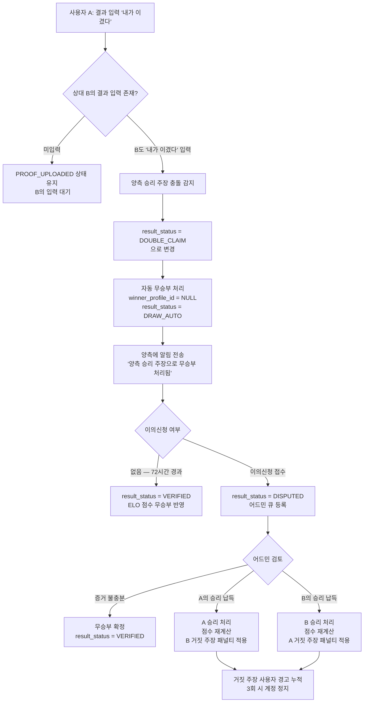
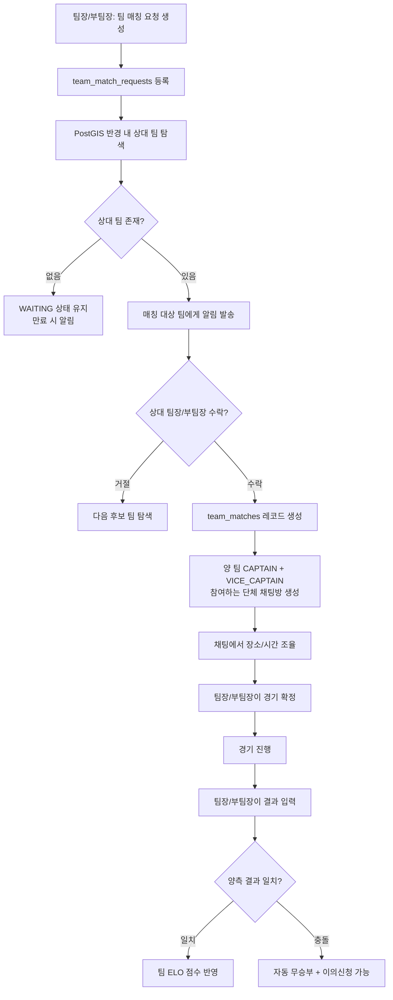
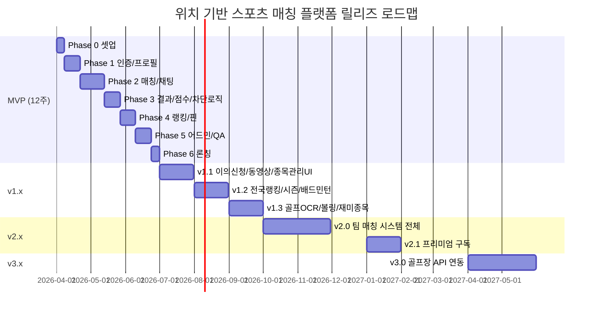

# 위치 기반 스포츠 매칭 플랫폼 — 추가 요구사항 명세서 V2

> 문서 버전: v2.0
> 작성일: 2026-04-01
> 기반 문서: PRD v1.0 (`docs/PRD.md`)
> 시스템 구성: 서버(Node.js/Fastify) + 어드민(React) + 모바일 앱(Flutter)

---

## 목차

1. [앱 이름 제안](#1-앱-이름-제안)
2. [추가 요구사항 상세 설계](#2-추가-요구사항-상세-설계)
   - 2.1 [매칭 결과 미입력 시 다음 매칭 차단](#21-매칭-결과-미입력-시-다음-매칭-차단)
   - 2.2 [양측 모두 승리 주장 시 처리 로직](#22-양측-모두-승리-주장-시-처리-로직)
   - 2.3 [골프 스코어카드 사진 분석 OCR/AI](#23-골프-스코어카드-사진-분석-ocrai)
   - 2.4 [스포츠 종목 어드민 관리 + 확장된 종목 목록](#24-스포츠-종목-어드민-관리--확장된-종목-목록)
   - 2.5 [팀 매칭 시스템 준비 단계 설계](#25-팀-매칭-시스템-준비-단계-설계)
3. [전체 변경 영향도 매트릭스](#3-전체-변경-영향도-매트릭스)
4. [업데이트된 MVP vs v2 범위 재정의](#4-업데이트된-mvp-vs-v2-범위-재정의)

---

# 1. 앱 이름 제안

## 1.1 후보 이름 목록

### 1. 맞짱 (Matjjang)

| 항목 | 내용 |
|------|------|
| 의미/컨셉 | "맞붙다 + 짱(최고)"의 합성어. 1:1 대결 느낌을 직관적으로 전달. 한국어 고유 어감으로 친근함 |
| 장점 | 발음이 강렬하고 기억에 남음. 대결/경쟁 의미 직관적. 한국 시장 친화적 |
| 단점 | 영어권 확장 시 발음 어색. "짱" 표현이 다소 어린 이미지 |
| 추천도 | ★★★★★ |

---

### 2. 스팟(SPOTT)

| 항목 | 내용 |
|------|------|
| 의미/컨셉 | Spot(장소) + Sports(스포츠)의 합성어. 위치 기반 스포츠 매칭이라는 핵심 가치를 담음 |
| 장점 | 글로벌 사용 가능. 4음절 이내 짧고 발음 쉬움. 앱스토어 "스포츠 위치" 키워드 연관 |
| 단점 | "SPOTT"는 도메인 확보 가능성 요확인. 스포츠 앱 느낌이 약간 약함 |
| 추천도 | ★★★★☆ |

---

### 3. 듀얼(DUEL)

| 항목 | 내용 |
|------|------|
| 의미/컨셉 | 1:1 대결을 의미하는 영문. 스포츠 매칭의 핵심(대결)을 담음. 국제적 용어 |
| 장점 | 직관적이고 세련된 느낌. 게임/스포츠 앱에서 친숙한 용어. 영한 모두 발음 자연스러움 |
| 단점 | 게임 앱과 혼동 가능성. 해외에 유사 이름 앱 다수 존재 |
| 추천도 | ★★★☆☆ |

---

### 4. 핀플(PINPL)

| 항목 | 내용 |
|------|------|
| 의미/컨셉 | Pin(지역 핀) + People(사람들). 위치 기반 스포츠 커뮤니티 의미 |
| 장점 | 이 서비스의 핵심 기능(핀 기반 매칭)을 브랜드명에 반영. 독창적 |
| 단점 | 발음이 다소 어색. 의미 전달이 즉각적이지 않아 설명 필요 |
| 추천도 | ★★★☆☆ |

---

### 5. 매치업(MATCHUP)

| 항목 | 내용 |
|------|------|
| 의미/컨셉 | Match(매칭) + Up(향상). "실력 향상을 위한 매칭"이라는 이중 의미 |
| 장점 | 앱스토어에서 "매치업 스포츠" 키워드 검색에 유리. 의미 전달 명확 |
| 단점 | 흔한 네이밍 패턴. 해외/국내 유사 서비스 이름 중복 가능성 높음 |
| 추천도 | ★★☆☆☆ |

---

### 6. 랠리(RALLY)

| 항목 | 내용 |
|------|------|
| 의미/컨셉 | 테니스/배드민턴의 "랠리"에서 착안. 지속적인 경쟁과 실력 향상을 의미 |
| 장점 | 스포츠 친화적 용어. 발음이 경쾌하고 기억하기 쉬움. 영문 브랜딩에 적합 |
| 단점 | 테니스/배드민턴 특화 이미지. 골프에는 어울리지 않음. 기존 서비스명 중복 확인 필요 |
| 추천도 | ★★★☆☆ |

---

### 7. 타파(TAPA)

| 항목 | 내용 |
|------|------|
| 의미/컨셉 | "타파하다(극복/이기다)"의 줄임말. 상대를 이기고 성장한다는 컨셉 |
| 장점 | 한국어 어감과 외래어 느낌 동시에 가짐. 짧고 강렬. 독창적 |
| 단점 | 스페인어 "tapas"(음식)와 혼동 가능. 스포츠 매칭 연상이 즉각적이지 않음 |
| 추천도 | ★★★☆☆ |

---

### 8. 어택(ATAK)

| 항목 | 내용 |
|------|------|
| 의미/컨셉 | Attack의 변형. 공격적이고 경쟁적인 스포츠 정신을 표현 |
| 장점 | 4음절 이내. 강렬하고 인상적인 이름. 도메인 확보 가능성 있음 |
| 단점 | 공격성 이미지가 강해 친목형 매칭에는 부적합할 수 있음 |
| 추천도 | ★★☆☆☆ |

---

### 9. 스쿼(SKWAR)

| 항목 | 내용 |
|------|------|
| 의미/컨셉 | "스쿼드(Squad) + 워(War/대결)"의 합성. 개인/팀 대결 모두를 아우름 |
| 장점 | 독창적 합성어. 팀 매칭까지 확장 시에도 브랜드 유지 가능 |
| 단점 | 발음이 불명확하고 기억하기 어려움. 한국 시장에서 직관적이지 않음 |
| 추천도 | ★★☆☆☆ |

---

### 10. 로컬매치(LocalMatch)

| 항목 | 내용 |
|------|------|
| 의미/컨셉 | Local(내 지역) + Match(매칭). 위치 기반 스포츠 매칭 서비스의 핵심 가치를 직접 표현 |
| 장점 | 서비스 성격을 가장 명확하게 전달. 앱스토어 "지역 스포츠 매칭" 검색에 유리 |
| 단점 | 3~4음절을 넘어 브랜드로서 임팩트가 약함. 상표/도메인 중복 가능성 중간 |
| 추천도 | ★★★☆☆ |

---

### 11. 격(GYUK / 格)

| 항목 | 내용 |
|------|------|
| 의미/컨셉 | 한자 "격(格)" — 격식, 격돌, 격투의 뜻. 단 하나의 음절로 강렬한 대결 의미 전달 |
| 장점 | 한국어 1음절 초간결. 스포츠 대결의 본질을 담음. 브랜드 차별성 매우 높음 |
| 단점 | 너무 짧아 검색 불리. 한자 이미지로 중·장년층 친화적이나 2030에게는 생소할 수 있음 |
| 추천도 | ★★★☆☆ |

---

### 12. 버서커(BERSERKR)

| 항목 | 내용 |
|------|------|
| 의미/컨셉 | 북유럽 전사 "Berserker"에서 차용. 최강의 도전자라는 이미지 |
| 장점 | 강렬하고 독특한 브랜드 아이덴티티. 게임·스포츠 문화와 잘 맞음 |
| 단점 | 발음이 길고 어려움. 한국 시장 일반 사용자에게 생소 |
| 추천도 | ★★☆☆☆ |

---

## 1.2 TOP 3 선정

### 1위 — 맞짱 (Matjjang) ★★★★★

**선정 이유:**
- 한국 스포츠/게임 문화에서 "맞짱 뜨다"라는 표현이 1:1 대결을 의미하는 자연스러운 숙어로 이미 자리잡혀 있어, 별도의 설명 없이 앱의 핵심 기능이 직관적으로 전달된다.
- 기억하기 쉽고 발음이 임팩트 있어 입소문 마케팅에 유리하다.
- 국내 스포츠 매칭 앱 시장에서 "맞짱"이라는 이름을 선점하면 강력한 브랜드 포지셔닝이 가능하다.
- 앱스토어에서 "맞짱", "스포츠 대결", "1대1 대결" 검색 시 연관도가 높다.

---

### 2위 — 스팟 (SPOTT) ★★★★☆

**선정 이유:**
- "위치(Spot) 기반 스포츠 매칭"이라는 서비스의 핵심 정체성을 영문으로 간결하게 담는다.
- 향후 글로벌 확장이나 영문 마케팅 시 그대로 사용할 수 있는 확장성이 있다.
- 알파벳 6자 이내로 짧고 발음이 쉬우며, 앱 아이콘 디자인에서도 위치 핀 이미지와 결합하기 좋다.
- "맞짱"이 너무 캐주얼하다는 판단이 있을 경우 세련된 대안이 된다.

---

### 3위 — 랠리 (RALLY) ★★★☆☆

**선정 이유:**
- 스포츠 문화권에서 이미 친숙한 단어로, 지속적인 경쟁·대결의 흐름을 자연스럽게 연상시킨다.
- 테니스·탁구·배드민턴 등 추가 예정인 네트 스포츠 종목들과 브랜드 정합성이 뛰어나다.
- 발음이 영·한 모두 자연스럽고, 밝고 역동적인 이미지를 준다.
- 다만 골프 중심 MVP 단계에서는 약간 어울림이 덜할 수 있으며, 골프 외 종목 확장 후에 더 빛을 발할 이름이다.

---

# 2. 추가 요구사항 상세 설계

---

## 2.1 매칭 결과 미입력 시 다음 매칭 차단

### 요구사항 ID: FR-002-7

| 항목 | 내용 |
|------|------|
| 우선순위 | Must |
| 적용 대상 | 매칭 상태가 CHAT / CONFIRMED / COMPLETED인 모든 사용자 |
| 차단 조건 | 이전 경기(Game)의 result_status가 VERIFIED 또는 VOIDED가 아닌 상태에서 신규 매칭 요청 생성 시도 |
| 차단 범위 | 양측 모두 차단 (한쪽이 미입력이어도 양쪽 모두 새 매칭 요청 불가) |

### 2.1.1 비즈니스 로직

```
매칭 요청 생성 요청 수신
        │
        ▼
사용자의 스포츠 프로필(sports_profile_id)로
미완료 게임 조회:
  - matches 테이블에서 본인이 참여한 매칭 중
    status IN ('CHAT', 'CONFIRMED', 'COMPLETED') AND
    game.result_status NOT IN ('VERIFIED', 'VOIDED')
  - 해당 게임이 1건 이상 존재하는가?
        │
   ┌────┴────┐
  존재       없음
   │          │
   ▼          ▼
에러 반환   매칭 요청 생성 진행
MATCH_BLOCKED_PENDING_RESULT
```

### 2.1.2 DB 쿼리 예시

```sql
-- 미완료 경기 존재 여부 체크 (매칭 요청 생성 전 반드시 실행)
-- :userId = 요청자 user_id
-- :sportType = 요청 종목
SELECT
    g.id              AS game_id,
    g.result_status,
    m.status          AS match_status,
    m.id              AS match_id
FROM matches m
JOIN games g ON g.match_id = m.id
JOIN sports_profiles sp
    ON (sp.id = m.requester_profile_id OR sp.id = m.opponent_profile_id)
WHERE sp.user_id    = :userId
  AND sp.sport_type = :sportType
  AND m.status      IN ('CHAT', 'CONFIRMED', 'COMPLETED')
  AND g.result_status NOT IN ('VERIFIED', 'VOIDED')
LIMIT 1;
```

```sql
-- 인덱스 추가 (성능 보장)
CREATE INDEX idx_games_result_status_pending
    ON games(result_status)
    WHERE result_status NOT IN ('VERIFIED', 'VOIDED');

CREATE INDEX idx_matches_status_active
    ON matches(status)
    WHERE status IN ('CHAT', 'CONFIRMED', 'COMPLETED');
```

### 2.1.3 API 변경사항

**기존 API**: `POST /matches/requests`

변경 내용: 매칭 요청 생성 전 미완료 게임 체크 로직 추가

**에러 응답 추가 (HTTP 409 Conflict)**

```json
{
  "success": false,
  "error": {
    "code": "MATCH_BLOCKED_PENDING_RESULT",
    "message": "이전 경기 결과를 먼저 입력해주세요.",
    "details": {
      "pendingGameId": "uuid",
      "matchId": "uuid",
      "matchStatus": "COMPLETED",
      "resultStatus": "PROOF_UPLOADED",
      "deepLink": "/games/{pendingGameId}"
    }
  }
}
```

**신규 API 추가**: `GET /matches/pending-result-check`

매칭 요청 생성 버튼을 누르기 전, 앱에서 사전 체크용으로 호출하는 API.

```
GET /matches/pending-result-check?sportType=GOLF
Authorization: Bearer {token}
```

```json
{
  "success": true,
  "data": {
    "canCreateMatch": false,
    "pendingGame": {
      "gameId": "uuid",
      "matchId": "uuid",
      "opponentNickname": "이서연프로",
      "matchStatus": "COMPLETED",
      "resultStatus": "PROOF_UPLOADED",
      "resultInputDeadline": "2026-04-04T15:00:00Z"
    }
  }
}
```

### 2.1.4 서버 비즈니스 로직 변경 (matching.service.ts)

```typescript
// matching.service.ts — createMatchRequest 메서드에 추가

async createMatchRequest(
  userId: string,
  dto: CreateMatchRequestDto
): Promise<MatchRequest> {

  // [신규] 미완료 경기 차단 체크
  const pendingGame = await this.checkPendingResult(userId, dto.sportType);
  if (pendingGame) {
    throw new AppError('MATCH_BLOCKED_PENDING_RESULT', 409, {
      pendingGameId: pendingGame.gameId,
      matchId: pendingGame.matchId,
    });
  }

  // 기존 로직 이하 동일 ...
}

private async checkPendingResult(
  userId: string,
  sportType: string
): Promise<{ gameId: string; matchId: string } | null> {
  const result = await this.prisma.$queryRaw<Array<{ game_id: string; match_id: string }>>`
    SELECT g.id AS game_id, m.id AS match_id
    FROM matches m
    JOIN games g ON g.match_id = m.id
    JOIN sports_profiles sp
      ON (sp.id = m.requester_profile_id OR sp.id = m.opponent_profile_id)
    WHERE sp.user_id    = ${userId}
      AND sp.sport_type = ${sportType}
      AND m.status      IN ('CHAT', 'CONFIRMED', 'COMPLETED')
      AND g.result_status NOT IN ('VERIFIED', 'VOIDED')
    LIMIT 1
  `;
  if (result.length === 0) return null;
  return { gameId: result[0].game_id, matchId: result[0].match_id };
}
```

### 2.1.5 앱 화면 변경사항

**변경 화면 1: 매칭 요청 생성 화면 (MatchRequestScreen)**

- 화면 진입 시 `GET /matches/pending-result-check` 호출
- `canCreateMatch: false`이면 상단에 배너 표시:
  > "이전 경기 결과를 먼저 입력해주세요."
  > [결과 입력하러 가기] 버튼 → 해당 Game 상세 화면으로 이동
- 매칭 요청 버튼 비활성화(disabled) 처리

**변경 화면 2: 매칭 탭 홈 화면**

- 미완료 게임이 있을 경우 상단 알림 카드 노출
  > "경기 결과 미입력: OO님과의 경기 결과를 입력하면 다음 매칭이 가능합니다."

**신규 알림 타입 추가**

| type | 트리거 | 딥링크 |
|------|--------|--------|
| `RESULT_INPUT_REQUIRED` | 경기 완료 후 24시간 경과 시 | `/games/:gameId` |

---

## 2.2 양측 모두 승리 주장 시 처리 로직

### 요구사항 ID: FR-004-6

| 항목 | 내용 |
|------|------|
| 우선순위 | Must |
| 트리거 조건 | 양측이 `POST /games/:gameId/result`에서 서로 자신이 이겼다고 입력한 경우 |
| 자동 처리 | 무승부(DRAW) 자동 판정, 점수 변동 최소 적용 |
| 이의신청 | 양측 모두 이의신청 가능. 사진 + 동영상 증빙 업로드 가능 |

### 2.2.1 자동 무승부 판정 플로우



### 2.2.2 결과 입력 충돌 감지 로직 (game.service.ts)

```typescript
// game.service.ts

async submitGameResult(
  userId: string,
  gameId: string,
  dto: SubmitResultDto
): Promise<Game> {

  const game = await this.prisma.game.findUnique({
    where: { id: gameId },
    include: {
      match: {
        include: {
          requesterProfile: { include: { user: true } },
          opponentProfile: { include: { user: true } }
        }
      }
    }
  });

  if (!game) throw new AppError('GAME_NOT_FOUND', 404);

  // 본인의 result submission 저장
  await this.prisma.gameResultSubmission.upsert({
    where: { gameId_userId: { gameId, userId } },
    create: {
      gameId,
      userId,
      claimedWinnerId: dto.claimedWinnerId,  // 본인 프로필 ID
      myScore: dto.myScore,
      opponentScore: dto.opponentScore,
    },
    update: {
      claimedWinnerId: dto.claimedWinnerId,
      myScore: dto.myScore,
      opponentScore: dto.opponentScore,
    }
  });

  // 양측 모두 제출했는지 확인
  const submissions = await this.prisma.gameResultSubmission.findMany({
    where: { gameId }
  });

  if (submissions.length < 2) {
    // 상대방 아직 미제출 — 대기 상태 유지
    await this.prisma.game.update({
      where: { id: gameId },
      data: { resultStatus: 'PROOF_UPLOADED' }
    });
    return game;
  }

  // 양측 모두 제출 — 충돌 여부 확인
  const [subA, subB] = submissions;
  const bothClaimWin =
    subA.claimedWinnerId !== subB.claimedWinnerId &&
    subA.claimedWinnerId !== null &&
    subB.claimedWinnerId !== null;

  if (bothClaimWin) {
    // 양측 승리 주장 — 자동 무승부 처리
    await this.handleDoubleClaimDraw(gameId, game);
  } else {
    // 결과 일치 — 정상 처리
    await this.verifyAndApplyResult(gameId, submissions);
  }

  return this.prisma.game.findUnique({ where: { id: gameId } }) as Promise<Game>;
}

private async handleDoubleClaimDraw(gameId: string, game: any): Promise<void> {
  await this.prisma.$transaction(async (tx) => {
    await tx.game.update({
      where: { id: gameId },
      data: {
        resultStatus: 'DRAW_AUTO',
        winnerProfileId: null,
        scoreData: {
          ...game.scoreData,
          drawReason: 'DOUBLE_CLAIM'
        }
      }
    });

    // 72시간 후 자동 확정 예약 (BullMQ)
    await this.autoVerifyQueue.add(
      'auto-verify-draw',
      { gameId },
      { delay: 72 * 60 * 60 * 1000 }
    );
  });

  // 양측에 알림 발송
  const requesterUserId = game.match.requesterProfile.userId;
  const opponentUserId  = game.match.opponentProfile.userId;

  await this.notificationService.sendBulk([
    {
      userId: requesterUserId,
      type: 'GAME_DRAW_AUTO',
      title: '무승부 처리 안내',
      body: '양측이 서로 승리를 주장하여 자동 무승부 처리되었습니다. 이의신청은 72시간 내에 가능합니다.',
      data: { gameId, deepLink: `/games/${gameId}` }
    },
    {
      userId: opponentUserId,
      type: 'GAME_DRAW_AUTO',
      title: '무승부 처리 안내',
      body: '양측이 서로 승리를 주장하여 자동 무승부 처리되었습니다. 이의신청은 72시간 내에 가능합니다.',
      data: { gameId, deepLink: `/games/${gameId}` }
    }
  ]);
}
```

### 2.2.3 이의신청(Dispute) 프로세스 상세

```
이의신청 접수 (POST /games/:gameId/dispute)
    │
    ├─ 사진 또는 동영상 증빙 업로드 (선택)
    │   - 사진: JPG/PNG, 최대 5장, 각 10MB
    │   - 동영상: MP4/MOV, 최대 1개, 최대 200MB
    │
    ▼
disputes 테이블 레코드 생성
game.result_status = 'DISPUTED'
    │
    ▼
어드민 Dispute 처리 큐에 등록
    │
    ▼
어드민 검토 화면에서 증빙 비교
    │
    ├─ 증거 불충분 → 무승부 유지 (VERIFIED, DRAW)
    │
    ├─ A 승리 납득
    │   ├─ game.winner_profile_id = A
    │   ├─ game.result_status = VERIFIED
    │   ├─ B의 false_claim_count += 1
    │   ├─ B의 false_claim_count >= 3 → B 계정 SUSPENDED
    │   └─ ELO 점수 재계산 및 반영
    │
    └─ B 승리 납득
        ├─ game.winner_profile_id = B
        ├─ A의 false_claim_count += 1
        └─ (동일 패널티 로직)
```

### 2.2.4 DB 스키마 변경

**1) game_result_submissions 신규 테이블 (양측 개별 결과 제출)**

```sql
CREATE TABLE game_result_submissions (
    id                  UUID PRIMARY KEY DEFAULT gen_random_uuid(),
    game_id             UUID NOT NULL REFERENCES games(id),
    user_id             UUID NOT NULL REFERENCES users(id),
    claimed_winner_id   UUID REFERENCES sports_profiles(id),  -- 이긴 쪽 프로필 ID
    my_score            INTEGER,    -- 제출자 기준 본인 점수
    opponent_score      INTEGER,    -- 제출자 기준 상대 점수
    created_at          TIMESTAMPTZ NOT NULL DEFAULT NOW(),
    updated_at          TIMESTAMPTZ NOT NULL DEFAULT NOW(),
    UNIQUE (game_id, user_id)
);

CREATE INDEX idx_game_result_submissions_game_id
    ON game_result_submissions(game_id);
```

**2) games 테이블 result_status ENUM 확장**

```sql
-- 기존 CHECK 제약 변경
ALTER TABLE games
DROP CONSTRAINT IF EXISTS games_result_status_check;

ALTER TABLE games
ADD CONSTRAINT games_result_status_check
CHECK (result_status IN (
    'PENDING',
    'PROOF_UPLOADED',
    'DRAW_AUTO',       -- 신규: 양측 승리 주장으로 자동 무승부
    'VERIFIED',
    'DISPUTED',
    'VOIDED'
));
```

**3) disputes 테이블 — 동영상 URL 필드 추가**

```sql
CREATE TABLE disputes (
    id                  UUID PRIMARY KEY DEFAULT gen_random_uuid(),
    game_id             UUID NOT NULL REFERENCES games(id),
    filed_by            UUID NOT NULL REFERENCES users(id),
    reason              TEXT NOT NULL,
    evidence_image_urls TEXT[],        -- 기존: 사진 URL 배열
    evidence_video_url  TEXT,          -- 신규: 동영상 URL (S3)
    status              VARCHAR(20) NOT NULL DEFAULT 'PENDING'
                        CHECK (status IN ('PENDING', 'REVIEWING', 'RESOLVED')),
    admin_note          TEXT,
    resolution          VARCHAR(30)
                        CHECK (resolution IN (
                            'ORIGINAL_MAINTAINED',
                            'RESULT_MODIFIED',
                            'DRAW_CONFIRMED',
                            'VOIDED'
                        )),
    resolved_by         UUID REFERENCES users(id),
    resolved_at         TIMESTAMPTZ,
    created_at          TIMESTAMPTZ NOT NULL DEFAULT NOW(),
    updated_at          TIMESTAMPTZ NOT NULL DEFAULT NOW()
);

CREATE INDEX idx_disputes_game_id   ON disputes(game_id);
CREATE INDEX idx_disputes_status    ON disputes(status, created_at DESC);
CREATE INDEX idx_disputes_filed_by  ON disputes(filed_by);
```

**4) users 테이블 — 거짓 주장 카운트 필드 추가**

```sql
ALTER TABLE users
ADD COLUMN false_claim_count INTEGER NOT NULL DEFAULT 0;
```

### 2.2.5 API 변경사항

**기존 API 변경**: `POST /games/:gameId/dispute`

```
요청 (multipart/form-data 또는 application/json)

기존:
{
  "reason": "string",
  "evidenceImageUrls": ["https://..."]
}

변경 후 (이미지는 Presigned URL로 선업로드 후 URL 전달):
{
  "reason": "string",
  "evidenceImageUrls": ["https://cdn.sportsmatch.kr/..."],  // 사진 URL (최대 5장)
  "evidenceVideoUrl": "https://cdn.sportsmatch.kr/..."      // 동영상 URL (최대 1개, 선택)
}
```

**신규 API**: `POST /games/:gameId/result`

```json
// 요청
{
  "claimedWinnerId": "my_sports_profile_uuid",
  "myScore": 82,
  "opponentScore": 88
}

// 응답 — 정상 처리
{
  "success": true,
  "data": {
    "gameId": "uuid",
    "resultStatus": "PROOF_UPLOADED",
    "waitingForOpponent": true
  }
}

// 응답 — 양측 주장 충돌 시
{
  "success": true,
  "data": {
    "gameId": "uuid",
    "resultStatus": "DRAW_AUTO",
    "message": "양측이 서로 승리를 주장하여 자동 무승부로 처리됩니다. 72시간 내 이의신청이 가능합니다.",
    "disputeDeadline": "2026-04-04T15:00:00Z"
  }
}
```

**어드민 API**: `PATCH /admin/disputes/:id/resolve`

```json
// 요청
{
  "resolution": "RESULT_MODIFIED",
  "winnerId": "sports_profile_uuid",  // RESULT_MODIFIED 시 필수
  "adminNote": "동영상 증거로 A의 승리가 명확히 확인됨"
}
```

---

## 2.3 골프 스코어카드 사진 분석 OCR/AI

### 요구사항 ID: FR-004-7

| 항목 | 내용 |
|------|------|
| 우선순위 | Should (MVP 이후, v1.3) |
| 지원 대상 종목 | 골프 (우선), 볼링 (추후 확장) |
| 지원 이미지 | 골프존 스코어 화면 캡처, 실제 스코어카드 사진 |
| 분석 결과 | 각 플레이어 타수 추출 → 핸디캡 적용 → 자동 승패 판정 |
| 분석 실패 처리 | 수동 입력 폴백(fallback) 제공 |

### 2.3.1 OCR/AI 기술 방안 비교

| 방안 | 장점 | 단점 | 추천도 |
|------|------|------|--------|
| **Claude Vision API** (Anthropic) | 비정형 이미지 이해 능력 뛰어남. 스코어카드 레이아웃 다양성에 강함. JSON 구조화 출력 가능 | API 비용 발생. 레이턴시 1~3초 | ★★★★★ |
| **Google Cloud Vision** | 텍스트 OCR 정확도 높음. 비용 저렴. 한국어 지원 | 표 구조 이해 별도 파싱 로직 필요 | ★★★★☆ |
| **AWS Textract** | 표(Table) 구조 추출에 특화 | 골프 스코어카드 특수 레이아웃에 약함 | ★★★☆☆ |
| **자체 ML 모델** | 도메인 특화 고정밀도 | 대규모 학습 데이터 필요, 개발 비용 큼 | ★★☆☆☆ |

**권장 방안**: Claude Vision API를 1차 분석에 사용하고, 실패 시 Google Cloud Vision OCR + 자체 파싱 로직을 폴백으로 사용하는 2단계 구조.

### 2.3.2 종목별 결과 판정 방식 인터페이스 설계

```typescript
// result-analyzer/interfaces/result-analyzer.interface.ts

export interface GameResultInput {
  sportType: string;
  imageUrls: string[];        // 분석할 이미지 URL 목록
  playerAProfileId: string;
  playerBProfileId: string;
  playerAHandicap?: number;   // 골프 전용
  playerBHandicap?: number;
}

export interface GameResultOutput {
  success: boolean;
  confidence: number;         // 0.0 ~ 1.0, 0.7 미만은 폴백 권장
  playerAScore: number | null;
  playerBScore: number | null;
  winner: 'A' | 'B' | 'DRAW' | null;
  rawData: Record<string, unknown>;  // 종목별 원본 추출 데이터
  failureReason?: string;
}

export interface ResultAnalyzer {
  analyze(input: GameResultInput): Promise<GameResultOutput>;
}
```

```typescript
// result-analyzer/golf/golf-ocr.analyzer.ts

import Anthropic from '@anthropic-ai/sdk';

export class GolfOcrAnalyzer implements ResultAnalyzer {
  private client: Anthropic;

  constructor() {
    this.client = new Anthropic();
  }

  async analyze(input: GameResultInput): Promise<GameResultOutput> {
    const imageContent = await Promise.all(
      input.imageUrls.map(async (url) => ({
        type: 'image' as const,
        source: {
          type: 'url' as const,
          url,
        }
      }))
    );

    const prompt = `
다음 골프 스코어카드 이미지에서 두 플레이어의 총 타수를 추출해주세요.
이미지는 골프존 스코어 화면이거나 실제 스코어카드일 수 있습니다.

반드시 아래 JSON 형식으로만 응답해주세요:
{
  "playerA_total_strokes": <숫자 또는 null>,
  "playerB_total_strokes": <숫자 또는 null>,
  "confidence": <0.0~1.0>,
  "detected_players": ["이름1", "이름2"],
  "hole_scores": { "player_a": [각홀타수배열], "player_b": [각홀타수배열] },
  "failure_reason": "<추출 실패 시 이유, 성공 시 null>"
}
    `.trim();

    try {
      const response = await this.client.messages.create({
        model: 'claude-opus-4-5',
        max_tokens: 1024,
        messages: [{
          role: 'user',
          content: [
            ...imageContent,
            { type: 'text', text: prompt }
          ]
        }]
      });

      const raw = JSON.parse(
        (response.content[0] as { type: string; text: string }).text
      );

      if (!raw.playerA_total_strokes || !raw.playerB_total_strokes) {
        return {
          success: false,
          confidence: raw.confidence ?? 0,
          playerAScore: null,
          playerBScore: null,
          winner: null,
          rawData: raw,
          failureReason: raw.failure_reason ?? 'OCR_EXTRACTION_FAILED'
        };
      }

      const winner = this.determineWinner(
        raw.playerA_total_strokes,
        raw.playerB_total_strokes,
        input.playerAHandicap ?? 0,
        input.playerBHandicap ?? 0
      );

      return {
        success: true,
        confidence: raw.confidence,
        playerAScore: raw.playerA_total_strokes,
        playerBScore: raw.playerB_total_strokes,
        winner,
        rawData: raw
      };

    } catch {
      return {
        success: false,
        confidence: 0,
        playerAScore: null,
        playerBScore: null,
        winner: null,
        rawData: {},
        failureReason: 'API_ERROR'
      };
    }
  }

  private determineWinner(
    strokesA: number,
    strokesB: number,
    handicapA: number,
    handicapB: number
  ): 'A' | 'B' | 'DRAW' {
    const netA = strokesA - handicapA;
    const netB = strokesB - handicapB;
    if (netA < netB) return 'A';   // 골프는 타수 낮을수록 유리
    if (netB < netA) return 'B';
    return 'DRAW';
  }
}
```

```typescript
// result-analyzer/result-analyzer.factory.ts

export class ResultAnalyzerFactory {
  static create(sportType: string, resultType: SportResultType): ResultAnalyzer {
    switch (resultType) {
      case 'OCR':
        if (sportType === 'GOLF')    return new GolfOcrAnalyzer();
        if (sportType === 'BOWLING') return new BowlingOcrAnalyzer();
        throw new AppError('UNSUPPORTED_OCR_SPORT', 400);

      case 'SELF_REPORT':
        return new SelfReportAnalyzer();  // 사용자 직접 입력 처리

      case 'SET':
        return new SetScoreAnalyzer();    // 탁구/테니스/배드민턴

      case 'SCORE':
        return new ScoreCompareAnalyzer(); // 당구/볼링

      default:
        return new SelfReportAnalyzer();
    }
  }
}

export type SportResultType = 'OCR' | 'SELF_REPORT' | 'SET' | 'SCORE';
```

### 2.3.3 분석 실패 시 폴백 플로우

```
사진 업로드 완료
        │
        ▼
OCR/AI 분석 실행 (최대 10초 타임아웃)
        │
   ┌────┴────┐
성공(≥0.7)   실패 또는 저신뢰
   │          │
   ▼          ▼
자동 결과  "자동 분석에 실패했습니다.
제안 표시  타수를 직접 입력해주세요."
   │          │
   │          ▼
   │    수동 입력 폼 표시
   │          │
   └────┬─────┘
        ▼
   사용자 확인/수정 후 결과 제출
```

### 2.3.4 DB 스키마 변경

**1) game_result_proofs 테이블 — OCR 관련 필드 추가**

```sql
ALTER TABLE game_result_proofs
ADD COLUMN media_type   VARCHAR(20) NOT NULL DEFAULT 'IMAGE'
                        CHECK (media_type IN ('IMAGE', 'VIDEO')),
ADD COLUMN video_url    TEXT,         -- 동영상 URL (S3)
ADD COLUMN ocr_provider VARCHAR(30),  -- 'CLAUDE_VISION', 'GOOGLE_VISION'
ADD COLUMN ocr_confidence NUMERIC(3,2), -- 신뢰도 0.00~1.00
ADD COLUMN ocr_result   JSONB;        -- OCR 원본 결과 (이미 ocr_data로 존재하나 구조 강화)
```

**2) ocr_jobs 신규 테이블 (OCR 분석 작업 추적)**

```sql
CREATE TABLE ocr_jobs (
    id              UUID PRIMARY KEY DEFAULT gen_random_uuid(),
    game_id         UUID NOT NULL REFERENCES games(id),
    proof_id        UUID NOT NULL REFERENCES game_result_proofs(id),
    sport_type      VARCHAR(50) NOT NULL,
    provider        VARCHAR(30) NOT NULL,
    status          VARCHAR(20) NOT NULL DEFAULT 'PENDING'
                    CHECK (status IN ('PENDING', 'PROCESSING', 'SUCCESS', 'FAILED', 'FALLBACK')),
    input_image_urls TEXT[],
    result_data     JSONB,
    confidence      NUMERIC(3,2),
    error_message   TEXT,
    processing_ms   INTEGER,          -- 처리 시간 (밀리초)
    created_at      TIMESTAMPTZ NOT NULL DEFAULT NOW(),
    completed_at    TIMESTAMPTZ
);

CREATE INDEX idx_ocr_jobs_game_id ON ocr_jobs(game_id);
CREATE INDEX idx_ocr_jobs_status  ON ocr_jobs(status);
```

### 2.3.5 API 변경사항

**기존 API 변경**: `POST /games/:gameId/proofs`

```
요청 변경 (multipart/form-data):

기존:
- images: [File, ...]  (최대 3장)
- imageType: SCORECARD

변경 후:
- images: [File, ...]  (최대 3장, 사진)
- video: File          (선택, 동영상 최대 200MB)
- mediaType: IMAGE | VIDEO | MIXED
- requestOcr: true | false  (OCR 분석 요청 여부, 골프 종목은 기본 true)
```

**신규 API**: `GET /games/:gameId/ocr-result`

```json
// 응답
{
  "success": true,
  "data": {
    "status": "SUCCESS",
    "confidence": 0.92,
    "suggestedResult": {
      "playerAScore": 82,
      "playerBScore": 88,
      "suggestedWinnerId": "sports_profile_uuid_a",
      "basis": "핸디캡 적용 순타수: A=82-12.5=69.5, B=88-9.0=79.0"
    },
    "requiresManualInput": false,
    "rawData": {
      "playerA_total_strokes": 82,
      "playerB_total_strokes": 88,
      "hole_scores": { ... }
    }
  }
}
```

---

## 2.4 스포츠 종목 어드민 관리 + 확장된 종목 목록

### 요구사항 ID: FR-001-7

| 항목 | 내용 |
|------|------|
| 우선순위 | Should |
| 핵심 변경 | sports_profiles.sport_type을 ENUM에서 sports 테이블 FK로 변경 |
| 어드민 기능 | 종목 추가/수정/비활성화/정렬순서 변경 |

### 2.4.1 확장된 1:1 종목 목록

| 종목 | slug | resultType | 팀 인원 | 특이사항 |
|------|------|------------|---------|---------|
| 골프 | golf | OCR | 1:1 | 타수 비교, 핸디캡 적용 |
| 탁구 | table-tennis | SET | 1:1 | 세트 점수 (3세트 2선승) |
| 테니스 | tennis | SET | 1:1 | 세트 점수 (3세트 2선승) |
| 배드민턴 | badminton | SET | 1:1 | 세트 점수 (3세트 2선승) |
| 볼링 | bowling | OCR | 1:1 | 스코어 사진 OCR |
| 가위바위보 | rock-paper-scissors | SELF_REPORT | 1:1 | 3판 2선승 |
| 동전 던지기 | coin-flip | SELF_REPORT | 1:1 | 재미 종목 |
| 팔씨름 | arm-wrestling | SELF_REPORT | 1:1 | 동영상 증거 권장 |
| 당구 | billiards | SCORE | 1:1 | 목표 점수 선취 방식 |

### 2.4.2 sports 테이블 신규 설계

```sql
CREATE TABLE sports (
    id              UUID PRIMARY KEY DEFAULT gen_random_uuid(),
    name            VARCHAR(50) NOT NULL,            -- "골프", "탁구"
    slug            VARCHAR(50) NOT NULL UNIQUE,     -- "golf", "table-tennis"
    icon_url        TEXT,                            -- S3 아이콘 이미지
    category        VARCHAR(20) NOT NULL
                    CHECK (category IN ('INDIVIDUAL', 'TEAM')),
    result_type     VARCHAR(20) NOT NULL
                    CHECK (result_type IN (
                        'OCR',          -- 스코어카드 사진 자동 분석
                        'SET',          -- 세트 점수 (탁구/테니스/배드민턴)
                        'SCORE',        -- 점수 비교 (당구/볼링)
                        'SELF_REPORT'   -- 자기신고
                    )),
    rules           JSONB NOT NULL DEFAULT '{}',     -- 종목별 규칙 설정
    min_players     INTEGER NOT NULL DEFAULT 1,      -- 팀 매칭 시 최소 인원
    max_players     INTEGER NOT NULL DEFAULT 1,
    is_active       BOOLEAN NOT NULL DEFAULT TRUE,
    sort_order      INTEGER NOT NULL DEFAULT 0,
    created_at      TIMESTAMPTZ NOT NULL DEFAULT NOW(),
    updated_at      TIMESTAMPTZ NOT NULL DEFAULT NOW()
);

-- rules JSONB 예시
-- 골프:     { "hasHandicap": true, "lowerIsBetter": true, "holes": 18 }
-- 탁구:     { "setsToWin": 2, "totalSets": 3, "pointsPerSet": 11 }
-- 볼링:     { "lowerIsBetter": false, "maxScore": 300 }
-- 가위바위보: { "roundsToWin": 2, "totalRounds": 3 }

CREATE INDEX idx_sports_slug     ON sports(slug);
CREATE INDEX idx_sports_category ON sports(category);
CREATE INDEX idx_sports_active   ON sports(is_active, sort_order);
```

**초기 데이터 삽입**

```sql
INSERT INTO sports (name, slug, category, result_type, rules, sort_order) VALUES
('골프',       'golf',                 'INDIVIDUAL', 'OCR',         '{"hasHandicap":true,"lowerIsBetter":true,"holes":18}',           1),
('탁구',       'table-tennis',         'INDIVIDUAL', 'SET',         '{"setsToWin":2,"totalSets":3,"pointsPerSet":11}',                2),
('테니스',     'tennis',               'INDIVIDUAL', 'SET',         '{"setsToWin":2,"totalSets":3}',                                 3),
('배드민턴',   'badminton',            'INDIVIDUAL', 'SET',         '{"setsToWin":2,"totalSets":3,"pointsPerSet":21}',                4),
('볼링',       'bowling',              'INDIVIDUAL', 'OCR',         '{"lowerIsBetter":false,"maxScore":300}',                        5),
('당구',       'billiards',            'INDIVIDUAL', 'SCORE',       '{"targetScore":30,"variations":["3구","4구","포켓"]}',            6),
('가위바위보', 'rock-paper-scissors',  'INDIVIDUAL', 'SELF_REPORT', '{"roundsToWin":2,"totalRounds":3}',                             7),
('팔씨름',     'arm-wrestling',        'INDIVIDUAL', 'SELF_REPORT', '{"videoEvidenceRecommended":true}',                             8),
('동전 던지기','coin-flip',            'INDIVIDUAL', 'SELF_REPORT', '{"funSport":true}',                                             9);
```

### 2.4.3 sports_profiles 테이블 마이그레이션

**마이그레이션 전략 (기존 ENUM → sports 테이블 FK 참조)**

```sql
-- Step 1: sports 테이블에 sport_id 컬럼 추가 (nullable로 시작)
ALTER TABLE sports_profiles
ADD COLUMN sport_id UUID REFERENCES sports(id);

-- Step 2: 기존 sport_type 값으로 sport_id 매핑
UPDATE sports_profiles sp
SET sport_id = s.id
FROM sports s
WHERE s.slug = LOWER(REPLACE(sp.sport_type, '_', '-'));
-- GOLF → golf, TABLE_TENNIS → table-tennis, BILLIARDS → billiards, TENNIS → tennis

-- Step 3: NULL 케이스가 없는지 확인
SELECT COUNT(*) FROM sports_profiles WHERE sport_id IS NULL;
-- 결과 0이어야 함

-- Step 4: NOT NULL 제약 추가 + 인덱스 생성
ALTER TABLE sports_profiles
ALTER COLUMN sport_id SET NOT NULL;

CREATE INDEX idx_sports_profiles_sport_id ON sports_profiles(sport_id);

-- Step 5: 기존 sport_type CHECK 제약 완화 (점진적 폐기, 즉시 삭제 금지)
-- 새 코드는 sport_id를 사용하고, sport_type은 NULL 허용으로 전환
-- 하위 호환성 유지를 위해 3개월 후 삭제
COMMENT ON COLUMN sports_profiles.sport_type IS 'DEPRECATED: Use sport_id instead. Will be removed in 2026-07-01.';
```

**UNIQUE 제약 변경**

```sql
-- 기존: UNIQUE (user_id, sport_type)
ALTER TABLE sports_profiles
DROP CONSTRAINT sports_profiles_user_id_sport_type_key;

-- 변경: UNIQUE (user_id, sport_id)
ALTER TABLE sports_profiles
ADD CONSTRAINT sports_profiles_user_id_sport_id_key
UNIQUE (user_id, sport_id);
```

### 2.4.4 어드민 종목 관리 화면 설계

**화면 구성**

```
[어드민] 종목 관리 화면 (/admin/sports)
┌─────────────────────────────────────────────────────┐
│  종목 관리                              [+ 종목 추가] │
├─────────────────────────────────────────────────────┤
│  드래그로 순서 변경 가능                              │
│  ┌─────────────────────────────────────────────┐    │
│  │ ⠿  [아이콘] 골프      INDIVIDUAL  OCR    활성│    │
│  │     사용자 수: 3,214명 | 이번달 게임: 892건   │    │
│  │                          [수정] [비활성화]    │    │
│  ├─────────────────────────────────────────────┤    │
│  │ ⠿  [아이콘] 탁구      INDIVIDUAL  SET    활성│    │
│  │     사용자 수: 1,102명 | 이번달 게임: 234건   │    │
│  ├─────────────────────────────────────────────┤    │
│  │ ⠿  [아이콘] 테니스    INDIVIDUAL  SET    활성│    │
│  └─────────────────────────────────────────────┘    │
└─────────────────────────────────────────────────────┘
```

**어드민 API**

```
GET    /admin/sports              # 종목 목록 (전체, 비활성 포함)
POST   /admin/sports              # 종목 추가
PATCH  /admin/sports/:id          # 종목 수정 (이름, 아이콘, 규칙 등)
PATCH  /admin/sports/:id/activate   # 활성화
PATCH  /admin/sports/:id/deactivate # 비활성화
PATCH  /admin/sports/sort-order   # 정렬 순서 일괄 변경
GET    /admin/sports/:id/stats    # 종목별 통계
```

```json
// POST /admin/sports 요청
{
  "name": "스쿼시",
  "slug": "squash",
  "iconUrl": "https://cdn.sportsmatch.kr/sports/squash.png",
  "category": "INDIVIDUAL",
  "resultType": "SET",
  "rules": {
    "setsToWin": 3,
    "totalSets": 5,
    "pointsPerSet": 11
  },
  "minPlayers": 1,
  "maxPlayers": 1,
  "sortOrder": 10
}
```

---

## 2.5 팀 매칭 시스템 준비 단계 설계

### 요구사항 ID: FR-007 (신규)

| 항목 | 내용 |
|------|------|
| 우선순위 | Could (v2.0 릴리즈 목표) |
| 해당 버전 | v2.0 (론칭 후 6개월) |
| 팀 종목 | 축구, 야구, 농구, 리그오브레전드 |

### 2.5.1 팀 종목 목록

| 종목 | slug | 팀 인원 | 특이사항 |
|------|------|---------|---------|
| 축구 | soccer | 5~11명 | 풋살(5인)과 정규(11인) 구분 |
| 야구 | baseball | 9~15명 | 투수 포함 최소 9명 |
| 농구 | basketball | 3~5명 | 3:3 또는 5:5 |
| 리그오브레전드 | league-of-legends | 5명 | e스포츠 |

### 2.5.2 DB 스키마 설계

**teams 테이블**

```sql
CREATE TABLE teams (
    id              UUID PRIMARY KEY DEFAULT gen_random_uuid(),
    name            VARCHAR(50) NOT NULL,
    slug            VARCHAR(50) NOT NULL UNIQUE,    -- URL용 식별자
    sport_id        UUID NOT NULL REFERENCES sports(id),
    logo_url        TEXT,
    description     TEXT,
    home_pin_id     UUID REFERENCES pins(id),       -- 주 활동 지역 핀
    home_point      GEOGRAPHY(POINT, 4326),
    activity_region VARCHAR(100),                   -- 활동 지역 텍스트
    min_members     INTEGER NOT NULL DEFAULT 3,
    max_members     INTEGER NOT NULL DEFAULT 11,
    current_members INTEGER NOT NULL DEFAULT 0,
    wins            INTEGER NOT NULL DEFAULT 0,
    losses          INTEGER NOT NULL DEFAULT 0,
    draws           INTEGER NOT NULL DEFAULT 0,
    team_score      INTEGER NOT NULL DEFAULT 1000,  -- 팀 ELO 점수
    is_recruiting   BOOLEAN NOT NULL DEFAULT TRUE,  -- 팀원 모집 여부
    status          VARCHAR(20) NOT NULL DEFAULT 'ACTIVE'
                    CHECK (status IN ('ACTIVE', 'INACTIVE', 'DISBANDED')),
    created_at      TIMESTAMPTZ NOT NULL DEFAULT NOW(),
    updated_at      TIMESTAMPTZ NOT NULL DEFAULT NOW()
);

CREATE INDEX idx_teams_sport_id     ON teams(sport_id);
CREATE INDEX idx_teams_home_point   ON teams USING GIST(home_point);
CREATE INDEX idx_teams_status       ON teams(status);
CREATE INDEX idx_teams_recruiting   ON teams(is_recruiting) WHERE is_recruiting = TRUE;
```

**team_members 테이블**

```sql
CREATE TABLE team_members (
    id          UUID PRIMARY KEY DEFAULT gen_random_uuid(),
    team_id     UUID NOT NULL REFERENCES teams(id) ON DELETE CASCADE,
    user_id     UUID NOT NULL REFERENCES users(id),
    role        VARCHAR(20) NOT NULL DEFAULT 'MEMBER'
                CHECK (role IN ('CAPTAIN', 'VICE_CAPTAIN', 'MEMBER')),
    position    VARCHAR(50),      -- 포지션 (선택, 축구: GK/FW 등)
    joined_at   TIMESTAMPTZ NOT NULL DEFAULT NOW(),
    status      VARCHAR(20) NOT NULL DEFAULT 'ACTIVE'
                CHECK (status IN ('ACTIVE', 'INACTIVE', 'BANNED')),
    UNIQUE (team_id, user_id)
);

CREATE INDEX idx_team_members_team_id ON team_members(team_id);
CREATE INDEX idx_team_members_user_id ON team_members(user_id);
CREATE INDEX idx_team_members_role    ON team_members(team_id, role);
```

**team_match_requests 테이블**

```sql
CREATE TABLE team_match_requests (
    id                  UUID PRIMARY KEY DEFAULT gen_random_uuid(),
    requester_team_id   UUID NOT NULL REFERENCES teams(id),
    requested_by        UUID NOT NULL REFERENCES users(id),   -- CAPTAIN 또는 VICE_CAPTAIN
    sport_id            UUID NOT NULL REFERENCES sports(id),
    desired_date        DATE,
    desired_time_slot   VARCHAR(20)
                        CHECK (desired_time_slot IN ('MORNING', 'AFTERNOON', 'EVENING', 'ANY')),
    location_point      GEOGRAPHY(POINT, 4326),
    location_name       VARCHAR(255),
    radius_km           FLOAT NOT NULL DEFAULT 20.0,
    message             TEXT,
    status              VARCHAR(20) NOT NULL DEFAULT 'WAITING'
                        CHECK (status IN ('WAITING', 'MATCHED', 'CANCELLED', 'EXPIRED')),
    expires_at          TIMESTAMPTZ NOT NULL,
    created_at          TIMESTAMPTZ NOT NULL DEFAULT NOW()
);

CREATE INDEX idx_team_match_requests_location
    ON team_match_requests USING GIST(location_point);
CREATE INDEX idx_team_match_requests_status
    ON team_match_requests(status, sport_id);
```

**team_matches 테이블**

```sql
CREATE TABLE team_matches (
    id                      UUID PRIMARY KEY DEFAULT gen_random_uuid(),
    team_match_request_id   UUID REFERENCES team_match_requests(id),
    home_team_id            UUID NOT NULL REFERENCES teams(id),
    away_team_id            UUID NOT NULL REFERENCES teams(id),
    sport_id                UUID NOT NULL REFERENCES sports(id),
    scheduled_date          DATE,
    scheduled_time          TIME,
    venue_name              VARCHAR(255),
    venue_location          GEOGRAPHY(POINT, 4326),
    status                  VARCHAR(20) NOT NULL DEFAULT 'CHAT'
                            CHECK (status IN ('CHAT', 'CONFIRMED', 'COMPLETED',
                                              'CANCELLED', 'DISPUTED')),
    chat_room_id            UUID,
    home_score              INTEGER,      -- 홈팀 득점
    away_score              INTEGER,      -- 어웨이팀 득점
    winner_team_id          UUID REFERENCES teams(id),
    result_status           VARCHAR(20) NOT NULL DEFAULT 'PENDING'
                            CHECK (result_status IN ('PENDING', 'PROOF_UPLOADED',
                                                     'DRAW_AUTO', 'VERIFIED', 'DISPUTED', 'VOIDED')),
    confirmed_at            TIMESTAMPTZ,
    completed_at            TIMESTAMPTZ,
    created_at              TIMESTAMPTZ NOT NULL DEFAULT NOW(),
    updated_at              TIMESTAMPTZ NOT NULL DEFAULT NOW()
);

CREATE INDEX idx_team_matches_home_team ON team_matches(home_team_id);
CREATE INDEX idx_team_matches_away_team ON team_matches(away_team_id);
CREATE INDEX idx_team_matches_status    ON team_matches(status);
```

**team_chat_rooms 테이블**

```sql
CREATE TABLE team_chat_rooms (
    id              UUID PRIMARY KEY DEFAULT gen_random_uuid(),
    team_match_id   UUID UNIQUE REFERENCES team_matches(id),
    room_type       VARCHAR(20) NOT NULL DEFAULT 'TEAM_MATCH'
                    CHECK (room_type IN ('TEAM_MATCH', 'TEAM_INTERNAL')),
    status          VARCHAR(20) NOT NULL DEFAULT 'ACTIVE'
                    CHECK (status IN ('ACTIVE', 'ARCHIVED')),
    last_message_at TIMESTAMPTZ,
    created_at      TIMESTAMPTZ NOT NULL DEFAULT NOW()
);

-- 팀 채팅방 참여자 (양 팀의 CAPTAIN + VICE_CAPTAIN)
CREATE TABLE team_chat_room_members (
    id          UUID PRIMARY KEY DEFAULT gen_random_uuid(),
    room_id     UUID NOT NULL REFERENCES team_chat_rooms(id) ON DELETE CASCADE,
    user_id     UUID NOT NULL REFERENCES users(id),
    team_id     UUID NOT NULL REFERENCES teams(id),
    joined_at   TIMESTAMPTZ NOT NULL DEFAULT NOW(),
    UNIQUE (room_id, user_id)
);

CREATE INDEX idx_team_chat_rooms_team_match  ON team_chat_rooms(team_match_id);
CREATE INDEX idx_team_chat_room_members_room ON team_chat_room_members(room_id);
CREATE INDEX idx_team_chat_room_members_user ON team_chat_room_members(user_id);
```

**team_posts 테이블 (팀 게시판)**

```sql
CREATE TABLE team_posts (
    id          UUID PRIMARY KEY DEFAULT gen_random_uuid(),
    team_id     UUID NOT NULL REFERENCES teams(id) ON DELETE CASCADE,
    author_id   UUID NOT NULL REFERENCES users(id),
    category    VARCHAR(30) NOT NULL DEFAULT 'FREE'
                CHECK (category IN ('NOTICE', 'SCHEDULE', 'FREE')),
    title       VARCHAR(100) NOT NULL,
    content     TEXT NOT NULL,
    is_pinned   BOOLEAN NOT NULL DEFAULT FALSE,   -- 공지 상단 고정
    view_count  INTEGER NOT NULL DEFAULT 0,
    is_deleted  BOOLEAN NOT NULL DEFAULT FALSE,
    created_at  TIMESTAMPTZ NOT NULL DEFAULT NOW(),
    updated_at  TIMESTAMPTZ NOT NULL DEFAULT NOW()
);

CREATE INDEX idx_team_posts_team_id ON team_posts(team_id, created_at DESC);
CREATE INDEX idx_team_posts_category ON team_posts(team_id, category);
```

### 2.5.3 팀 매칭 플로우



### 2.5.4 팀 API 설계

**팀 CRUD**

```
POST   /teams                      # 팀 생성
GET    /teams/:id                  # 팀 상세 조회
PATCH  /teams/:id                  # 팀 정보 수정 (CAPTAIN만)
DELETE /teams/:id                  # 팀 해산 (CAPTAIN만)
GET    /teams/nearby               # 주변 팀 목록 (위치+종목 기반)
GET    /teams/search               # 팀 검색
```

**팀원 관리**

```
GET    /teams/:id/members                    # 팀원 목록
POST   /teams/:id/members/invite             # 팀원 초대
POST   /teams/:id/members/join               # 팀 가입 신청
PATCH  /teams/:id/members/:userId/role       # 역할 변경 (CAPTAIN만)
DELETE /teams/:id/members/:userId            # 팀원 추방/탈퇴
```

**팀 매칭**

```
POST   /team-matches/requests               # 팀 매칭 요청 생성 (CAPTAIN/VICE_CAPTAIN)
DELETE /team-matches/requests/:id           # 팀 매칭 요청 취소
GET    /team-matches                        # 우리 팀 매칭 목록
GET    /team-matches/:id                    # 팀 매칭 상세
PATCH  /team-matches/:id/confirm            # 경기 확정
PATCH  /team-matches/:id/result             # 결과 입력 (CAPTAIN/VICE_CAPTAIN)
POST   /team-matches/:id/dispute            # 이의신청
```

**팀 채팅**

```
GET    /team-chat-rooms                     # 내 팀 채팅방 목록
GET    /team-chat-rooms/:id/messages        # 메시지 목록
POST   /team-chat-rooms/:id/messages        # 메시지 전송 (HTTP fallback)
```

**팀 게시판**

```
GET    /teams/:id/posts                     # 팀 게시글 목록
POST   /teams/:id/posts                     # 게시글 작성 (팀원만)
GET    /teams/:id/posts/:postId             # 게시글 상세
PATCH  /teams/:id/posts/:postId             # 게시글 수정 (작성자 또는 CAPTAIN)
DELETE /teams/:id/posts/:postId             # 게시글 삭제
POST   /teams/:id/posts/:postId/comments    # 댓글 작성
```

**요청/응답 예시**

```json
// POST /teams 요청
{
  "name": "강남 FC",
  "sportSlug": "soccer",
  "description": "강남구에서 활동하는 풋살팀입니다.",
  "activityRegion": "서울 강남구",
  "latitude": 37.5012,
  "longitude": 127.0396,
  "minMembers": 5,
  "maxMembers": 11
}

// 응답 201
{
  "success": true,
  "data": {
    "id": "uuid",
    "name": "강남 FC",
    "slug": "gangnam-fc",
    "sport": { "id": "uuid", "name": "축구", "slug": "soccer" },
    "teamScore": 1000,
    "myRole": "CAPTAIN",
    "createdAt": "2026-04-01T10:00:00Z"
  }
}
```

### 2.5.5 앱 화면 추가

**추가 탭/섹션**

```
현재 탭 구조:
  [홈] [매칭] [채팅] [랭킹] [내 프로필]

변경 후:
  [홈] [매칭] [팀] [채팅] [랭킹] [내 프로필]
```

**신규 화면 목록**

| 화면 | 경로 | 설명 |
|------|------|------|
| 팀 탭 홈 | /teams | 내 팀 목록 + 주변 팀 탐색 |
| 팀 생성 | /teams/create | 종목 선택 + 팀 정보 입력 |
| 팀 상세 | /teams/:id | 팀 프로필, 전적, 멤버 목록 |
| 팀 관리 | /teams/:id/manage | 팀원 관리, 역할 변경 (CAPTAIN용) |
| 팀 매칭 요청 | /teams/:id/match/request | 매칭 조건 설정 |
| 팀 매칭 목록 | /teams/:id/matches | 진행 중/완료된 팀 매칭 |
| 팀 단체 채팅 | /team-chats/:roomId | 양 팀 대표 채팅 |
| 팀 게시판 | /teams/:id/board | 공지/일정/자유 게시판 |
| 팀 게시글 작성 | /teams/:id/board/write | 글쓰기 |

---

# 3. 전체 변경 영향도 매트릭스

아래 매트릭스는 각 신규/변경 요구사항이 시스템 레이어에 미치는 영향을 정리한 것입니다.

| 요구사항 | DB 스키마 변경 | API 변경/추가 | 서버 비즈니스 로직 | 앱 화면 변경/추가 | 어드민 화면 변경/추가 | Worker/배치 변경 |
|----------|:---:|:---:|:---:|:---:|:---:|:---:|
| **2.1 매칭 결과 미입력 차단** | 인덱스 추가 | POST /matches/requests 수정, GET /matches/pending-result-check 추가 | MatchingService.checkPendingResult() 추가 | 매칭 요청 화면 배너, 버튼 비활성화 | - | result-deadline.worker 수정 |
| **2.2 양측 승리 주장 자동 무승부** | game_result_submissions 신규, games.result_status ENUM 확장, disputes 동영상 필드 추가, users.false_claim_count 추가 | POST /games/:id/result 수정, POST /games/:id/dispute 수정, PATCH /admin/disputes/:id/resolve 추가 | GameService.handleDoubleClaimDraw() 신규, 패널티 로직 신규 | 결과 충돌 안내 화면, 이의신청 동영상 업로드 추가 | Dispute 처리 화면에 동영상 플레이어 추가, 패널티 적용 버튼 추가 | auto-verify-draw Worker 신규 (72시간 후 자동 확정) |
| **2.3 골프 OCR/AI 분석** | game_result_proofs 필드 추가(media_type, video_url, ocr 관련), ocr_jobs 테이블 신규 | POST /games/:id/proofs 수정 (동영상 추가), GET /games/:id/ocr-result 신규 | ResultAnalyzerFactory, GolfOcrAnalyzer 신규 | 사진 업로드 화면에 OCR 분석 대기 UI, 결과 제안 확인 UI 추가 | OCR 성공률 통계 화면 추가 | OCR 분석 BullMQ Worker 신규 |
| **2.4 스포츠 종목 어드민 관리** | sports 테이블 신규, sports_profiles.sport_id FK 추가, 기존 sport_type ENUM 폐기(점진적) | 공개 GET /sports 신규, 어드민 /admin/sports CRUD 전체 신규 | SportService 신규, ResultAnalyzerFactory에 sports 테이블 연동 | 종목 선택 UI를 동적 목록으로 변경 | 종목 관리 화면 전체 신규 (목록/추가/수정/정렬) | - |
| **2.5 팀 매칭 시스템** | teams, team_members, team_match_requests, team_matches, team_chat_rooms, team_chat_room_members, team_posts 7개 테이블 신규 | 팀 CRUD, 팀원 관리, 팀 매칭, 팀 채팅, 팀 게시판 API 20+ 신규 | TeamService, TeamMatchingService, TeamChatGateway 신규 | 팀 탭 전체 신규 (팀 홈/상세/관리/매칭/채팅/게시판 8개 화면) | 팀 현황 조회, 팀 매칭 결과 처리 화면 신규 | team-match-expiry Worker 신규 |

**영향도 요약**

| 레이어 | 총 변경/추가 항목 수 | 비고 |
|--------|---------------------|------|
| DB 스키마 | 신규 9개 테이블, 기존 4개 테이블 변경 | sports 테이블 마이그레이션이 핵심 위험 요소 |
| API | 신규 30+개, 변경 5개 | 팀 매칭이 가장 큰 비중 |
| 서버 비즈니스 로직 | 신규 서비스 5개, 기존 서비스 변경 3개 | |
| 앱 화면 | 신규 10+개 화면, 변경 4개 화면 | 팀 탭이 가장 큰 추가 |
| 어드민 화면 | 신규 4개 화면, 변경 2개 화면 | |
| Worker/배치 | 신규 3개, 변경 1개 | |

---

# 4. 업데이트된 MVP vs v2 범위 재정의

## 4.1 기존 MVP 범위 (PRD v1.0 기준)

기존 MVP는 **골프 1:1 매칭 핵심 플로우**에 집중하여 다음을 포함했습니다:
- 카카오 소셜 로그인
- 골프 프로필 + G핸디 입력
- 자동 매칭 + "오늘 대결"
- 1:1 채팅 (텍스트)
- 결과 사진 업로드 + 상호 인증
- ELO 점수 반영
- 지역 핀 랭킹 (TOP 50)
- 핀 게시판 기본 CRUD
- 어드민 기본 기능

---

## 4.2 변경된 MVP 범위

v2.0 요구사항 추가를 반영하여 MVP 범위를 아래와 같이 재정의합니다.

### MVP에 추가되는 항목 (Must)

| 항목 | 근거 | 영향 범위 |
|------|------|----------|
| **매칭 결과 미입력 시 다음 매칭 차단** (2.1) | 결과 입력 독려 + 데이터 신뢰성의 핵심 메커니즘. 론칭 초기부터 없으면 결과 미입력 누적 | 서버 로직, 앱 화면 |
| **양측 승리 주장 자동 무승부 처리** (2.2 기본) | 결과 충돌은 MVP 단계에서도 발생 가능. 자동 무승부까지는 필수 | 서버 로직, DB |
| **sports 테이블 기반 종목 구조** (2.4 기반) | 추후 종목 추가 시 코드 배포 없이 어드민에서 처리 가능해야 함. 초기부터 설계에 반영 필수 | DB 스키마, 어드민 |

### MVP에서 유지되는 제외 항목

| 항목 | 제외 사유 |
|------|----------|
| 애플 로그인 | 개발 리소스 절약. 론칭 후 1개월 이내 추가 |
| 이의신청 동영상 증빙 (2.2 이의신청 부분) | 이미지 기반 이의신청으로 MVP 운영 가능 |
| OCR/AI 스코어카드 분석 (2.3) | 수동 입력 폴백으로 MVP 운영 가능 |
| 종목별 어드민 관리 UI (2.4 어드민 화면) | DB 구조만 준비하고 UI는 v1.1에서 완성 |
| 팀 매칭 시스템 (2.5) 전체 | v2.0 릴리즈 대상 |

---

## 4.3 업데이트된 로드맵

### MVP (Week 1~12 — 변경 없음, 단 아래 항목 포함)

| 추가 작업 | 소요 예상 | 포함 Phase |
|----------|----------|-----------|
| sports 테이블 설계 및 초기 데이터 삽입 | 0.5일 | Phase 0 |
| sports_profiles 마이그레이션 로직 | 1일 | Phase 1 |
| 매칭 결과 미입력 차단 로직 + API | 1일 | Phase 3 |
| 양측 승리 주장 자동 무승부 로직 | 1.5일 | Phase 3 |
| game_result_submissions 테이블 | 0.5일 | Phase 3 |

**총 추가 공수**: 약 4.5일 (기존 MVP 12주에 흡수 가능)

---

### v1.1 (론칭 후 1개월)

| 기능 | 출처 |
|------|------|
| 애플 로그인 | 기존 PRD v1.0 |
| 이의신청 처리 (사진 기반) | 기존 PRD v1.0 |
| 채팅 이미지 전송 | 기존 PRD v1.0 |
| **이의신청 동영상 증빙 업로드** | 신규 (2.2) |
| **종목 어드민 관리 UI 완성** | 신규 (2.4) |

---

### v1.2 (론칭 후 2개월)

| 기능 | 출처 |
|------|------|
| 전국 랭킹 | 기존 PRD v1.0 |
| 시즌 시스템 | 기존 PRD v1.0 |
| 랭킹 히스토리 | 기존 PRD v1.0 |
| **당구, 배드민턴 종목 추가** | 신규 (2.4) |

---

### v1.3 (론칭 후 3개월)

| 기능 | 출처 |
|------|------|
| **골프 OCR 스코어카드 분석** | 신규 (2.3) |
| **볼링 종목 + OCR 분석** | 신규 (2.3, 2.4) |
| **가위바위보, 팔씨름, 동전 던지기** (재미 종목) | 신규 (2.4) |

---

### v2.0 (론칭 후 6개월)

| 기능 | 출처 |
|------|------|
| **팀 생성 + 팀원 관리** | 신규 (2.5) |
| **팀 매칭 플로우 전체** | 신규 (2.5) |
| **팀 단체 채팅방** | 신규 (2.5) |
| **팀 게시판** | 신규 (2.5) |
| **축구, 야구, 농구, 리그오브레전드 종목 추가** | 신규 (2.4, 2.5) |
| 리그 시스템 | 기존 PRD v1.0 확장 |

---

### v2.1 (론칭 후 8개월)

| 기능 | 출처 |
|------|------|
| 프리미엄 구독 (광고 제거, 우선 매칭) | 기존 PRD v1.0 |

---

### v3.0 (론칭 후 12개월)

| 기능 | 출처 |
|------|------|
| 골프장 API 연동, 라운드 예약 통합 | 기존 PRD v1.0 |

---

## 4.4 전체 로드맵 시각화



---

*문서 끝 — 작성일: 2026-04-01 | 버전: v2.0 | 기반 문서: PRD v1.0*
