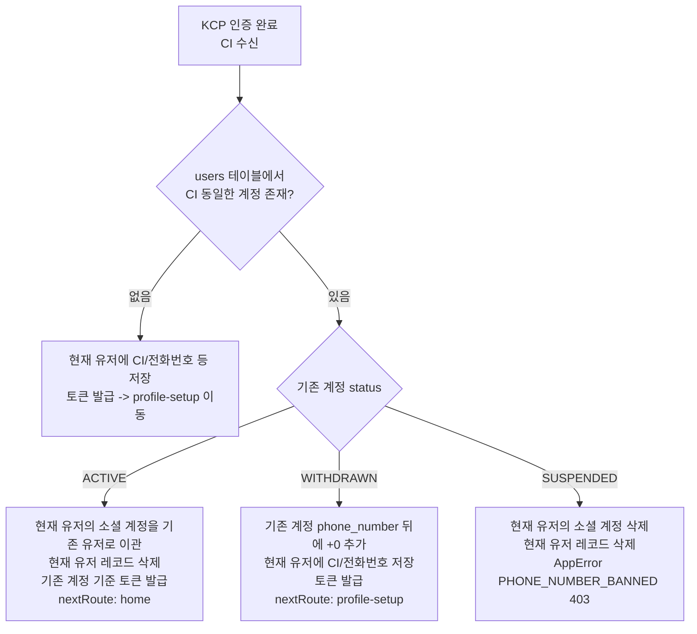

# NHN KCP 휴대폰 본인인증 연동 문서

> 작성일: 2026-04-14
> 최종 업데이트: 2026-04-22
> 적용 대상: Spots(핀돌) -- Flutter(Riverpod, GoRouter) + Fastify(TypeORM, PostgreSQL)
> 인증 방식: KCP 본인확인 V2 (API 기반, certDataReg.do / getCertData.do)
> KCP 사이트코드: ALQ1Q

---

## 목차

1. [개요](#1-개요)
2. [전체 흐름](#2-전체-흐름)
3. [중복 가입 처리 로직](#3-중복-가입-처리-로직)
4. [API 명세](#4-api-명세)
5. [KCP 복호화 필드 명세](#5-kcp-복호화-필드-명세)
6. [DB 스키마](#6-db-스키마)
7. [앱 라우터 변경](#7-앱-라우터-변경)
8. [파일 목록 및 역할](#8-파일-목록-및-역할)
9. [iOS / Android 플랫폼 설정](#9-ios--android-플랫폼-설정)
10. [에러 코드 정의](#10-에러-코드-정의)
11. [보안 고려사항](#11-보안-고려사항)

---

## 1. 개요

### 1.1 배경 및 목적

| 항목 | 내용 |
|------|------|
| 목적 | 실명 기반 서비스 운영 및 다중 계정 방지 |
| 적용 시점 | 소셜 로그인(Apple/Google/Kakao) 후 신규 유저 첫 진입 시 |
| 인증 방식 | KCP 본인확인 V2 API (서버-to-서버, AES-256-CBC 암호화 통신) |
| 수집 항목 | CI, DI, 전화번호, 성별, 생년월일, 실명, 통신사 |

### 1.2 KCP V2 API 구성

KCP 본인확인 V2는 HMAC 기반 웹 팝업형이 아닌, **API 기반** 3단계 플로우를 사용한다.

| 단계 | 엔드포인트 | 설명 |
|------|-----------|------|
| 1단계 | `POST https://cert.kcp.co.kr/api/reg/certDataReg.do` | 거래등록 -- `call_url`, `reg_cert_key` 수신 |
| 2단계 | WebView가 `call_url`로 form submit | KCP 인증창 표시 -- 사용자가 본인인증 수행 |
| 3단계 | `POST https://cert.kcp.co.kr/api/query/getCertData.do` | 결과 조회 -- `enc_cert_data` 복호화하여 CI/DI 등 추출 |

### 1.3 암호화 방식

- **PBKDF2**(SHA-256, 10,000 iterations, 256-bit)로 key/iv 유도
- **AES-256-CBC** + 수동 PKCS 패딩
- 거래등록 요청 시 payload를 `encryptJson()`으로 암호화, 결과 조회 시 `decryptJson()`으로 복호화
- 구현 파일: `server/src/modules/auth/kcp-crypto.ts`

### 1.4 요구사항 요약 (MoSCoW)

| ID | 요구사항 | 우선순위 |
|----|----------|----------|
| FR-KCP-001 | 신규 유저 첫 로그인 시 본인인증 화면 진입 | Must |
| FR-KCP-002 | KCP V2 API 기반 WebView 연동 | Must |
| FR-KCP-003 | CI 기반 중복 가입 체크 | Must |
| FR-KCP-004 | 중복 계정 ACTIVE 상태 -- 기존 계정 자동 로그인 | Must |
| FR-KCP-005 | 중복 계정 WITHDRAWN 상태 -- 전화번호 변형 후 신규 가입 허용 | Must |
| FR-KCP-006 | 중복 계정 SUSPENDED 상태 -- 가입 차단 + 에러 메시지 | Must |
| FR-KCP-007 | 인증 완료 후 users 테이블에 본인인증 정보 저장 | Must |
| FR-KCP-008 | 기존 인증 유저 재로그인 시 인증 화면 건너뜀 | Must |
| FR-KCP-009 | iOS 통신사 앱 URL Scheme 등록 | Must |
| FR-KCP-010 | Android intent-filter 등록 | Must |
| NFR-KCP-001 | KCP 거래등록 키(ordr_idxx)는 Redis에 30분 TTL로 일회성 처리 | Must |
| NFR-KCP-002 | 인증 결과는 서버 측에서만 KCP API(getCertData.do) 호출로 검증 | Must |
| NFR-KCP-003 | CI/DI 값은 암호화 없이 저장 (KCP에서 이미 해시 처리) | Should |

---

## 2. 전체 흐름

### 2.1 신규 유저 인증 흐름

```
[앱] 소셜 로그인 (Apple/Google/Kakao)
  |
[서버] POST /v1/auth/google (또는 /apple, /kakao)
  -> 응답: { isNewUser: true, isVerified: false }
  |
[앱] GoRouter redirect -> /phone-verification
  |
[앱] GET /v1/auth/kcp/form 호출 (Bearer Token 필요)
  |
[서버] 1. KCP certDataReg.do에 거래등록 요청 (AES-256-CBC 암호화)
       2. call_url, reg_cert_key 수신
       3. Redis에 ordr_idxx -> {userId, reg_cert_key} 저장 (30분 TTL)
       4. HTML form 생성 (call_url로 auto-submit)
  -> 응답: { html: "..." }
  |
[앱] WebView에 HTML 로드 -> form 자동 submit
  |
[KCP] 통신사 선택 -> 이름/생년월일/전화번호 입력 -> SMS 인증번호 확인
  |
[KCP] 인증 완료 -> Ret_URL (서버 콜백)로 POST
       (Ret_URL에 ordr_idxx 쿼리 파라미터 포함)
  |
[서버] POST /v1/auth/kcp/callback 수신
       1. body에서 res_cd 확인 (0000=성공, 9999=취소)
       2. query에서 ordr_idxx 추출
       3. Redis에서 {userId, reg_cert_key} 복원
       4. getCertData.do 호출 -> enc_cert_data 복호화
       5. CI/DI/전화번호/성별/생년월일/실명/통신사 추출
       6. CI 중복 체크 (아래 3.1 참고)
       7. users 테이블 업데이트
       8. JWT(accessToken, refreshToken) 발급
       9. 앱 커스텀 스킴 리다이렉트: spots://kcp-cert?status=success&...
  |
[앱] 딥링크 수신 -> 토큰 저장 -> /profile-setup 또는 /home 이동
```

### 2.2 기존 유저(이미 인증 완료) 재로그인 흐름

```
[앱] 소셜 로그인
  |
[서버] POST /v1/auth/google (또는 /apple, /kakao)
  -> 응답: { isNewUser: false, isVerified: true }
  |
[앱] GoRouter redirect -> /home (인증 화면 건너뜀)
```

### 2.3 시퀀스 다이어그램

```mermaid
sequenceDiagram
    participant App as Flutter 앱
    participant WV as WebView
    participant Server as Fastify 서버
    participant KCP as KCP 서버

    App->>Server: POST /v1/auth/google { idToken }
    Server-->>App: { isNewUser: true, isVerified: false, tokens }

    App->>Server: GET /v1/auth/kcp/form (Bearer Token)
    Server->>KCP: POST certDataReg.do (AES 암호화 payload)
    KCP-->>Server: { call_url, reg_cert_key }
    Server->>Server: Redis set kcp:order:{ordr_idxx} (30분 TTL)
    Server-->>App: { html: "<form action=call_url ...>" }

    App->>WV: WebView.loadHtmlString(html)
    WV->>KCP: form.submit() -> HTTPS POST (call_url)

    Note over KCP: 통신사 선택<br/>이름/생년월일/전화번호 입력<br/>SMS 인증

    KCP->>Server: POST /v1/auth/kcp/callback?ordr_idxx=ORDxxx (Ret_URL)
    Server->>Server: Redis get kcp:order:{ordr_idxx} -> {userId, reg_cert_key}
    Server->>KCP: POST getCertData.do { site_cd, reg_cert_key, ordr_idxx }
    KCP-->>Server: { enc_cert_data, rv }
    Server->>Server: decryptJson -> CI, DI, phone_no, user_name, birth_day, sex_code, comm_id

    Server->>Server: CI 중복 체크 + users 테이블 업데이트 + JWT 발급

    Server-->>WV: HTML redirect -> spots://kcp-cert?status=success&accessToken=...
    WV-->>App: 딥링크 감지

    App->>App: 토큰 저장 -> /profile-setup 또는 /home
```



---

## 3. 중복 가입 처리 로직

### 3.1 CI 기반 중복 처리 흐름



### 3.2 케이스별 처리 상세

#### Case 1: 기존 계정 ACTIVE

```
1. 현재 유저의 social_accounts 레코드를 기존 유저(existingUser)에게 이관
   (UPDATE social_accounts SET userId = existingUser.id WHERE userId = currentUser.id)
2. 현재 신규 유저 레코드 삭제 (DELETE users WHERE id = currentUser.id)
3. 기존 계정의 lastLoginAt 업데이트
4. 기존 계정 기준으로 JWT 발급 -> 앱으로 반환
5. 앱은 isNewUser: false 처리 -> nextRoute: home
```

#### Case 2: 기존 계정 WITHDRAWN (탈퇴)

```
1. 기존 계정의 phone_number를 "{phone_number}+0" 으로 업데이트
   (예: "01012345678" -> "01012345678+0")
   이유: phone_number unique 제약 해소
2. 현재 신규 유저에 CI, DI, phone_number, realName, carrier, gender, birthDate 정상 저장
3. 현재 유저 기준으로 JWT 발급 -> 앱으로 반환
4. 앱은 isNewUser: true 처리 -> nextRoute: profile-setup
```

#### Case 3: 기존 계정 SUSPENDED (밴)

```
1. 현재 유저의 social_accounts 레코드 삭제 (트랜잭션 내)
2. 현재 유저 레코드 삭제 (트랜잭션 내)
3. AppError(ErrorCode.PHONE_NUMBER_BANNED, 403) 반환
4. 앱: 에러 메시지 표시 -> 로그인 화면으로 이동
```

---

## 4. API 명세

### 4.1 GET /v1/auth/kcp/form

**KCP 인증 HTML Form 생성**

- 인증: Bearer Token 필요
- 역할: KCP V2 API로 거래등록 후, WebView에서 auto-submit할 HTML form 반환

**Request**

```
GET /v1/auth/kcp/form
Authorization: Bearer {accessToken}
```

**Response (200 OK)**

```json
{
  "success": true,
  "data": {
    "html": "<!DOCTYPE html><html>...<form id='form_auth' action='{call_url}' method='POST'>...<script>document.getElementById('form_auth').submit();</script></html>"
  }
}
```

**서버 내부 처리 흐름**

1. `ordr_idxx` 생성: `ORD{timestamp}{random}`
2. KCP Ret_URL 구성: `https://api.pins.kr/v1/auth/kcp/callback?ordr_idxx={ordr_idxx}`
3. 거래등록 payload 암호화 (`encryptJson`)
4. `POST certDataReg.do` 호출 (헤더: `site_cd`, `rv`)
5. 응답에서 `call_url`, `reg_cert_key` 추출
6. Redis에 `kcp:order:{ordr_idxx}` -> `{userId, reg_cert_key}` 저장 (30분 TTL)
7. HTML form 조립 (hidden fields: `call_url`, `reg_cert_key`, `kcp_page_submit_yn=Y`)

**거래등록 요청 파라미터**

| 파라미터 | 설명 | 값 |
|----------|------|-----|
| `site_cd` | 사이트코드 | `ALQ1Q` |
| `ordr_idxx` | 주문번호 (고유값) | `ORD{timestamp}{random}` |
| `Ret_URL` | 인증 완료 후 콜백 URL | `https://api.pins.kr/v1/auth/kcp/callback?ordr_idxx=...` |
| `web_siteid` | 웹 사이트 ID | (빈 문자열) |
| `param_opt_1~3` | 옵션 파라미터 | (빈 문자열) |

**거래등록 응답**

| 필드 | 설명 |
|------|------|
| `res_cd` | 결과 코드 (`0000` = 성공) |
| `res_msg` | 결과 메시지 |
| `call_url` | KCP 인증창 URL (WebView form action) |
| `reg_cert_key` | 등록 인증 키 (getCertData.do 호출 시 필요) |

---

### 4.2 POST /v1/auth/kcp/callback

**KCP 인증 완료 후 콜백 (KCP -> 서버)**

- 인증: 불필요 (KCP 서버가 직접 호출)
- Content-Type: `application/x-www-form-urlencoded` (KCP가 form post)
- 역할: KCP 인증 결과 수신 -> 복호화 -> 유저 정보 저장 -> 앱으로 딥링크 리다이렉트

**Request** (KCP가 호출)

```
POST /v1/auth/kcp/callback?ordr_idxx=ORDxxx
Content-Type: application/x-www-form-urlencoded

res_cd=0000&res_msg=...
```

**서버 내부 처리 흐름**

1. `body.res_cd` 확인 (`0000`=성공, `9999`=사용자 취소)
2. `query.ordr_idxx` 또는 `body.ordr_idxx` 추출
3. Redis에서 `kcp:order:{ordr_idxx}` 조회 -> `{userId, reg_cert_key}` 복원
4. `POST getCertData.do` 호출 -> `enc_cert_data`, `rv` 수신
5. `decryptJson(enc_cert_data, rv, encKey, siteCd)` -> 평문 JSON 복호화
6. 복호화된 필드에서 CI/DI/phone/gender/birth/name/carrier 추출
7. CI 중복 체크 + users 테이블 업데이트 + JWT 발급
8. Redis에서 `kcp:order:{ordr_idxx}` 삭제 (일회성 보장)

**성공 시 응답** (HTML 리다이렉트)

```html
<!DOCTYPE html>
<html><head><meta charset="UTF-8"><title>인증 완료</title></head>
<body>
<script>window.location.href = 'spots://kcp-cert?status=success&userId=...&nickname=...&accessToken=...&refreshToken=...&nextRoute=profile-setup&isNewUser=true';</script>
<p>인증이 완료되었습니다. 앱으로 이동 중...</p>
<a href="spots://kcp-cert?...">앱으로 이동</a>
</body></html>
```

**딥링크 파라미터 (spots://kcp-cert)**

| 파라미터 | 설명 |
|----------|------|
| `status` | `success` 또는 `error` |
| `userId` | 유저 UUID |
| `nickname` | 닉네임 (URL 인코딩) |
| `accessToken` | JWT Access Token (URL 인코딩) |
| `refreshToken` | JWT Refresh Token (URL 인코딩) |
| `nextRoute` | `profile-setup` (신규) 또는 `home` (기존 ACTIVE) |
| `isNewUser` | `true` 또는 `false` |

**에러 시 응답** (HTML 리다이렉트)

```html
<script>window.location.href = 'spots://kcp-cert?status=error&message=...';</script>
```

**HTTP 상태코드 요약**

| 상황 | 코드 | 비고 |
|------|------|------|
| 정상 인증 완료 | 200 | HTML 리다이렉트 (spots://kcp-cert?status=success) |
| 기존 ACTIVE 계정으로 자동 로그인 | 200 | nextRoute=home |
| 기존 WITHDRAWN -> 신규 가입 허용 | 200 | nextRoute=profile-setup |
| 밴 계정 (SUSPENDED) 차단 | 200 | HTML 리다이렉트 (spots://kcp-cert?status=error) |
| 사용자 취소 (res_cd=9999) | 200 | HTML 리다이렉트 (spots://kcp-cert?status=error) |
| 인증 세션 만료 | 200 | HTML 리다이렉트 (spots://kcp-cert?status=error) |

> **참고**: 콜백은 KCP가 직접 호출하고 WebView가 렌더링하므로, 에러 시에도 HTTP 200으로 HTML을 반환한다.
> 에러 정보는 딥링크의 `status=error&message=...`로 전달된다.

---

### 4.3 기존 소셜 로그인 API 응답

`POST /v1/auth/google`, `POST /v1/auth/apple`, `POST /v1/auth/kakao` 응답에 `isVerified` 필드가 포함된다.

```json
{
  "user": {
    "id": "uuid",
    "nickname": "...",
    "profileImageUrl": null,
    "isNewUser": true,
    "isVerified": false
  }
}
```

앱의 GoRouter redirect 로직이 `isNewUser && !isVerified` 조건으로 `/phone-verification` 진입 여부를 결정한다.

---

## 5. KCP 복호화 필드 명세

### 5.1 getCertData.do 응답 구조

`getCertData.do` 호출 시 `enc_cert_data`(암호화된 본문)와 `rv`(초기화 벡터)가 반환된다.
`decryptJson(enc_cert_data, rv, encKey, siteCd)`로 복호화하면 아래 JSON 필드를 얻는다.

### 5.2 복호화된 필드 목록

| KCP 원본 필드명 | 설명 | 예시 값 | 서버 매핑 |
|-----------------|------|---------|-----------|
| `phone_no` | 휴대폰 번호 (하이픈 없음) | `01012345678` | `kcpData.phoneNumber` |
| `user_name` | 실명 | `홍길동` | `kcpData.realName` |
| `birth_day` | 생년월일 (YYYYMMDD) | `19900101` | `kcpData.birthDate` |
| `sex_code` | 성별 코드 | `01` (남), `02` (여) | `kcpData.gender` |
| `comm_id` | 통신사 코드 | `KT`, `SKT`, `LGT` 등 | `kcpData.carrier` |
| `CI` | Connecting Information | (88자 해시) | `kcpData.ci` |
| `DI` | Duplicated Information | (64자 해시) | `kcpData.di` |

> **gender 필드 참고**: KCP 응답에서 `gender`, `sex_code`, `sex` 중 어떤 필드명으로 내려올 수 있음.
> 코드에서 `decrypted.gender || decrypted.sex_code || decrypted.sex` 순으로 fallback 처리한다.

### 5.3 성별(gender) 매핑 규칙

KCP에서 내려오는 성별 코드는 여러 포맷이 존재할 수 있다. 서버에서 아래 규칙으로 매핑한다.

```typescript
// kcp.service.ts - verifyCert() 내부
const gender =
  kcpData.gender === 'M' || kcpData.gender === '1' || kcpData.gender === '01'
    ? 'MALE'
    : kcpData.gender === 'F' || kcpData.gender === '0' || kcpData.gender === '02'
      ? 'FEMALE'
      : null;
```

| KCP 원본 값 | 매핑 결과 | 비고 |
|-------------|-----------|------|
| `M` | `MALE` | 영문 코드 |
| `1` | `MALE` | 숫자 코드 |
| `01` | `MALE` | KCP V2 sex_code 포맷 |
| `F` | `FEMALE` | 영문 코드 |
| `0` | `FEMALE` | 숫자 코드 |
| `02` | `FEMALE` | KCP V2 sex_code 포맷 |
| 기타 | `null` | 매핑 불가 시 저장 안 함 |

### 5.4 통신사(carrier) 매핑

통신사 코드도 `comm_id` 또는 `local_code` 중 존재하는 값을 사용한다.

```typescript
const carrier = decrypted.comm_id || decrypted.local_code || '';
```

### 5.5 디버그 로깅

복호화 후 아래 로그가 출력된다 (운영 환경에서 필드명 확인용).

```
[KCP CertGet] decrypted keys: ['phone_no', 'user_name', 'birth_day', 'sex_code', 'comm_id', 'CI', 'DI', ...]
[KCP CertGet] gender-related: {"gender":"...","sex_code":"01","sex":"..."}
[KCP verifyCert] raw gender: 01 -> mapped: MALE
```

---

## 6. DB 스키마

### 6.1 users 테이블 KCP 관련 컬럼

> **레거시 `phone` 컬럼은 삭제됨.** `phone_number` 컬럼만 사용한다.

```sql
-- users 테이블 KCP 본인인증 컬럼
phone_number    VARCHAR(30)   NULL    -- KCP에서 수신한 휴대폰 번호
ci              VARCHAR(100)  NULL    -- Connecting Information (중복 가입 체크용)
di              VARCHAR(100)  NULL    -- Duplicated Information
real_name       VARCHAR(50)   NULL    -- 실명
carrier         VARCHAR(20)   NULL    -- 통신사 코드
is_verified     BOOLEAN       NOT NULL DEFAULT FALSE  -- 본인인증 완료 여부
verified_at     TIMESTAMPTZ   NULL    -- 본인인증 완료 시각

-- CI 중복 체크용 partial unique index
CREATE UNIQUE INDEX uidx_users_ci ON users (ci) WHERE ci IS NOT NULL;

-- 전화번호 인덱스
CREATE INDEX idx_users_phone_number ON users (phone_number) WHERE phone_number IS NOT NULL;
```

### 6.2 TypeORM Entity (user.entity.ts)

```typescript
// KCP 본인인증 컬럼
@Column({ name: 'phone_number', type: 'varchar', length: 30, nullable: true })
phoneNumber!: string | null;

@Column({ name: 'ci', type: 'varchar', length: 100, nullable: true })
ci!: string | null;

@Column({ name: 'di', type: 'varchar', length: 100, nullable: true })
di!: string | null;

@Column({ name: 'real_name', type: 'varchar', length: 50, nullable: true })
realName!: string | null;

@Column({ name: 'carrier', type: 'varchar', length: 20, nullable: true })
carrier!: string | null;

@Column({ name: 'is_verified', type: 'boolean', default: false })
isVerified!: boolean;

@Column({ name: 'verified_at', type: 'timestamptz', nullable: true })
verifiedAt!: Date | null;
```

> **레거시 `phone` 컬럼**: `user.entity.ts`에서 이미 삭제됨. DB에도 존재하지 않음.
> KCP 인증 결과의 전화번호는 `phoneNumber` (DB 컬럼: `phone_number`)에 저장된다.

### 6.3 컬럼 의미 정의

| 컬럼 | 타입 | 설명 |
|------|------|------|
| `phone_number` | VARCHAR(30) | KCP에서 수신한 휴대폰 번호 (하이픈 없음, 예: 01012345678) |
| `ci` | VARCHAR(100) | Connecting Information -- 중복 가입 체크용 고유 식별값 (KCP 발급, 범사이트 동일) |
| `di` | VARCHAR(100) | Duplicated Information -- 사이트 내 중복 확인용 값 (사이트별 상이) |
| `real_name` | VARCHAR(50) | 실명 (KCP 본인인증 결과) |
| `carrier` | VARCHAR(20) | 통신사 코드 (KT, SKT, LGT, KT_MVNO, SKT_MVNO, LGT_MVNO 등) |
| `is_verified` | BOOLEAN | 본인인증 완료 여부 (기본값: false) |
| `verified_at` | TIMESTAMPTZ | 본인인증 완료 시각 |

> 기존 컬럼인 `gender`(VARCHAR(10)), `birth_date`(DATE)도 KCP 결과로 채워진다.
> gender는 `MALE` / `FEMALE` 문자열로 저장된다.
> birth_date는 KCP의 YYYYMMDD 문자열을 `Date` 객체로 파싱하여 저장한다.

---

## 7. 앱 라우터 변경

### 7.1 신규 라우트 경로

```dart
// AppRoutes 클래스에 추가
static const String phoneVerification = '/phone-verification';
```

### 7.2 publicRoutes 목록 추가

```dart
final publicRoutes = [
  AppRoutes.splash,
  AppRoutes.onboarding,
  AppRoutes.login,
  AppRoutes.phoneVerification,  // 추가
  AppRoutes.profileSetup,
  AppRoutes.fontSizeSetup,
  AppRoutes.sportProfileSetup,
  AppRoutes.locationSetup,
];
```

### 7.3 redirect 로직

```dart
redirect: (context, state) {
  final authState = ref.read(authStateProvider);
  final isAuthenticated = authState.valueOrNull?.isAuthenticated ?? false;
  final isNewUser = authState.valueOrNull?.isNewUser ?? false;
  final isVerified = authState.valueOrNull?.isVerified ?? true;
  final location = state.matchedLocation;

  // 신규 유저 + 본인인증 미완료 -> 본인인증 화면으로
  if (isAuthenticated && isNewUser && !isVerified &&
      location != AppRoutes.phoneVerification) {
    return AppRoutes.phoneVerification;
  }

  // 신규 유저 + 본인인증 완료 -> 프로필 설정으로
  if (isAuthenticated && isNewUser && isVerified &&
      location == AppRoutes.phoneVerification) {
    return AppRoutes.profileSetup;
  }

  // ...
},
```

### 7.4 딥링크 처리

KCP 인증 완료 후 서버가 `spots://kcp-cert?status=success&accessToken=...` 딥링크로 리다이렉트한다.
앱의 WebView에서 이 커스텀 스킴을 감지하여 토큰을 저장하고 라우팅한다.

---

## 8. 파일 목록 및 역할

### 8.1 서버 (Fastify)

| 파일 경로 | 역할 |
|-----------|------|
| `server/src/modules/auth/kcp.service.ts` | KCP V2 API 연동 핵심 로직: 거래등록, 콜백 처리, 복호화, CI 중복 처리, JWT 발급 |
| `server/src/modules/auth/kcp.routes.ts` | GET /v1/auth/kcp/form, POST /v1/auth/kcp/callback 라우트 등록 |
| `server/src/modules/auth/kcp.schema.ts` | KcpRawResult, KcpVerifyResult 타입 정의 |
| `server/src/modules/auth/kcp-crypto.ts` | AES-256-CBC + PBKDF2 암/복호화 (encryptJson, decryptJson) |
| `server/src/modules/auth/auth.service.ts` | 소셜 로그인 응답에 isVerified 필드 포함 |
| `server/src/entities/user.entity.ts` | phoneNumber, ci, di, realName, carrier, isVerified, verifiedAt 컬럼 |
| `server/src/shared/errors/app-error.ts` | PHONE_NUMBER_BANNED, KCP_INVALID_KEY, KCP_KEY_ALREADY_USED, KCP_SERVER_ERROR 에러코드 |

**kcp.service.ts 주요 메서드**

```typescript
class KcpService {
  constructor(private dataSource: DataSource) {}

  // GET /kcp/form 처리: 거래등록 + WebView용 HTML form 반환
  async generateCertForm(userId: string, returnUrl: string): Promise<string>

  // POST /kcp/callback 처리: 콜백 데이터 검증 + getCertData.do 호출 + 복호화
  async handleCallback(
    body: Record<string, any>,
    query: Record<string, any>,
  ): Promise<{ userId: string; kcpData: KcpRawResult }>

  // 유저 정보 저장 + CI 중복 처리 + JWT 발급
  async verifyCert(userId: string, kcpData: KcpRawResult): Promise<KcpVerifyResult>

  // getCertData.do 호출 + 복호화 (private)
  private async fetchAndDecryptCertData(
    ordr_idxx: string,
    reg_cert_key: string,
  ): Promise<KcpRawResult>

  // CI 중복 처리 로직 (private)
  private async handleDuplicateCi(
    currentUser: User,
    existingUser: User,
    kcpData: KcpRawResult,
  ): Promise<KcpVerifyResult>

  // 생년월일 파싱 YYYYMMDD -> Date (private)
  private parseBirthDate(yyyymmdd: string): Date | null
}
```

### 8.2 앱 (Flutter)

| 파일 경로 | 역할 |
|-----------|------|
| `app/lib/screens/auth/phone_verification_screen.dart` | 본인인증 화면 -- WebView로 KCP form 로드 + 딥링크 수신 처리 |
| `app/lib/repositories/kcp_repository.dart` | GET /kcp/form API 호출 |
| `app/lib/providers/auth_provider.dart` | AuthState에 isVerified 추가, 소셜 로그인 응답 처리 |
| `app/lib/config/router.dart` | /phone-verification 라우트 + redirect 로직 |
| `app/ios/Runner/Info.plist` | 통신사 앱 스킴 + spots:// 커스텀 스킴 등록 |
| `app/android/app/src/main/AndroidManifest.xml` | spots://kcp-cert intent-filter 등록 |

---

## 9. iOS / Android 플랫폼 설정

### 9.1 iOS -- Info.plist

```xml
<!-- 통신사 앱 연동을 위한 URL Scheme 허용 (LSApplicationQueriesSchemes) -->
<key>LSApplicationQueriesSchemes</key>
<array>
  <string>tauthlink</string>           <!-- SKT T인증 -->
  <string>ktauthexternalcall</string>   <!-- KT 본인인증 -->
  <string>upluscorporation</string>     <!-- LG U+ 본인인증 -->
</array>

<!-- 커스텀 URL Scheme 등록 (KCP 인증 완료 후 앱 복귀) -->
<key>CFBundleURLTypes</key>
<array>
  <dict>
    <key>CFBundleURLName</key>
    <string>kr.pindor.app.kcp</string>
    <key>CFBundleURLSchemes</key>
    <array>
      <string>spots</string>
    </array>
  </dict>
</array>
```

### 9.2 Android -- AndroidManifest.xml

```xml
<activity android:name=".MainActivity" ...>
  <intent-filter android:autoVerify="true">
    <action android:name="android.intent.action.VIEW" />
    <category android:name="android.intent.category.DEFAULT" />
    <category android:name="android.intent.category.BROWSABLE" />
    <data android:scheme="spots" android:host="kcp-cert" />
  </intent-filter>
</activity>
```

### 9.3 WebView 패키지 의존성 (pubspec.yaml)

```yaml
dependencies:
  webview_flutter: ^4.8.0    # WebView (KCP form 렌더링)
  app_links: ^6.1.0          # 딥링크 수신 (spots://kcp-cert)
```

---

## 10. 에러 코드 정의

`server/src/shared/errors/app-error.ts`의 `ErrorCode` enum에 정의된 KCP 관련 에러 코드.

| 에러 코드 | HTTP | 메시지 | 앱 처리 |
|-----------|------|--------|---------|
| `PHONE_NUMBER_BANNED` | 403 | 해당 전화번호로는 가입이 불가합니다. | 에러 다이얼로그 -> /login |
| `KCP_INVALID_KEY` | 400 | 인증 정보가 유효하지 않습니다. 다시 시도해주세요. | 재시도 안내 |
| `KCP_KEY_ALREADY_USED` | 409 | 이미 처리된 인증입니다. | /home 또는 /profile-setup |
| `KCP_SERVER_ERROR` | 502 | 인증 서버와 통신 중 오류가 발생했습니다. | 재시도 안내 |
| `VERIFICATION_REQUIRED` | 403 | 본인인증이 필요합니다. | /phone-verification 리다이렉트 |

---

## 11. 보안 고려사항

### 11.1 거래등록 키 일회성 처리

- `ordr_idxx` -> `{userId, reg_cert_key}` 매핑은 Redis에 30분 TTL로 저장
- 콜백 처리 완료 후 즉시 Redis에서 삭제 (`redis.del`)
- 만료된 세션은 "인증 세션이 만료되었습니다." 에러 반환

### 11.2 암호화 통신

- 거래등록 요청: payload를 AES-256-CBC로 암호화하여 전송
- 결과 조회 응답: `enc_cert_data`를 AES-256-CBC로 복호화
- KCP 암호화 키(`eaa433b5...`)는 서버 코드에만 존재, 앱/응답에 절대 노출 안 함

### 11.3 CI/DI 저장

CI와 DI는 KCP에서 이미 해시 처리된 값이다.
추가 암호화 없이 DB에 저장해도 무방하나, 개인정보보호법 준수를 위해 컬럼 레벨 접근 권한 제한을 권장한다.

### 11.4 실명 저장 시 고려사항

`real_name`은 성명(실명)이므로 개인정보에 해당한다.
실명이 필요한 기능(예: 고객센터 문의)에서만 조회하고, 일반 API 응답에는 포함하지 않는다.

### 11.5 콜백 보안

- KCP 콜백(`POST /v1/auth/kcp/callback`)은 인증 불필요 (KCP 서버가 직접 호출)
- 단, `ordr_idxx`로 Redis 세션을 검증하므로 외부에서 위조 불가
- 콜백 처리 결과는 직접 JSON 응답이 아닌 HTML 리다이렉트로 반환 (WebView 환경)
