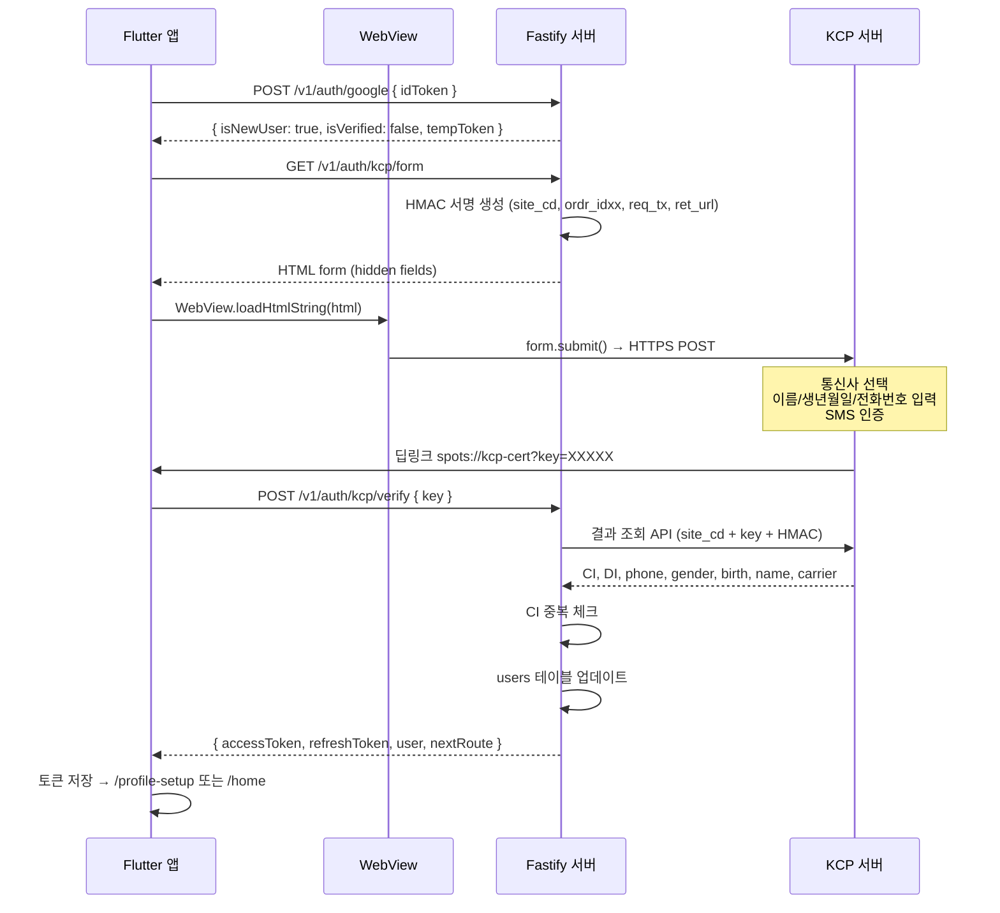
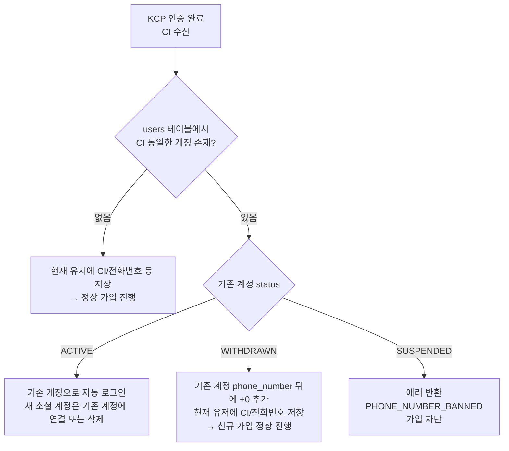

# NHN KCP 휴대폰 본인인증 연동 기획서

> 작성일: 2026-04-14  
> 적용 대상: 핀돌(PINDOR) — Flutter(Riverpod, GoRouter) + Fastify(TypeORM, PostgreSQL)  
> 인증 방식: KCP 웹 팝업형 (CERT)  
> KCP 사이트코드: J26040912350

---

## 목차

1. [개요](#1-개요)
2. [전체 흐름](#2-전체-흐름)
3. [중복 가입 처리 로직](#3-중복-가입-처리-로직)
4. [API 명세](#4-api-명세)
5. [DB 스키마 변경](#5-db-스키마-변경)
6. [앱 라우터 변경](#6-앱-라우터-변경)
7. [파일 목록 및 역할](#7-파일-목록-및-역할)
8. [iOS / Android 플랫폼 설정](#8-ios--android-플랫폼-설정)
9. [에러 코드 정의](#9-에러-코드-정의)
10. [보안 고려사항](#10-보안-고려사항)
11. [구현 순서 및 체크리스트](#11-구현-순서-및-체크리스트)

---

## 1. 개요

### 1.1 배경 및 목적

| 항목 | 내용 |
|------|------|
| 목적 | 실명 기반 서비스 운영 및 다중 계정 방지 |
| 적용 시점 | 소셜 로그인(Apple/Google) 후 신규 유저 첫 진입 시 |
| 인증 방식 | NHN KCP 웹 팝업형 CERT (서버-to-서버 결과 검증) |
| 수집 항목 | CI, DI, 전화번호, 성별, 생년월일, 실명, 통신사 |

### 1.2 요구사항 요약 (MoSCoW)

| ID | 요구사항 | 우선순위 |
|----|----------|----------|
| FR-KCP-001 | 신규 유저 첫 로그인 시 본인인증 화면 진입 | Must |
| FR-KCP-002 | KCP 웹 팝업 CERT 방식 WebView 연동 | Must |
| FR-KCP-003 | CI 기반 중복 가입 체크 | Must |
| FR-KCP-004 | 중복 계정 활성 상태 → 기존 계정 자동 로그인 | Must |
| FR-KCP-005 | 중복 계정 탈퇴 상태 → 전화번호 변형 후 신규 가입 허용 | Must |
| FR-KCP-006 | 중복 계정 밴 상태 → 가입 차단 + 에러 메시지 | Must |
| FR-KCP-007 | 인증 완료 후 users 테이블에 본인인증 정보 저장 | Must |
| FR-KCP-008 | 기존 인증 유저 재로그인 시 인증 화면 건너뜀 | Must |
| FR-KCP-009 | iOS 통신사 앱 URL Scheme 등록 | Must |
| FR-KCP-010 | Android intent-filter 등록 | Must |
| NFR-KCP-001 | KCP key는 일회성 처리 (재사용 방지) | Must |
| NFR-KCP-002 | 인증 결과는 서버 측에서만 KCP API 호출로 검증 | Must |
| NFR-KCP-003 | CI/DI 값은 암호화 없이 저장 (KCP에서 이미 해시 처리) | Should |

---

## 2. 전체 흐름

### 2.1 신규 유저 인증 흐름

```
[앱] 소셜 로그인 (Apple/Google)
  ↓
[서버] POST /v1/auth/google (또는 /apple)
  → 응답: { isNewUser: true, isVerified: false }
  ↓
[앱] GoRouter redirect → /phone-verification
  ↓
[앱] GET /v1/auth/kcp/form 호출
  ↓
[서버] KCP용 HTML form 생성 (사이트코드, 리턴URL, HMAC 서명 포함)
  ↓
[앱] WebView에 HTML 로드 → form 자동 submit
  ↓
[KCP] 통신사 선택 → 이름/생년월일/전화번호 입력 → SMS 인증번호 확인
  ↓
[KCP] 인증 완료 → spots://kcp-cert?key=XXXXX 딥링크 호출
  ↓
[앱] 딥링크 수신 → key 파라미터 추출
  → POST /v1/auth/kcp/verify { key }
  ↓
[서버] KCP 서버에 key로 인증 결과 조회
  → CI/DI/전화번호/성별/생년월일/실명/통신사 추출
  → CI 중복 체크 (아래 3.1 참고)
  → users 테이블 업데이트
  → 최종 JWT 응답
  ↓
[앱] 토큰 저장 → /profile-setup 또는 /home 이동
```

### 2.2 기존 유저(이미 인증 완료) 재로그인 흐름

```
[앱] 소셜 로그인
  ↓
[서버] POST /v1/auth/google (또는 /apple)
  → 응답: { isNewUser: false, isVerified: true }
  ↓
[앱] GoRouter redirect → /home (인증 화면 건너뜀)
```

### 2.3 시퀀스 다이어그램



---

## 3. 중복 가입 처리 로직

### 3.1 CI 기반 중복 처리 흐름



### 3.2 케이스별 처리 상세

#### Case 1: 기존 계정 ACTIVE

```
1. 기존 계정(existingUser)에 현재 소셜 계정 연결 (social_accounts 레코드 추가)
   또는 현재 생성 중인 신규 유저 레코드 삭제
2. 기존 계정의 lastLoginAt 업데이트
3. 기존 계정 기준으로 JWT 발급 → 앱으로 반환
4. 앱은 isNewUser: false 처리 → /home 이동
```

#### Case 2: 기존 계정 WITHDRAWN (탈퇴)

```
1. 기존 계정의 phone_number를 "{phone_number}+0" 으로 업데이트
   (예: "01012345678" → "01012345678+0")
   이유: phone_number unique 제약 해소
2. 현재 신규 유저에 CI, DI, phone_number 등 정상 저장
3. 현재 유저 기준으로 JWT 발급 → 앱으로 반환
4. 앱은 isNewUser: true 처리 → /profile-setup 이동
```

#### Case 3: 기존 계정 SUSPENDED (밴)

```
1. AppError(ErrorCode.PHONE_NUMBER_BANNED, 403) 반환
2. 현재 신규 유저 레코드는 삭제 (또는 트랜잭션 롤백)
3. 앱: "해당 전화번호로는 가입이 불가합니다." 다이얼로그 → 로그인 화면으로 이동
```

---

## 4. API 명세

### 4.1 GET /v1/auth/kcp/form

**KCP 인증 HTML Form 생성**

- 인증: Bearer Token 필요 (소셜 로그인 후 임시 토큰 또는 정식 accessToken)
- 역할: KCP CERT 방식 인증에 필요한 HTML hidden form 생성 + HMAC 서명 삽입

**Request**

```
GET /v1/auth/kcp/form
Authorization: Bearer {accessToken}
```

**Response (200 OK)**

```json
{
  "success": true,
  "data": {
    "html": "<html>...<form id='certForm' action='https://cert.kcp.co.kr/kcp_cert/cert_view.jsp' method='POST'>...</form><script>document.getElementById('certForm').submit();</script></html>"
  }
}
```

**서버 측 생성 파라미터**

| KCP 파라미터 | 설명 | 값 |
|-------------|------|-----|
| `site_cd` | 사이트코드 | `J26040912350` |
| `ordr_idxx` | 주문번호 (고유값) | `{userId}_{timestamp}` |
| `req_tx` | 요청 구분 | `cert` |
| `cert_method` | 인증 방법 | `01` (휴대폰) |
| `up_hash` | HMAC-SHA256 서명 | 서버에서 생성 |
| `Ret_URL` | 인증 완료 후 리턴 URL | `spots://kcp-cert` |
| `kcp_merchant_time` | 요청 시각 | 현재 시각 (yyyyMMddHHmmss) |

---

### 4.2 POST /v1/auth/kcp/verify

**KCP 인증 결과 검증 및 유저 정보 저장**

- 인증: Bearer Token 필요
- 역할: 앱에서 받은 key로 KCP 서버에 인증 결과 조회 → CI 중복 체크 → DB 저장

**Request**

```
POST /v1/auth/kcp/verify
Authorization: Bearer {accessToken}
Content-Type: application/json
```

```json
{
  "key": "XXXXX_KCP_ONE_TIME_KEY"
}
```

**Response (200 OK) — 정상 인증 완료**

```json
{
  "success": true,
  "data": {
    "accessToken": "eyJ...",
    "refreshToken": "eyJ...",
    "user": {
      "id": "uuid",
      "nickname": "빠른호랑이",
      "profileImageUrl": null,
      "isNewUser": true,
      "isVerified": true,
      "phoneNumber": "01012345678"
    },
    "nextRoute": "profile-setup"
  }
}
```

**Response — CI 중복 (기존 ACTIVE 계정 존재)**

```json
{
  "success": true,
  "data": {
    "accessToken": "eyJ...",
    "refreshToken": "eyJ...",
    "user": {
      "id": "기존_유저_uuid",
      "nickname": "기존닉네임",
      "profileImageUrl": "https://...",
      "isNewUser": false,
      "isVerified": true,
      "phoneNumber": "01012345678"
    },
    "nextRoute": "home"
  }
}
```

**Response — CI 중복 (기존 SUSPENDED 계정 존재)**

```json
{
  "success": false,
  "error": {
    "code": "PHONE_NUMBER_BANNED",
    "message": "해당 전화번호로는 가입이 불가합니다."
  }
}
```

**HTTP 상태코드 요약**

| 상황 | 코드 |
|------|------|
| 정상 인증 완료 | 200 |
| 기존 ACTIVE 계정으로 자동 로그인 | 200 |
| 기존 WITHDRAWN → 신규 가입 허용 | 200 |
| 밴 계정 (SUSPENDED) 차단 | 403 |
| key 유효하지 않음 / 만료 | 400 |
| key 이미 사용됨 | 409 |

---

### 4.3 기존 소셜 로그인 API 응답 변경

기존 `POST /v1/auth/google`, `POST /v1/auth/apple` 응답에 `isVerified` 필드를 추가한다.

**변경 전**

```json
{
  "user": {
    "id": "uuid",
    "nickname": "...",
    "profileImageUrl": null,
    "isNewUser": true
  }
}
```

**변경 후**

```json
{
  "user": {
    "id": "uuid",
    "nickname": "...",
    "profileImageUrl": null,
    "isNewUser": true,
    "isVerified": false
  }
}
```

앱의 GoRouter redirect 로직이 `isNewUser && !isVerified` 조건으로 `/phone-verification` 진입 여부를 결정한다.

---

## 5. DB 스키마 변경

### 5.1 users 테이블 컬럼 추가

기존 `users` 테이블에 아래 컬럼을 추가한다.

```sql
-- Migration: add_kcp_verification_columns_to_users

ALTER TABLE users
  ADD COLUMN IF NOT EXISTS phone_number    VARCHAR(30)  NULL,
  ADD COLUMN IF NOT EXISTS ci              VARCHAR(100) NULL,
  ADD COLUMN IF NOT EXISTS di              VARCHAR(100) NULL,
  ADD COLUMN IF NOT EXISTS real_name       VARCHAR(50)  NULL,
  ADD COLUMN IF NOT EXISTS carrier         VARCHAR(20)  NULL,
  ADD COLUMN IF NOT EXISTS is_verified     BOOLEAN      NOT NULL DEFAULT FALSE,
  ADD COLUMN IF NOT EXISTS verified_at     TIMESTAMPTZ  NULL;

-- CI 중복 체크용 인덱스 (NULL 제외)
CREATE UNIQUE INDEX IF NOT EXISTS uidx_users_ci
  ON users (ci)
  WHERE ci IS NOT NULL;

-- 전화번호 인덱스 (NULL 제외)
CREATE INDEX IF NOT EXISTS idx_users_phone_number
  ON users (phone_number)
  WHERE phone_number IS NOT NULL;
```

> **주의**: 기존 `phone` 컬럼이 `VARCHAR(20)`으로 이미 존재한다.
> 역할이 다르므로 기존 컬럼 유지 + 신규 `phone_number` 컬럼 추가 방식으로 처리한다.
> 추후 마이그레이션 정리 시 `phone` → `phone_number` 통합 가능.

### 5.2 TypeORM Entity 변경 (user.entity.ts)

```typescript
// 추가할 컬럼들

@Column({ name: 'phone_number', type: 'varchar', length: 30, nullable: true })
phoneNumber!: string | null;

@Column({ name: 'ci', type: 'varchar', length: 100, nullable: true, unique: false })
ci!: string | null;

@Column({ name: 'di', type: 'varchar', length: 100, nullable: true })
di!: string | null;

@Column({ name: 'real_name', type: 'varchar', length: 50, nullable: true })
realName!: string | null;

@Column({ name: 'carrier', type: 'varchar', length: 20, nullable: true })
carrier!: string | null;

@Column({ name: 'is_verified', type: 'boolean', default: false })
isVerified!: boolean;

@Column({ name: 'verified_at', type: 'timestamptz', nullable: true })
verifiedAt!: Date | null;
```

> **unique 설정**: CI는 NULL이 다수 포함되므로 Entity에서 `unique: false` 유지하고,
> 위 SQL의 partial unique index(`WHERE ci IS NOT NULL`)로 무결성을 보장한다.
> TypeORM의 `@Index({ unique: true, where: 'ci IS NOT NULL' })` 데코레이터도 병행 적용 가능.

### 5.3 컬럼 의미 정의

| 컬럼 | 타입 | 설명 |
|------|------|------|
| `phone_number` | VARCHAR(30) | KCP에서 수신한 휴대폰 번호 (하이픈 없음, 예: 01012345678) |
| `ci` | VARCHAR(100) | Connecting Information — 중복 가입 체크용 고유 식별값 (KCP에서 발급) |
| `di` | VARCHAR(100) | Duplicated Information — 사이트 내 중복 확인용 값 |
| `real_name` | VARCHAR(50) | 실명 (KCP 본인인증 결과) |
| `carrier` | VARCHAR(20) | 통신사 코드 (KT, SKT, LGT, KT_MVNO 등) |
| `is_verified` | BOOLEAN | 본인인증 완료 여부 (기본값: false) |
| `verified_at` | TIMESTAMPTZ | 본인인증 완료 시각 |

> 기존 컬럼인 `gender`(VARCHAR(10)), `birth_date`(DATE)도 KCP 결과로 채워진다.
> 기존에 소셜 로그인에서 받은 gender/birth_date가 있을 경우 KCP 값으로 덮어쓴다.

---

## 6. 앱 라우터 변경

### 6.1 신규 라우트 경로

```dart
// AppRoutes 클래스에 추가
static const String phoneVerification = '/phone-verification';
```

### 6.2 publicRoutes 목록 추가

```dart
final publicRoutes = [
  AppRoutes.splash,
  AppRoutes.onboarding,
  AppRoutes.login,
  AppRoutes.phoneVerification,  // 추가
  AppRoutes.profileSetup,
  AppRoutes.fontSizeSetup,
  AppRoutes.sportProfileSetup,
  AppRoutes.locationSetup,
];
```

### 6.3 redirect 로직 변경

현재 `AuthState`에 `isNewUser` 필드가 있다. `isVerified` 필드를 추가하여 본인인증 완료 여부를 판단한다.

**AuthState 변경**

```dart
class AuthState {
  final bool isAuthenticated;
  final User? user;
  final bool isNewUser;
  final bool isVerified;  // 추가

  const AuthState({
    required this.isAuthenticated,
    this.user,
    this.isNewUser = false,
    this.isVerified = true,  // 기존 유저는 기본 true
  });
}
```

**GoRouter redirect 로직 변경**

```dart
redirect: (context, state) {
  final authState = ref.read(authStateProvider);
  final isAuthenticated = authState.valueOrNull?.isAuthenticated ?? false;
  final isNewUser = authState.valueOrNull?.isNewUser ?? false;
  final isVerified = authState.valueOrNull?.isVerified ?? true;
  final isLoading = authState.isLoading;
  final location = state.matchedLocation;

  if (isLoading) return null;

  final publicRoutes = [
    AppRoutes.splash,
    AppRoutes.onboarding,
    AppRoutes.login,
    AppRoutes.phoneVerification,
    AppRoutes.profileSetup,
    AppRoutes.fontSizeSetup,
    AppRoutes.sportProfileSetup,
    AppRoutes.locationSetup,
  ];

  final isPublicRoute = publicRoutes.any((r) => location.startsWith(r));

  if (!isAuthenticated && !isPublicRoute) {
    return AppRoutes.login;
  }

  // 신규 유저 + 본인인증 미완료 → 본인인증 화면으로
  if (isAuthenticated && isNewUser && !isVerified &&
      location != AppRoutes.phoneVerification) {
    return AppRoutes.phoneVerification;
  }

  // 신규 유저 + 본인인증 완료 → 프로필 설정으로
  if (isAuthenticated && isNewUser && isVerified &&
      location == AppRoutes.phoneVerification) {
    return AppRoutes.profileSetup;
  }

  if (isAuthenticated &&
      (location == AppRoutes.login || location == AppRoutes.splash)) {
    return AppRoutes.home;
  }

  return null;
},
```

### 6.4 GoRoute 추가

```dart
GoRoute(
  path: AppRoutes.phoneVerification,
  builder: (context, state) => const PhoneVerificationScreen(),
),
```

### 6.5 커스텀 URL Scheme 처리 (딥링크)

```dart
// main.dart 또는 router.dart의 GoRouter 설정에 추가
// flutter_web_auth_2 또는 app_links 패키지 활용

// 앱 시작 시 딥링크 수신 처리
// spots://kcp-cert?key=XXXXX
```

---

## 7. 파일 목록 및 역할

### 7.1 서버 (Fastify)

| 파일 경로 | 역할 | 변경 구분 |
|-----------|------|-----------|
| `server/src/modules/auth/kcp.service.ts` | KCP HTML form 생성, KCP 서버 결과 조회, CI 중복 처리 핵심 로직 | 신규 |
| `server/src/modules/auth/kcp.routes.ts` | GET /v1/auth/kcp/form, POST /v1/auth/kcp/verify 라우트 등록 | 신규 |
| `server/src/modules/auth/kcp.schema.ts` | Zod 스키마 + DTO 타입 정의 (KcpVerifyDto 등) | 신규 |
| `server/src/modules/auth/auth.routes.ts` | 기존 소셜 로그인 응답에 isVerified 필드 추가 | 수정 |
| `server/src/modules/auth/auth.service.ts` | 소셜 로그인 응답 DTO에 isVerified 포함 | 수정 |
| `server/src/entities/user.entity.ts` | phoneNumber, ci, di, realName, carrier, isVerified, verifiedAt 컬럼 추가 | 수정 |
| `server/src/shared/errors/app-error.ts` | PHONE_NUMBER_BANNED, KCP_INVALID_KEY, KCP_KEY_ALREADY_USED 에러코드 추가 | 수정 |
| `server/src/migrations/YYYYMMDD_add_kcp_columns.ts` | users 테이블 컬럼 추가 + partial unique index 생성 | 신규 |

**kcp.service.ts 주요 메서드**

```typescript
class KcpService {
  // GET /kcp/form 처리: KCP HTML form 문자열 생성
  generateCertForm(userId: string): Promise<string>

  // POST /kcp/verify 처리: key로 KCP 결과 조회 → CI 중복 처리 → DB 저장
  verifyCert(userId: string, key: string): Promise<KcpVerifyResult>

  // KCP 서버에 key로 인증 결과 조회 (서버-to-서버)
  private fetchKcpResult(key: string): Promise<KcpRawResult>

  // CI 중복 처리 로직
  private handleDuplicateCi(
    currentUserId: string,
    existingUser: User,
    kcpData: KcpRawResult
  ): Promise<KcpVerifyResult>
}
```

---

### 7.2 앱 (Flutter)

| 파일 경로 | 역할 | 변경 구분 |
|-----------|------|-----------|
| `app/lib/screens/auth/phone_verification_screen.dart` | 본인인증 화면 — WebView + KCP form 로드 + 딥링크 수신 처리 | 신규 |
| `app/lib/repositories/kcp_repository.dart` | GET /kcp/form, POST /kcp/verify API 호출 | 신규 |
| `app/lib/providers/auth_provider.dart` | AuthState에 isVerified 추가, loginWithGoogle/Apple 응답 처리 변경 | 수정 |
| `app/lib/config/router.dart` | /phone-verification 라우트 추가, redirect 로직 변경, publicRoutes 추가 | 수정 |
| `app/ios/Runner/Info.plist` | 통신사 앱 스킴 + spots:// 커스텀 스킴 등록 | 수정 |
| `app/android/app/src/main/AndroidManifest.xml` | spots://kcp-cert intent-filter 등록 | 수정 |

**phone_verification_screen.dart 처리 흐름**

```
initState
  → kcp_repository.getForm() 호출
  → WebViewController 생성
  → HTML string 로드 (form 자동 submit)

navigationDelegate
  → URL이 spots://kcp-cert 로 시작하면
  → URI에서 key 파라미터 추출
  → kcp_repository.verify(key) 호출
  → 성공: auth_provider 상태 갱신 → router redirect 처리
  → 실패: 에러 다이얼로그 표시
```

---

## 8. iOS / Android 플랫폼 설정

### 8.1 iOS — Info.plist

```xml
<!-- 통신사 앱 연동을 위한 URL Scheme 허용 (LSApplicationQueriesSchemes) -->
<key>LSApplicationQueriesSchemes</key>
<array>
  <!-- 기존 항목들 유지 -->
  <string>tauthlink</string>       <!-- SKT T인증 -->
  <string>ktauthexternalcall</string>  <!-- KT 본인인증 -->
  <string>upluscorporation</string>    <!-- LG U+ 본인인증 -->
</array>

<!-- 커스텀 URL Scheme 등록 (KCP 인증 완료 후 앱 복귀) -->
<key>CFBundleURLTypes</key>
<array>
  <!-- 기존 항목들 유지 -->
  <dict>
    <key>CFBundleURLName</key>
    <string>kr.pindor.app.kcp</string>
    <key>CFBundleURLSchemes</key>
    <array>
      <string>spots</string>
    </array>
  </dict>
</array>
```

> **주의**: `spots://` 스킴이 기존에 다른 용도로 이미 등록되어 있다면 동일 스킴에 처리 분기를 추가한다.
> KCP의 Ret_URL은 `spots://kcp-cert` 로 등록되므로, 앱에서 URL path로 구분한다.

### 8.2 Android — AndroidManifest.xml

```xml
<activity android:name=".MainActivity" ...>
  <!-- 기존 intent-filter 유지 -->

  <!-- KCP 인증 완료 딥링크 처리 -->
  <intent-filter android:autoVerify="true">
    <action android:name="android.intent.action.VIEW" />
    <category android:name="android.intent.category.DEFAULT" />
    <category android:name="android.intent.category.BROWSABLE" />
    <data
      android:scheme="spots"
      android:host="kcp-cert" />
  </intent-filter>
</activity>
```

### 8.3 WebView 패키지 의존성 (pubspec.yaml)

```yaml
dependencies:
  webview_flutter: ^4.8.0    # WebView (KCP form 렌더링)
  app_links: ^6.1.0          # 딥링크 수신 (spots://kcp-cert)
```

> `webview_flutter`가 이미 사용 중이라면 버전만 확인한다.
> `app_links`는 GoRouter와 함께 쓸 때 추가 설정 없이 통합 가능하다.

---

## 9. 에러 코드 정의

`server/src/shared/errors/app-error.ts`의 `ErrorCode` enum에 아래를 추가한다.

| 에러 코드 | HTTP | 설명 | 앱 처리 |
|-----------|------|------|---------|
| `PHONE_NUMBER_BANNED` | 403 | 해당 전화번호로 가입된 밴 계정 존재 | "해당 전화번호로는 가입이 불가합니다." 다이얼로그 → /login |
| `KCP_INVALID_KEY` | 400 | KCP key가 유효하지 않거나 만료됨 | "인증 정보가 유효하지 않습니다. 다시 시도해주세요." → 재시도 |
| `KCP_KEY_ALREADY_USED` | 409 | 이미 사용된 KCP key (재사용 시도) | "이미 처리된 인증입니다." → /home 또는 /profile-setup |
| `KCP_SERVER_ERROR` | 502 | KCP 서버 통신 오류 | "인증 서버와 통신 중 오류가 발생했습니다." → 재시도 |
| `VERIFICATION_REQUIRED` | 403 | 본인인증이 필요한 엔드포인트에 미인증 사용자 접근 | /phone-verification 리다이렉트 |

---

## 10. 보안 고려사항

### 10.1 KCP key 일회성 처리

KCP에서 발급한 key는 한 번만 검증에 사용되어야 한다.

```typescript
// Redis를 활용한 중복 사용 방지
const usedKey = await redis.get(`kcp:used_key:${key}`);
if (usedKey) {
  throw new AppError(ErrorCode.KCP_KEY_ALREADY_USED, 409);
}

// KCP 검증 성공 후 즉시 Redis에 기록 (TTL: 24시간)
await redis.set(`kcp:used_key:${key}`, '1', 'EX', 86400);
```

### 10.2 HMAC 서명 검증

KCP form 생성 시 `up_hash`(HMAC-SHA256)를 서버에서만 생성한다.
앱은 서버에서 받은 완성된 HTML을 그대로 WebView에 로드한다.
KCP 인증키(`eaa433b5...`)는 절대 앱 코드나 응답에 노출하지 않는다.

### 10.3 CI/DI 저장

CI와 DI는 KCP에서 이미 해시 처리된 값이다.
추가 암호화 없이 평문으로 DB에 저장해도 무방하나, 개인정보보호법 준수를 위해 컬럼 레벨 접근 권한을 제한하는 것을 권장한다.

### 10.4 실명 저장 시 고려사항

`real_name`은 성명(실명)이므로 개인정보에 해당한다.
실명이 필요한 기능(예: 고객센터 문의)에서만 조회하고, 일반 API 응답에는 포함하지 않는다.

---

## 11. 구현 순서 및 체크리스트

### Phase 1 — 서버 (2~3일)

- [ ] `users` 테이블 마이그레이션 작성 및 적용
- [ ] `user.entity.ts` 컬럼 추가
- [ ] `app-error.ts`에 KCP 관련 에러코드 추가
- [ ] `kcp.schema.ts` — Zod 스키마 및 DTO 정의
- [ ] `kcp.service.ts` — `generateCertForm()` 구현
  - KCP HMAC-SHA256 서명 생성 로직
  - HTML form 문자열 조립
- [ ] `kcp.service.ts` — `fetchKcpResult()` 구현
  - KCP 서버 결과 조회 API 호출 (node-fetch 또는 axios)
  - 응답 파싱 (CI, DI, phone, gender, birth, name, carrier)
- [ ] `kcp.service.ts` — `verifyCert()` 구현
  - Redis key 중복 체크
  - CI 중복 처리 (3가지 케이스)
  - users 테이블 업데이트
  - JWT 발급
- [ ] `kcp.routes.ts` — 라우트 등록
- [ ] `server.ts` 또는 라우트 플러그인에 kcp.routes 등록
- [ ] `auth.service.ts` — 소셜 로그인 응답에 `isVerified` 추가
- [ ] 로컬 테스트 (KCP 테스트 환경 사이트코드 사용)

### Phase 2 — 앱 (2~3일)

- [ ] `pubspec.yaml` — webview_flutter, app_links 의존성 추가
- [ ] `kcp_repository.dart` — getForm(), verify() API 클라이언트 구현
- [ ] `auth_provider.dart` — AuthState에 isVerified 추가, 소셜 로그인 처리 변경
- [ ] `phone_verification_screen.dart` 구현
  - WebView 로드
  - navigationDelegate에서 딥링크 URL 감지
  - verify 호출 및 결과 처리
  - 에러 다이얼로그 (밴, 유효하지 않은 key 등)
- [ ] `router.dart` — /phone-verification 라우트 추가, redirect 로직 수정
- [ ] `Info.plist` — URL Scheme 등록
- [ ] `AndroidManifest.xml` — intent-filter 등록
- [ ] iOS 시뮬레이터 + 실기기 딥링크 동작 확인
- [ ] Android 에뮬레이터 + 실기기 딥링크 동작 확인

### Phase 3 — 통합 테스트 (1~2일)

- [ ] 신규 유저 전체 흐름: 소셜 로그인 → 본인인증 → 프로필 설정 → 홈
- [ ] 기존 유저 재로그인: 소셜 로그인 → 홈 (인증 화면 건너뜀)
- [ ] CI 중복 - ACTIVE: 기존 계정으로 자동 로그인
- [ ] CI 중복 - WITHDRAWN: 전화번호 변형 후 신규 가입
- [ ] CI 중복 - SUSPENDED: 에러 메시지 표시, 가입 차단
- [ ] KCP key 재사용 시도: 409 에러 및 앱 처리
- [ ] 인증 중 앱 백그라운드 전환 후 복귀 시 정상 처리
- [ ] 통신사 앱 연동 (SKT/KT/LGU+) 실기기 확인

---

## 부록 — KCP 연동 참고

### KCP CERT 방식 흐름 요약

```
1. 가맹점 서버 → KCP 서버: 인증 요청 파라미터 + HMAC 전송
2. KCP 서버 → 사용자 브라우저: 본인인증 UI 표시
3. 사용자: 통신사 선택 → 개인정보 입력 → SMS 인증
4. KCP 서버 → 앱(Ret_URL): 인증 완료 리다이렉트 (key 포함)
5. 가맹점 앱 → 가맹점 서버: key 전달
6. 가맹점 서버 → KCP 서버: key로 인증 결과 조회 (CI/DI/phone 등)
```

### 주요 KCP 파라미터

| 파라미터 | 설명 |
|----------|------|
| `site_cd` | 가맹점 사이트코드 (J26040912350) |
| `ordr_idxx` | 가맹점 측 주문번호 (고유값, 최대 40자) |
| `up_hash` | HMAC-SHA256(site_cd + ordr_idxx + kcp_merchant_time, 인증키) |
| `Ret_URL` | 인증 완료 후 콜백 URL (spots://kcp-cert) |
| `ci_val` | 응답: Connecting Information |
| `di_val` | 응답: Duplicated Information |
| `phone_no` | 응답: 휴대폰 번호 |
| `sex_code` | 응답: 성별 (1=남, 2=여) |
| `birth_day` | 응답: 생년월일 (YYYYMMDD) |
| `user_name` | 응답: 실명 |
| `comm_name` | 응답: 통신사명 |
